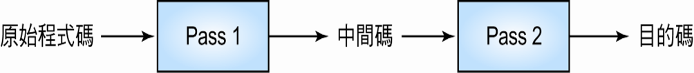

# 組譯器\(assembler\)

組譯器的功能是將組合語言寫成的程式碼翻譯成目的碼。

組合語言程式是由**指令及資料**組成。常用的指令有二種，分別是機器指令\(machine instruction\)與虛擬指令\(pseudo instruction\)。

* 機器指令經由組譯器處理後會產生目的碼；
* 虛擬指令的主要作用是標明程式的開始處及結束處，或給予組譯器指引，因此虛擬指令經由組譯器處理後通常不會產生目的碼。

## 組譯器的工作及輸出

組譯器應執行的工作有以下 5 項

* 將機器指令轉換成相對應的機器碼。
* 將符號運算元\(symbolic operand\)轉換成相對應的機器位址。
* 以機器所能接受的格式產生機器指令。
* 將資料常數\(constant\)轉換成機器內部的表示法。
* 產生的目的碼\(object code\)及組合程式列表 。

## 目的碼之基本內容 

組譯器處理完原始程式碼後將產生目的碼，而目的碼之基本內容應有以下三種

* 標頭記錄\(head record\)：記載程式的名稱，程式的起始位址以及程式的長度等三種資訊。
* 本文記錄\(text record\)：記載程式的內容，包括指令的機器碼，欲載入的位址及資料。
* 結束記錄\(end record\)：記載程式的結束處， 並指定程式第一個開始執行的指令的位址 。

## 處理程式碼次數模式

組譯器依不同的處理方式，通常可以分為三類：

### 單次處理\(single-pass\)組譯模式

* 處理原始程式碼一次並產生的目的碼。
* 單次處理組譯模式允許「後方參考」\(backward reference\)，但不允許「前方參考」\(forward reference\)動作。「後方參考」指符號先定義，才引用，而「前方參考」則是指符號未定義前就先引用。
* 因為單次處理組譯模式只掃瞄原始程式碼一次，因此組譯\(assemble\)時間在三種組譯模式中最短

  因目的碼未執行最佳化處理\(optimization\)，執行效率可能稍差。

### 
兩次處理\(two-pass\)組譯器

* 兩次處理組譯模式的程式結構分為二個部份，分別是Pass 1與Pass 2。

  先由Pass 1處理原始程式後，輸出「中間碼」，Pass 2再處理「中間碼」後輸出目的碼\(請注意：不是處理原始程式二次\)。

* Pass1的工作為定義符號\(define symbol\)，而Pass 2的工作則為產生目的程式\(generate object code\)。
* 兩次處理組譯程式允許「前方參考」，通常不會對目的碼執行最佳化處理，因此執行效率可能稍差 
  。

### 多次處理\(multiple-pass\)組譯程式 

* 多次處理組譯程式會作多次掃瞄的動作，因此允許「前方參考」。
* 在第一次處理時先保留這些牽涉到「前方參考」的未定義符號，在往後的幾次處理中再一一的對這些符號作處理。
* 可對目的碼執行最佳化處理，因此執行效率較佳。
* 因多次處理組譯程式會掃瞄程式碼多次，因此組譯時間在三種組譯程式中最長 。

