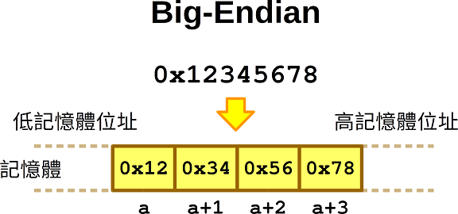
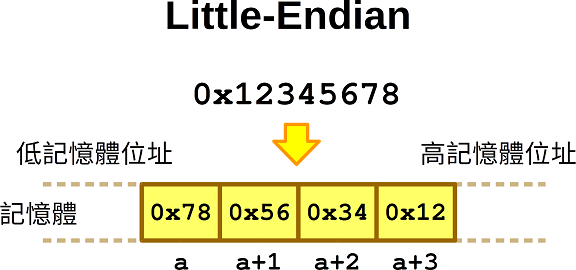

# 大端與小端(big endian and little endian)

大端小端在計算機領域，是指位元組順序(byte order)。

&#x20;**目前我們常見的CPU PowerPC、IBM是大端模式，x86是小端模式。ARM既可以工作在大端模式，也可以工作在小端模式，一般ARM都預設是小端模式。一般通訊協議都採用的是大端模式。**

針對一個32-bit (4 bytes)的數值，如0x12345678h，總共四個位元組，兩個十六進位制數表示一個位元組，高位位元組為0x12，低位位元組為0x78；中間兩個位元組分別為0x34和0x56；

&#x20;數值**0x12345678**想要在計算機中正確使用，就必須要考慮在記憶體中將其對應的四個位元組合理儲存。假設記憶體的地址都是從低到高分配的，那麼對於一個數值多個位元組順序儲存就有兩種儲存方式：

* &#x20;**方式一 (big endian)**、數值的高位位元組存放在記憶體的低地址端，低位位元組存放在記憶體的高地址端：
* **方式二 (little endian)**、數值的低位位元組存放在記憶體的低地址端，高位位元組存放在記憶體的高地址端：






## 應用

* **大端：**基於其儲存特點，符號位在所表示的資料的記憶體的第一個位元組中，便於快速判斷資料的正負和大小（CPU做數值運算時從記憶體中依順序依次從低位地址到高位地址取資料進行運算，大端就會最先拿到資料的(高位元組的)符號位）。
* &#x20;**小端:** 基於其儲存特點，記憶體的低地址處存放低位元組，所以在強制轉換資料時不需要調整位元組的內容（比如，把int---4位元組強制轉換成short---2位元組，就可以直接把int資料儲存的前兩個位元組給short就行，因為其前兩個位元組剛好就是最低的兩個位元組，符合轉換邏輯；另外CPU做數值運算時從記憶體中依順序依次從低位地址到高位地址取資料進行運算，開始只管取值，最後重新整理最高位地址的符號位就行，這樣的運算方式會更高效一些）。

## &#x20;**檢測當前環境採用的是大端還是小端模式**

### **使用union**

```c
#include <stdio.h>

union EndianTest {
  unsigned long l;
  unsigned char c[4];
};

int main() {
  EndianTest et;
  et.l = 0x12345678;
  printf("byte order:");
  if (et.c[0] == 0x78 && et.c[1] == 0x56 &&
    et.c[2] == 0x34 && et.c[3] == 0x12) {
    printf("Little Endian\n");
  } else if (et.c[0] == 0x12 && et.c[1] == 0x34 &&
    et.c[2] == 0x56 && et.c[3] == 0x78) {
    printf("Big Endian\n");
  } else {
    printf("Unknown Endian\n");
  }
  printf("0x%lX store order：\n", et.l);
  for (int i = 0; i < 4; i++) {
    printf("%p : 0x%02X\n", & et.c[i], et.c[i]);
  }
  return 0;
}
```

****

