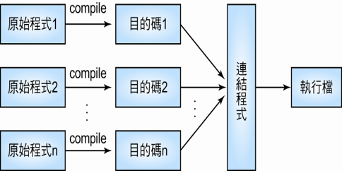
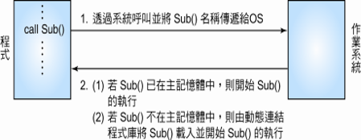

# 連結器\(linker\)

* 連結器\(linker\)的工作是解決不同程式段間彼此相互參考的問題，即解決「**外部符號**」的參考問題。
* 「外部符號」指的是不在本地定義的符號，可能是函式庫\(library\)內的函式，或是其他程式段內定義的函式或符號，連結程式會將程式中所使用到外部符號連結起來，並產生完整的執行檔。
* 假設程式由多個模組完成，每個模組都可個別編譯\(separate compile\)成目的碼，然後再利用連結程式將這些目的檔連結合併成一個完整的執行檔。

## 動態連結\(dynamic linking\)

動態連結是指將連結的動作，延遲到程式執行時才處理。真正會被執行到的程式段才執行連結處理動作。

程式在執行過程中，可能有部份的符號或副程式並不會被引用或呼叫，因此如果在連結時便將這些未被引用或呼叫的符號或副程式連結進來，將增加連結程式的負擔，同時也增加了記憶體空間的需求量。

