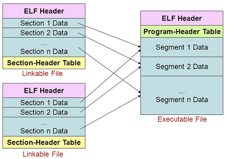

# 連結器\(linker\)

* 連結器\(linker\)的工作是解決不同程式段間彼此相互參考的問題，即解決「**外部符號**」的參考問題。
* 「外部符號」指的是不在本地定義的符號，可能是函式庫\(library\)內的函式，或是其他程式段內定義的函式或符號，連結程式會將程式中所使用到外部符號連結起來，並產生完整的執行檔。
* 假設程式由多個模組完成，每個模組都可個別編譯\(separate compile\)成目的碼，然後再利用連結程式將這些目的檔連結合併成一個完整的執行檔。

## 連結可重複使用已開發的程式

靜態連結\(static linking\)、動態連結\(dynamic linking\)與動態讀取\(dynamic loading\) 是複用其他軟體程式碼的三種機制。特性分別如下：

* 靜態連結：在編譯時，外部函式庫就加入程式中。
  * 因為函式都已經在執行檔中，不必呼外外部函式，執行速度快。
  * 但因為每一個執行檔都包含了大量相同的函式庫，浪費記憶體空間。
* 動態連結\(shared library\)：在程式執行期間，當某個模組被真正呼叫到時才將其載入到主記憶體中。
  * 節省主記憶體空間。
  * 節省編譯、組譯、連結所花費的時間。因動態連結函式庫可以單獨重新編譯。
  * 需要作業系統支持，不同作業系統有不同的稱呼。
    Windows .dll \(Dynamic Linking Libraries\)。

    Linux .so \(Shared Object\)。
* 動態讀取：讓程式設計師在程式執行的過程中，動態決定要載入的函式庫。
  * 

    節省主記憶體空間。

  * 讓設計師可以呼叫讀取器，比動態連結更具有彈性，靈活度也更高。
  * 但程式設計師要自己規劃而不是 OS 負責程式的讀取，拖長執行時間。
  * 動態讀取是古老的方法，e.g. MS-DOS Overlay files。

## 動態連結\(dynamic linking\)

動態連結是指將連結的動作，延遲到程式執行時才處理。真正會被執行到的程式段才執行連結處理動作。

程式在執行過程中，可能有部份的符號或副程式並不會被引用或呼叫，因此如果在連結時便將這些未被引用或呼叫的符號或副程式連結進來，將增加連結程式的負擔，同時也增加了記憶體空間的需求量。

