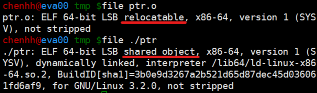

# 目的檔\(object file\)

編譯器編譯原始碼後產生的檔案叫做目的檔\(以.o為檔名結尾\)。目的檔從結構上分析，是已經編譯過的可執行檔格式，只是還沒有經過連結，有些符號和記憶體地址還需要調整，因此和可執行檔採用相同的儲存格式。

## 目的檔格式

* Windows的PE \(portable executable\)格式
* Linux下的ELF \(executable linkable format\)格式
* 上述兩者都是COFF \(common object file format\)格式的變形。
* \(較少見\) Intel/Microsoft的 MOF\(object module format\)、Unix的a.out格式，MS-DOS的 .COM格式。

COFF是由Unix system V release 3提供並使用的格式規範。之後Microsoft據此製定了PE格式，而release 4以COFF為基礎引進了ELF格式，兩者源於相同格式，因此結構相似。

COFF的主要貢戲是在目的檔裡面引進了區段\(section or segment\)的機制，相異的目的檔可擁有不同數量及類型的區段。而且COFF定義了除錯資料的格式。

### ELF檔案格式分類

| ELF檔案類型 | 說明 | 實例 |
| :--- | :--- | :--- |
| 可重定檔案 \(relocatable file\) | 包含了程式碼和資料，可用來連結成可執從檔或共用目的檔，靜態函式庫屬於這一類 | Linux的.o與Windows的.obj |
| 可執行檔 \(executable file\) | 包含了可直接執行的程式，代表是ELF可執行檔，沒有副檔名 | Linux下的可執行檔與Windows的.exe |
| 共用目的檔 \(shared object file\) | 包含了程式碼與資料，可在以下兩種情況下使用。一是連結器可以使用這種檔案和其它的可重定檔、共用目的檔連結。二是動態連結器可以結合幾個這種共用目的檔與可執行檔，作為行程映久的一部分來執行。 | Linux的.so與Windows的.dll |
| 核心傾印檔 \(core dump file\) | 當行程意外終止時，系統可以將行程的位址空間的內容及終止時的一些其它資料傾印到核心傾印檔案。 | Linux下的core dump |

可在Linux下以`file`命令檔案對應的檔案類型：

* 程式碼編譯後的機器指令經常被放在程式碼區段\(code section\)，常見的名稱為.code或.text。
* \(已初始化的\)全域變數和區域靜態變數資料經常放在資料區段\(data section\)，一般稱為.data。
* \(未初始化的\)全域變數和區域靜態變數資料經常放在名為.bss的區段。

