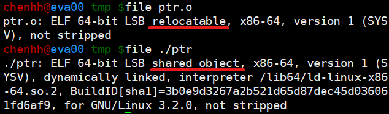

# 目的檔\(object file\)

編譯器編譯原始碼後產生的檔案叫做目的檔\(以.o為檔名結尾\)。目的檔從結構上分析，是已經編譯過的可執行檔格式，只是還沒有經過連結，有些符號和記憶體地址還需要調整，因此和可執行檔採用相同的儲存格式。

## 目的檔格式

* Windows的PE \(portable executable\)格式
* Linux下的ELF \(executable linkable format\)格式
* 上述兩者都是COFF \(common object file format\)格式的變形。
* \(較少見\) Intel/Microsoft的 MOF\(object module format\)、Unix的a.out格式，MS-DOS的 .COM格式。

COFF是由Unix system V release 3提供並使用的格式規範。之後Microsoft據此製定了PE格式，而release 4以COFF為基礎引進了ELF格式，兩者源於相同格式，因此結構相似。

COFF的主要貢戲是在目的檔裡面引進了區段\(section or segment\)的機制，相異的目的檔可擁有不同數量及類型的區段。而且COFF定義了除錯資料的格式。

### ELF檔案格式分類

| ELF檔案類型 | 說明 | 實例 |
| :--- | :--- | :--- |
| 可重定檔案 \(relocatable file\) | 包含了程式碼和資料，可用來連結成可執從檔或共用目的檔，靜態函式庫屬於這一類 | Linux的.o與Windows的.obj |
| 可執行檔 \(executable file\) | 包含了可直接執行的程式，代表是ELF可執行檔，沒有副檔名 | Linux下的可執行檔與Windows的.exe |
| 共用目的檔 \(shared object file\) | 包含了程式碼與資料，可在以下兩種情況下使用。一是連結器可以使用這種檔案和其它的可重定檔、共用目的檔連結。二是動態連結器可以結合幾個這種共用目的檔與可執行檔，作為行程映久的一部分來執行。 | Linux的.so與Windows的.dll |
| 核心傾印檔 \(core dump file\) | 當行程意外終止時，系統可以將行程的位址空間的內容及終止時的一些其它資料傾印到核心傾印檔案。 | Linux下的core dump |

可在Linux下以`file`命令檔案對應的檔案類型：



## 目的檔的內容

為了支援連結與執行等兩種時期的不同用途，ELF 格式可以分為兩種不同觀點，第一種是連結時期觀點 \(Linking View\)，第二種是執行時期觀點 \(Execution View\)。

* 在連結時期，是以分段 \(Section\) 為主的結構。
* 但在執行時期，則是以分割槽 \(Segment\) 為主的結構。


* ELF的檔頭\(header\)描述了整個檔案的屬性，包括是否可執行，是靜態還是動態連結及入口地址\(如果是可執行檔\)，目標硬體，目標作業系統等資訊。
* 檔頭還包含了一個段表\(section\)，記錄了檔案中各個區段的偏移量及區段的屬性。
* 程式碼編譯後的機器指令經常被放在程式碼區段\(code section\)，常見的名稱為.code或.text。
* \(已初始化的\)全域變數和區域靜態變數資料經常放在資料區段\(data section\)，一般稱為.data。
* \(未初始化的\)全域變數和區域靜態變數資料經常放在名為.bss \(block started by symbol\)的區段，只是為未初化的變數預留位址而已，並沒有內容。


### 目的檔 ELF 的檔頭結構 \(Elf32\_Ehdr\)

ELF header的定義可以在 `/usr/include/elf.h` 中找到。Elf32\_Ehdr是32位 ELF header的結構體。Elf64\_Ehdr是64位ELF header的結構體

```c
typedef struct {
  unsigned char e_ident[EI_NIDENT]; // ELF 辨識代號區
  Elf32_Half e_type;       // 檔案型別代號
  Elf32_Half e_machine;    // 機器平台代號
  Elf32_Word e_version;    // 版本資訊
  Elf32_Addr e_entry;      // 程式的起始位址
  Elf32_Off e_phoff;       // 程式表頭的位址
  Elf32_Off e_shoff;       // 分段表頭的位址
  Elf32_Word e_flags;      // 與處理器有關的旗標值
  Elf32_Half e_ehsize;     // ELF檔頭的長度
  Elf32_Half e_phentsize;  // 程式表頭的記錄長度
  Elf32_Half e_phnum;      // 程式表頭的記錄個數
  Elf32_Half e_shentsize;  // 分段表頭的記錄長度
  Elf32_Half e_shnum;      // 分段表頭的記錄個數
  Elf32_Half e_shstrndx;   // 分段字串表 .shstrtab 的分段代號
} Elf32_Ehdr;
```


簡單的說，程式碼編譯之後主要分成兩種區段：**程式指令和程式資料**。其優點如下：

* 檔案讀取記憶體後，可將程式指令對應到唯讀的區段，而程式資料對應到可讀寫的區段，可防止指令被修改。
* 指令與資料分開有利於提高程式的區域性，提升CPU快取的命中率。
* 當系統中執行多個該程式的副本時，因為其指令均相同，只需在記憶體中共用同一份區段即可，可節省大量記憶體空間。

### Program Header 與 Section Header

ELF有兩種header table，Program header table和Section header table。

* Program header table：程式載入時給linker讀取，以尋找需要的section。
* Section header table：給程式\(如readelf\)或使用者分析檔案時使用。

同一個Section在兩種不同的header table中可能會被標記在檔案的不同位置，由於執行的時候linker式讀取progran header table，所以section所在檔案中的位置要以progran header table為主。

## PLT和GOT機制

PLT \(Procedure Linkage Table\) 和 GOT \(Global Offset Table\) 是 GCC 中實作shared library的重要元素。

### PLT的功能

既然GOT已經列出需要的函式與全域變數，為何還需要PLT？

當你的大型程式載入記憶體時，linker 為了解析所需要的函式，也許會花不少時間，並導致使用者認為反應很慢。為了解決這個問題，GCC 改為呼叫shared library的函式前，才去把絕對位置填入GOT內。而PLT的功用就是呼叫 linker去填入 GOT，這個機制就是延遲解析 \(lazy binding\)。

### GOT的功能

以gcc 內建的libc.so為例，因為你不太可能用到libc.so內的所有函式，不用知道所有函式在記憶體內的絕對位置。其中GOT只列出你會用到的函式或是全域變數的絕對位置。這樣會節省許多解析時間。


## 參考資料

* [ELF-64 Object File Format](https://www.uclibc.org/docs/elf-64-gen.pdf)


