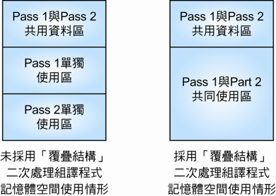

# 程式重定址\(program relocation\)

## 絕對程式\(absolute program\)

「絕對程式」\(absolute program\)是指必須載入到使用者指定的記憶體地址才能執行的程式。

事實上在同一時刻可能同時會有多個程式在記憶體中，由於無法預知這些程式執行的順序，因此無法事先分配程式所實際佔用的記憶體空間。因為程式在執行過程中可能因為本身之需求或其他程式之需求而必須將程式碼由目前所佔用的記憶體空間，搬移到另一個記憶體空間來執行。

基於以上二個原因，可以瞭解「絕對程式」的觀念有嚴重的缺點為滿足程式執行時的實際需求，必須有一種作法可以允許程式能載入不同於原先載入的位址，**這種可將程式載入不同於原先載入的位址的動作稱為「重定位」\(relocation\)** 。

## 程式重定址

為了滿足「重定址」之需求，組譯器輸出之目的碼中應提供資訊給載入程式，再由載入程式來執行修正位址的動作。

目的碼中若包含程式載入記憶體時應修改的資料，此種目的碼便稱為「可重定址程式」\(relocatable program\)。

* **為了提供目的碼「重定址」能力，組譯器會在目的碼中多輸出一項稱為修飾記錄\(modification record\)的資料，修飾記錄內記載了目的碼在載入記憶體時需修改的資訊**。
* 修飾記錄的內容包含了必須被修改的位址欄位之起始位址及被修改的欄位的長度 。

假設程式中有goto 敘述。若程式提供「重定址」功能，則goto 敘述後方所指定的敘述之位址便必須隨著程式載入位址的不同而連帶被更改 。

## 覆疊結構 \(overlay structure\) 

**「覆疊結構」是指將程式中不會同時執行的部份載入到記憶體中相同的地址執行**。

* e.g. 兩次處理組譯程式中的Pass 1與Pass 2，因為先執行Pass 1，再執行Pass 2，滿足「不會同時執行」的條件。
* 可讓組譯程式的Pass 1與Pass 2使用相同的記憶體空間來執行，如此一來便可降低兩次處理組譯程式執行時記憶體空間的需求量 。

## 

