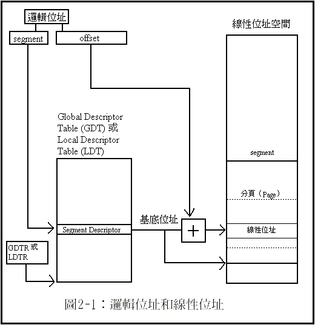
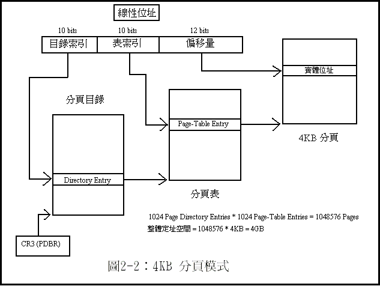
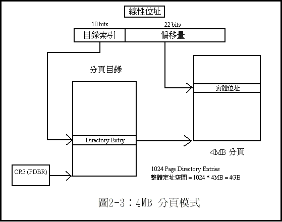
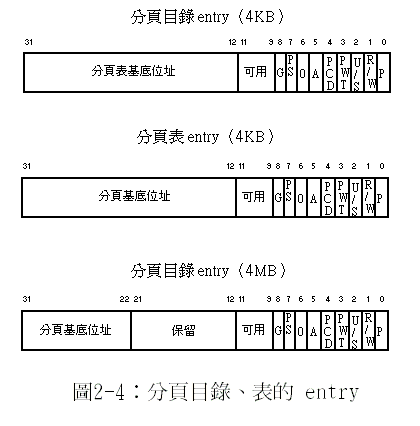

# 保護模式\(protect mode\)

## Intel architecture架構概觀

Intel CPU架構又稱 x86 架構，因為它的第一代處理器的代號是 8086，而其後繼產品依序以 8088、80186、80188、80286……為代號，均為 80x86 的形式；而在 80286 之後，Intel 改以 i386、i486 來命名，因此才被稱為 x86 架構。在 i486 處理器之後，Intel 就不再以 x86 的形式命名，所以在這裡以較正式的 Intel Architecture 來稱呼這個架構（簡稱 IA 架構）。

Intel Architecture 系列的處理器中，最早的 8086 是一 16 bit 的處理器，具有 16 bit 的暫存器和資料匯流排，並具有 20 bit 的定址能力，能定址最多達 1MB 的記憶體。然而，20 bit 的位址和 16 bit 的暫存器無法相符，因此 Intel 設計了一種 **segment:offset** 的定址方式，利用兩個 16 bit 暫存器來表示一個 20 bit 的位址。

到了 80286 的時代，1MB 的定址能力已經不敷使用，因此 Intel 為它設計了一個新的「保護模式」（Protected Mode），並將原先 8086 所使用的方式稱為「真實模式」（Real Mode）。80286 具有 24 bit 的定址能力，可以定址 16MB 的記憶體，但是只有在保護模式下才能發揮。在真實模式中，為了維持和 8086 的相容性，還是只能使用 1MB 的記憶體。80286 的保護模式已經有了多工作業的能力，並且可以保護各個節區的資料和程式不被其它程式干擾。

在 i386 出現時，情形有很大的變化。i386 是一個 32 bit 的處理器，並具有 32 bit 的定址能力，可以定址達 4GB 的記憶體。它同時也改進了 80286 不完整的的保護模式，提供了很多新的功能，如虛擬記憶體等等。一般所說的「保護模式架構」，就是指 i386 的保護模式。

## IA-32 的操作模式

在 i386 以後的 Intel Architecture 相容處理器（統稱 IA-32 架構），具有四種操作模式：

* **真實模式（Real Mode）**：在這個模式下，處理器的行為和的 8086 一般。
* **（32 bit）保護模式（Protected Mode）**：在這個模式下，處理器具有多工、分節保護、分頁等等的能力。
* **虛擬 8086 模式（Virtual-8086 Mode）**：這個模式是在一般的保護模式下，模擬一個 8086 的執行環境，可以同時執行多個 8086 程式。
* **系統管理模式（System Management Mode, SMM）**：這個模式會使處理器切換到一個獨立的定址空間中執行，通常在電源管理之類的系統工作才會使用這個模式。

而在保護模式中，有四個重要的部分：記憶體管理、保護機制、中斷／例外處理、和多工處理。

### 系統暫存器

在處理器中有一些暫存器，是用來控制系統的一些行為的，這些暫存器通常只有作業系統會使用。這些暫存器中，和保護模式有關的，有：

* **EFLAGS** 中（32 bit 的旗標暫存器）的一些系統旗標和 IOPL 欄位。在保護模式中，只有 CPL 小於或等於 IOPL 的程式才存取 I/O 位址空間，和進行一些其它的操作。
* **控制暫存器（Control Registers）**，包括 CR0、CR2、CR3、CR4（CR1 保留）。這些暫存器包括一些和保護模式關係密切的內容（例如，是否進入保護模式、是否開啟分頁功能等等）。
* **GDTR、LDTR、和 IDTR**。這三個暫存器存放三個系統的 descriptor table 的基底位址和邊界（大小）。
* 工作暫存器（Task Register）存放目前工作（task）的 TSS 的基底位址和大小。

## 定址方式

在保護模式中，有三種定址方式：

* 邏輯位址（Logical Address）
* 線性位址（Linear Address）
* 實體位址（Physical Address）

對大部分的應用程式而言，幾乎只會用到邏輯位址。線性位址和實體位址在大部分的情形中，只有作業系統會使用。

### 實體位址

所謂的「實體位址」，就是指系統的記憶體的真正位址，它的範圍由 00000000H 到 FFFFFFFFH，共有 4GB。大部分情形中，系統的 RAM 都是由 00000000H 開始定址（即在最底端），而 ROM 則由 FFFFFFFFH 開始定址（即在最頂端）。這是因為在 RESET 之後，處理器會從定址空間的頂端開始執行，所以把 ROM 定址在頂端才能讓處理器在 RESET 後執行到開機用的程式（如開機自我測試之類的程式）。

### 線性位址

**在沒有使用分頁（Paging）功能的時候，線性位址是直接對映到實體位址的**。也就是說，線性位址就等同於實體位址。

不過，**在開啟分頁分能之後，一個線性位址可能沒有相對映的實體位址**（因為它所對映的記憶體可能被 swap 到硬碟裡了）。所謂的分頁功能，是指把定址空間分割成許多頁，而實際的記憶體可能無法容納這麼多頁，因此有些頁若暫時沒有用到，就可以暫時存放到硬碟（或其它儲存媒體）中，等到需要的時候再取出來。這個功能可以讓系統使用比實際的 RAM 空間更大的記憶體。因此，在這種情形下，一個線性位址所在的頁可能還在硬碟中，因此，要存取這個位址，就要先把 swap 到硬碟中的資料取出，放到實體記憶體中的某個位置中（這時，可能有些頁就得讓開位置，被 swap 到硬碟中了）。

### 邏輯位址

**而邏輯位址則和真實模式類似，仍然是 segment:offset 的形式**，只不過現在 offset 的大小改成 32 bit 而已，而 segment 仍然是 16 bit。

不過，和真實模式不同的是，segment 的意義不同；在保護模式中，segment 的位置不再是固定的，而是可以自由決定的。

Segment 暫存器（稱為 Segment Selector）則是用來選擇想要使用的 segment。同時，**在保護模式中，segment 也可以有大小限制**，不像在真實模式中，一個 segment 一定是 64KB\(16 bit的上限\)（雖然 segment 的實際大小可以比 64KB 小，但是處理器並不會檢查存取動作是否超出了 segment 的範圍）。

**在保護模式中，每一個 segment 都有一個 segment descriptor，描述這個 segment 的位置、大小、型態、存取權限等等資料。**Segment 的位置是以「基底位址」來表示，基底位址是一個線性位址。要存取 segment 中的某個位址，需要指定一個 offset 位址，而實際的線性位址則是將 segment 的基底位址加上 offset 就可以得到。

上圖中，顯示出 segment 的 segment descriptor 是存放在 Global Descriptor Table（GDT）或 Local Descriptor Table（LDT）中。GDT 和 LDT 都是由 segment descriptor 所組成的陣列。Segment selector 則可以視為這個陣列的 index。

GDT 的基底位址存放在 GDTR 中（GDTR 是一個暫存器），而 LDT 的基底位址則放在 LDTR 中（LDTR 也是一個暫存器）。

分段架構可以有效地解決多工環境中，程式和資料的重定位（Reallocation）問題。利用分段架構，為程式和資料分別指定一個 @segment，程式和資料都可以從 00000000H 開始取用，而不受程式和資料在記憶體中的位址影響。同時，分段架構也可以避免錯誤的程式意外地存取到不該存取的位址。

## 分頁架構\(paging\)

當分頁功能開啟時，線性記憶體就不是直接對映到實體記憶體上了。線性記憶空間會分割成許多固定大小的頁（Pages），通常是 4KB。

**在以線性位址存取記憶體時，處理器會找出對映的頁，並把線性位址轉換成相對的實體位址。**如果該線性位址所對映的頁現在並不在實體記憶體中，則處理器會發出一個 page-fault 的例外（Exception）。作業系統必須提供一個例外的 handler 來處理這個例外，來取出所需要的頁（例如，作業系統可能會把某一個不需要的頁寫到 swap file 中，再從 swap file 中讀入現在需要的頁）。在處理完這個例外之後，程式就可以從發生例外的地方開始，繼續執行下去。

### 4KB與4MB分頁大小

分頁的大小有兩種：4KB 和 4MB。

在 4KB 的模式中，線性位址被分成三個部分：目錄索引（Directory）、表索引（Page Table）、和偏移量（Offset）。

所有分頁目錄和分頁表中所記載的位址，均為實體位址。在 CR3 中所存放的分頁目錄的基底位址，也是實體位址。分頁目錄的基底位址必須是 4KB 的倍數。

下圖中，目錄中可定址$$2^{10}$$個分頁表，而每一個分頁表中又可定址$$2^{10}$$個實體，每個實體可定址$$2^{12}$$位元組，因此總共可定址空間 $$2^{10} \times 2^{10} \times 2^{12} = 2^{32} = 4\ \text{GB}$$。

 4MB 分頁模式，即一頁的大小是 4MB。4MB 分頁模式和 4KB 分頁模式很類似，但是**在 4MB 分頁模式中，只有分頁目錄，沒有分頁表**；即分頁目錄中的 Directory Entry 直接指向分頁的基底位址，而在線性位址中的表索引則和偏移量合併成 22 bits（4MB）的偏移量。

4MB 分頁模式和 4KB 分頁模式可以共用。例如，在作業系統中，可能會想把整個核心（Kernel）都放在同一頁中，以減少 swap 所產生的額外負擔，而在其它的地方則使用 4KB 的分頁空間。

## 設定分頁功能

在控制暫存器（control registers）中，有三個和分頁功能有關的旗標：

* PG（CR0 的 bit 31）
* PSE（CR4 的 bit 4，在 Pentium 和以後的處理器才有）
*  PAE（CR4 的 bit 5，在 Pentium Pro 和 Pentium II 以後的處理器才有）

* PG（paging）旗標設為 1 時，就會開啟分頁功能。
* PSE（page size extensions）旗標設為 1 時，才可以使用 4MB 的分頁大小（否則就只能使用 4KB 的分頁大小）。
* 而 PAE（physical address extension）是 P6 家族新增的功能，可以支援到 64GB 的實體記憶體。

## 分頁目錄和分頁表

分頁目錄和分頁表存放分頁的資訊。

分頁目錄的基底位址是存放在 CR3（或稱 PDBR，page directory base register），存放的是實體位址。在開啟分頁功能之前，一定要先設定好這個暫存器的值。在開啟分頁功能之後，可以用 MOV 命令來改變 PDBR 的值，而在工作切換（task switch）時，也可能會載入新的 PDBR 值。也就是說，每一個工作（task）可以有自己的分頁目錄。在工作切換時，前一個工作的分頁目錄可能會被 swap 到硬碟中，而不再存在實體記憶體中。不過，在工作被切換回來之前，一定要使該工作的分頁目錄存放在實體記憶體中，而且在工作切換之前，分頁目錄都必須一直在實體記憶體中。

分頁目錄和分頁表的實例格式如下：

* **分頁表基底位址、分頁基底位址：存放分頁表／分頁的基底位址（以實體位址）**。
  * 在 4KB 的分頁中，分頁表和分頁的位址都必須是 4KB 的倍數，所以用 20 bits 來表示基底位址的最左邊的（most-significant）20 bits。
  * 在 4MB 的分頁中，分頁的位址必須是 4MB 的倍數，因此用 10 bits 表示基底位址最左數的 10 bits。
* **P（present）旗標：表示這個分頁（或分頁表）目前是否存在記憶體中。**
  * 若 P = 1，則表示這個分頁或分頁表在記憶體中，可以進行位址轉換。
  * 若 P = 0，則表示這個分頁不在記憶體中，若對這個分頁進行存取動作，會導致 page fault（\#PF）例外。
  * 作業系統在將分頁 swap 到硬碟時，要把 P 設為 0；而在把分頁由硬碟中讀入時，則要把 P 設為 1。
* **R/W（read/write）旗標：當 R/W = 1 時，表示分頁可以寫入；當 R/W = 0 時，表示分頁只能讀取（read-only）。**
  * 當 CR0 的 WP 旗標（第 16 bit）設為 1 時，所有的程式都不能寫入唯讀的分頁；
  * 但 WP 為 0 時，具有 supervisor 等級的程序就可以寫入唯讀的分頁。在指向分頁表的分頁目錄 entry 中，這個旗標對其指向的分頁表中的每個分頁都有效。
* **U/S（user/supervisor）旗標：當 U/S = 1 時，表示分頁是一個 user level 的分頁，而 U/S = 0 時，表示分頁是一個 supervisor level 的分頁。**和 R/W 旗標一樣，在分頁目錄中，這個旗標對其指向的分頁表中的每個分頁都有效。
* **PWT（page-level write-through）旗標**：在 PWT = 1 時，處理器會對這個分頁（或分頁表）做 write-through caching；而 PWT = 0 時，處理器會對這個分頁（或分頁表）做 write-back caching。在 CR0 的 CD（cache disable，第 30 bit）設為 1 時，這個旗標會被忽略。
* **PCD（page cache disable）旗標**：在 PCD = 1 時，處理器不會對這個分頁（或分頁表）進行 cache；而 PCD = 0 時，則會進行 cache。例如，在分頁是對映一 I/O 記憶體時，就需要把 cache 關閉。在 CR0 的 CD 旗標設為 1 時，這個旗標會被忽略。
* **A（accessed）旗標：在 A = 0 時，若分頁被存取，則處理器會把它設為 1。在被設為 1 之後，處理器不會自動把它設為 0，只有軟體可以把它清為 0**。因此，通常在一個分頁被載入實體記憶體時，作業系統會把 A 清為 0。記憶體管理程式或作業系統可以利用這個旗標來決定 swap 的方式。
* **D（dirty）旗標：在 D = 0 時，若對分頁進行寫入動作，則處理器會把它設為 1。在被設為 1 之後，只有軟體可以把它清為 0。**通常作業系統在載入一個分頁之後，會把 D 清為 0。如此一來，要把這個分頁 swap 到硬碟中時，若 D 仍為 0，則表示分頁沒有被修改過，就不需要再寫回硬碟中了。這個旗標在「指向分頁表的分頁目錄 entry」中沒有作用。
* **PS（page size）旗標**：這個旗標只在分頁目錄 entry 中有作用。當 **PS = 0 時，表示這是一個 4KB 的分頁**，因此 entry 是指向一個分頁表；**當 PS = 1 時，表示這是一個 4MB 的分頁**，因此 entry 是指向一個分頁。只有在 CR4 的 PSE（page size extensions，第 4 bit）為 1 時，才能存取 4MB 的分頁。
* G（global）旗標：這是在 Pentium Pro 及之後的處理器才有的旗標。在本文中不討論。在 Pentium 和之前的處理器，這個旗標視為保留旗標，必須設為 0。
* **保留和可用部分**：保留部分一律要設成 0，而可用部分則可以自己決定用途。如果 P 為 0，則整個 entry（除了 P 之外）都視為可用部分，可供作業系統存放相關的資訊（例如，可以用來存放分頁在硬碟 swap file 中的位置）。

## Translation Lookaside Buffers（TLBs）

到記憶體中查分頁目錄和分頁表是非常耗時的工作（需要經由較慢的 記憶體匯流排），而查分頁目錄和分頁表又是非常頻繁的事件（幾乎所有的記憶體存取動作都需要），因此，處理器把最近使用的分頁目錄和分頁表的 entry 存放在叫 Translation Lookaside Buffers（TLBs）的 cache 中。

只有 CPL 為 0 的程序才能選擇 TLB 的 entry 或是把 TLB 設為無效。無論是在更動分頁目錄或分頁表之後，都要立刻把相對的 TLB entry 設為無效，這樣在下次取用這個分頁目錄或分頁表時，才會更新 TLB 的內容（否則就可能會從 TLB 中讀到舊的資料了）。

要把 TLB 設為無效，只要重新載入 CR3 就可以了。要重新載入 CR3，可以用 MOV 指令（例如：MOV CR3, EAX），或是在工作切換時，處理器也會重新載入 CR3 的值。此外，INVLPG 指令可以把某個特定的 TLB entry 設成無效。不過，在某些狀況下，它會把一些 TLB entries 甚至整個 TLB 都設為無效。INVLPG 的參數是該分頁的位址，處理器會把 TLB 中存放該分頁的 entry 設為無效。

## 分頁的規劃

在多工作業系統中，往往同時執行很多個程式，因此，記憶體可能常常會用盡。但是，即使一個程式載入大量的資料到記憶體中，也很少會同時使用到全部的資料。這時候，把暫時不需要的資料寫入硬碟（或其它類似的裝置）中，就可以空出位置載入其它的程式了。

不過，為了管理的方便，分頁的大小往往是固定的。例如，在 IA-32 架構下，分頁的大小是 4KB。分頁如果太大，則在 swap 時，常常會 swap 到不需要 swap 的部分；而若分頁太小，則過於破碎，不易管理，也缺乏效率。

在 i486 和之前的處理器中，分頁的大小只有一種選擇：4KB。在大部分情形中，這個大小還算適當。但是，在某些情形下，可能會需要更大的分頁。因此，在 Pentium 和以後的處理器，就增加了 4MB 的分頁大小。然而，4MB 在一般的情形中，實在是太大了，實用性也降低。不過，4MB 的分頁在某些狀況下還是有用的。例如：為了方便管理，可以把作業系統的核心放在 4MB 的分頁中，而一般應用程式則使用 4KB 的分頁。

此外，在 Linux 作業系統中還有一種用法：Linux 作業系統的核心部分常常需要使用實體位址，因此在 Linux 中，應用程式和核心是使用不同的分頁目錄。核心的分頁目錄便是將線性記憶體直接對映到實體記憶體中。在這種情形下，就很適合使用 4MB 的分頁模式。不過，要注意一點：4MB 的分頁模式，只有在 Pentium 及以後的處理器才能使用。

