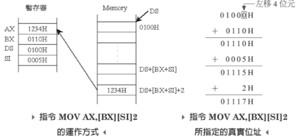

# x86定址模式(addressing mode)

## 記憶體簡介

記憶體是電腦用來存放程式與資料的地方。依讀寫能力可分為：

* 隨機存取記憶體 (random access memory, RAM)與
* 唯讀記憶體 (read only memory, ROM)。

x86 CPU 在運作時根據其對記憶體的定址的模式，主要區分為：

* 真實模式 (real mode) 與
* 保護模式 (protected mode)。

在真實模式下，CPU 只有 1MB(2\*\*20) 的記憶體定址空間，而且對於所有的記憶體位址 (這 1MB 的空間)、I/O 位址，以及周邊設備的存取完全不設限。也因此在真實模式下，電腦並沒有多工的能力。在 Intel 80186 及其以前的 CPU 都只有一種運作模式，也就是真實模式。

在 80286 之後，增加了保護模式以擴充記憶體的定址能力，而真實模式就是為了保有軟硬體向下相容的目的而存在。在保護模式下，CPU 提供記憶體位址保護的功能，所以擁有虛擬記憶體管理與多工作業的能力。可以讓作業系統同時執行多個程式，甚至是同時運行多個作業系統 (虛擬化技術)。

### 記憶體地址 (memory address)

以8086可定址的1M記憶體來說，為了便於管理這些容量，會將記憶體編號為00000h\~FFFFFh，這些編號即為<mark style="color:red;">**記憶體地址 (memory address)**</mark>。 而<mark style="background-color:red;">記憶體最小的存取單元為1 byte</mark>。


### x86真實模式下的記憶體佈局

| 起始地址  | 結束地址   | 大小             | 用途                                                                                   |
| ----- | ------ | -------------- | ------------------------------------------------------------------------------------ |
| 000   | 3FF    | 1KB            | 中斷向量表(interrupt vector table)                                                        |
| 400   | 4FF    | 256B           | BIOS Data area                                                                       |
| 500   | 7BFF   | 30464B，約30KB   | 程式設計師可用區域                                                                            |
| 7C00  | 7DFF   | 512B           | MBR被BIOS加載到此處，共512 bytes                                                             |
| 7E00  | 9FBFF  | 622080B，約608KB | 程式設計師可用區域                                                                            |
| 9FC00 | 9FFFF  | 1KB            | EBDA (extended BIOS data area)                                                       |
| A0000 | AFFFF  | 64KB           | 彩色顯示配適器                                                                              |
| B0000 | B7FFFF | 32KB           | 黑白顯示配適器                                                                              |
| B8000 | BFFFF  | 32KB           | 用於文本模式顯示配適器                                                                          |
| C0000 | C7FFF  | 32KB           | 顯示配適器BIOS                                                                            |
| C8000 | EFFFF  | 160KB          | 映射硬體配適器的ROM或記憶體映式IO                                                                  |
| F0000 | FFFEF  | 64KB-16B       | 系統BIOS範圍是F0000\~FFFFF，為說明入口地址，將最後面的16 bytes從此處去除，所以終止地址為0xFFFEF                      |
| FFFF0 | FFFFF  | 16B            | BIOS入口地址，此地址也屬於BIOS程式碼，同樣屬於頂部的64KB，只是為了強調入口地址才單獨列出。此處16 bytes的內容是跳轉指令 JMP F000:E05B。 |

### DRAM

記憶體位址0x00000\~0x9FFFF這最低的640KB的位址空間範圍，對應DRAM，也就是通常意義上的記憶體。

### BIOS ROM

最高位址0xF0000\~0xFFFFF這64KB的記憶體對應的就是ROM BIOS。BIOS的主要工作就是檢測和初始化硬體，在最低1KB的記憶體處建立真實模式下的中斷向量表。

### 其它外部設備

位址0xA0000\~0xEFFFF這320KB的位址空間範圍對應的就是外部設備。

### 開機時的動作

x86 CPU 開機後(處於真實模式)的第一個動作，就是指向記憶體的最高位址。

* CS=DS=ES=SS=0FFFFh IP=0000h
* CS:IP=FFFF:0000h (定址至000FFFF0h)
* <mark style="color:red;">因此CPU會至000FFFF0h 開始抓取指令並執行</mark>。

所以BIOS儲存的ROM，必須在「可以解碼的記憶體最高位置」，否則在開機時，CPU將無法抓取BIOS的第一道指令，當然也就無法繼續開機的動作。

### 真實模式特性

* 捲繞(8086 記憶體特性)：當記憶體位址超過0FFFFFh 時，會捲繞回00000h。
* A20 開關(switch)：X86 CPU在268時，位址線增加至24條(16MB超過1024KB)。為了相容性，在位址線A20\~A23設計了一個開關(A20 switch)，它可切換兩種定址方式:
  * 強制歸零: 在真實模式模擬8086的記憶體捲繞特性。
  * 可進位：在保護模式可以在0FFFFFh進位。
* 保護模式切換為真實模式需要重置，在386以後以設計可直接從保護模式返回真實模式，但還是保留A20開關、軟體重置(為了向下相容性)。

### 資料儲存：小端 (little endian)

x86 CPU儲存資料是採用小端的方式。詳細介細可看[大端與小端章節](big-endian-and-little-endian.md)。

簡單的說，如果有數值1234h要存入記憶體中，高位元組為12h，低位元組為34h。高位元組存在記憶體高地址，低位元組放在記憶體低地址處的方式稱為小端。


### 區段管理記憶體

區段(segment)是記憶體連續的區塊。x86使用區段(segment)的方式讓作業系統管理記憶體的優點，是程式設計師不必自行管理程式放在記憶體的區塊。且CPU使用CS、DS、SS分別記錄資料(data)、程式(code)與堆疊(stack) 區段在記憶體中的開始位址，然後以同樣以偏移量(offset)方式存取讓區段中所需要元素即可。

## 定址模式簡介

定址模式 (addressing mode)是要告訴CPU如何存取和取得資料的模式。可分為以下7大類。

* 立即定址法：地址欄=運算元給定的數值
* 暫存器定址法：地址欄=暫存器中的數值
* 直接定址法：地址欄=運算元給定的地址
* 暫存器間接定址法：地址欄=暫存器中的地址
* 基底相對定址法：
* 直接索引定址法：
* 基底索引定地法：

在組合語言中，可將指令分為兩個部份，分別為操作碼(operation)與存放資料的運算元(operand)，而運算元又可分別目的運算元與來源運算元。在指令前面有時會加上標籤(label)以標記程式碼的位置。


Intel格式的組合語言是 `operation destination operand, source operand`。目的運算元在前，來源運算元在後。

### 立即定址法(immediate addressing mode)

這種表示法是最簡單的，完全不用去尋找記憶體位址，就直接給數值 (當然這樣程式比較沒有彈性) 。例如 `MOV AX,12h` 就是直接把12h這個數值，傳送暫存器AX中。

只要可以立即定址的指令，都屬於立即定址法，如`INT 21h`，呼叫編號21h的中斷服務地址。

### 暫存器定址法(register operand addressing mode)

直接將指定暫存器中的內容(記憶體地址或數值)，傳送給另一個暫存器，或是直接操作暫存器。例如`MOV AX, BX`，就是將BX暫存器中的資料傳送給AX暫存器；而`POP CX`則是則堆疊中的頂端資料取出放在CX暫存器。

x86的暫存器中，區段暫存器有特別的限制，就是區段暫存器不可以直接互傳資料，必須經過第三個暫存器才行。如`MOV CS, DS` 這是不合法的操作。必須修改如下：

```erlang
; MOV CS, DS 不合法。修改如下
MOV AX, DS
MOV CS, AX
```


### 直接定址法(direct addressing mode)

直接定址模式代表指令中運算元之值為資料存放在記憶體中的位址，必須透過此位址作一次記憶體存取的動作才能取得所需的資料。如 `MOV AX, [1234h]`等價於`MOV AX, DS:[1234h]` 。數值加上中括號即代表記憶體的地址。但此數值並非實際記憶體的地址，還必須考慮DS暫存器中的值。

* 舉例若DS=0100h，則\[1234h]代表記憶體地址 `01000h + 1234h = 02234h`。
* **此定址法的暫存器如果明確寫出DS，則取出的數值視為資料；如果為CS，則取出的資料視為命令**。


### 暫存器間接定址法(register indirect addressing mode)

此種表示法，就是把暫存器裡面的數值資料，當成記憶體位址的偏移量，與直接定址法類似，只是把指定的地址改放到暫存器中。例如本來 BX 裡面放了 0123h 這筆資料， 用了暫存器間接定址之後，就變成是指定 0123h 這個地址。

* 例如 `MOV CX,[BX]` (等價於`MOV CX, DS:[BX])`，就是把記憶體位址 `(DS)0 + BX` 裡面的資料，移到 暫存器CX。
* 同直接定址法，如果明確寫出DS，則取出的數值視為資料；如果為CS，則取出的資料視為命令。


### 基底相對定址法(base addressing mode)

類似暫存器間接定址法，只是在後面又增加了數值的偏移量。利用BP或BX暫存器再加上一的偏移量得到真實的記憶體地址。

```erlang
; 以下三個指令意義相同
; 以基底暫存器BX為記憶體起始地址
; 再加上2 bytes得真實記憶體地址
; 預設取DS段的資料
MOV AX, [BX]2
MOV AX, 2[BX]
MOV AX, [BX+2]
```

例如 `MOV AX, [BX]2`，AX對應到的實體地址為 `(DS<<4)+[BX]+2` 中資料之值。


* 當使用BX暫存器做基底相對定址時，組譯器會認為資料在資料區段，所以會自動用DS計算真實地址。
* 如果是使用BP暫存器做基底相對定址時，組譯器會認為資料在堆疊區段，所以會自動用SS計算真實地址。

### 直接索引定址法 (index addressing mode)

與基底相對定址法相似，只是索引的暫存器暫存器是SI或DI，再加上偏移量得到真實的記憶體地址。

```erlang
MOV SI, 5
MOV AX, [SI]2    ;等同2[SI]或 [SI+2]
```


不論使用SI或DI做直接索引定址時，均會使用DS為區段暫存器，計算真實地址。AX對應到的實體地址為 `(DS<<4)+[SI]+2` 中資料之值。

### 基底索引定址(base-indexed addressing mode)

把基底和索引定址法一起使用。常用於陣列。

```erlang
; 預設使用DS區段
MOV AX, [BX][SI]2 ; 即[BX+SI+2]
```


