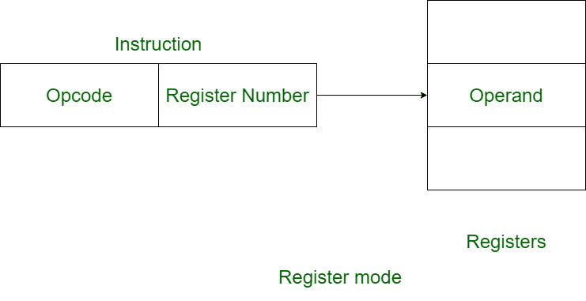

# x86定址模式\(addressing mode\)

## 記憶體簡介

記憶體是電腦用來存放程式與資料的地方。依讀寫能力可分為隨機存取記憶體 \(random access memory, RAM\)與唯讀記憶體 \(read only memory, ROM\)。

### 記憶體地址 \(memory address\)

以8088可定址的1M記憶體來說，為了便於管理這些容量，會將記憶體編號為00000h~FFFFh，這些編號即為**記憶體地址 \(memory address\)**。 


### 資料儲存：小端 \(little endian\)

x86 CPU儲存資料是採用小端的方式。詳細介細可看[大端與小端章節](big-endian-and-little-endian.md)。

簡單的說，如果有數值1234h要存入記憶體中，高位元組為12h，低位元組為34h。高位元組存在記憶體高地址，低位元組放在記憶體低地址處的方式稱為小端。


### 區段管理記憶體

區段\(segment\)是記憶體連續的區塊。x86使用區段\(segment\)的方式讓作業系統管理記憶體的優點，是程式設計師不必自行管理程式放在記憶體的區塊。且CPU使用CS、DS、SS分別記錄資料\(data\)、程式\(code\)與堆疊\(stack\) 區段在記憶體中的開始位址，然後以同樣以偏移量\(offset\)方式存取讓區段中所需要元素即可。

## 定址模式簡介

定址模式 \(addressing mode\)是要告訴CPU如何存取和取得資料的模式。可分為以下7大類。

* 立即定址法：地址欄=運算元給定的數值
* 暫存器定址法：地址欄=暫存器中的數值
* 直接定址法：地址欄=運算元給定的地址
* 暫存器間接定址法：地址欄=暫存器中的地址
* 基底相對定址法：
* 直接索引定址法：
* 基底索引定地法：

在組合語言中，可將指令分為兩個部份，分別為操作碼\(operation\)與存放資料的運算元\(operand\)，而運算元又可分別目的運算元與來源運算元。在指令前面有時會加上標籤\(label\)以標記程式碼的位置。


Intel格式的組合語言是 `operation destination operand, source operand`。目的運算元在前，來源運算元在後。

### 立即定址法\(immediate addressing mode\)

這種表示法是最簡單的，完全不用去尋找記憶體位址，就直接給數值 \(當然這樣程式比較沒有彈性\) 。例如 `MOV AX,12h` 就是直接把12h這個數值，傳送暫存器AX中。

只要可以立即定址的指令，都屬於立即定址法，如`INT 21h`，呼叫編號21h的中斷服務地址。

### 暫存器定址法\(register operand addressing mode\)

直接將指定暫存器中的內容\(記憶體地址或數值\)，傳送給另一個暫存器，或是直接操作暫存器。例如`MOV AX, BX`，就是將BX暫存器中的資料傳送給AX暫存器；而`POP CX`則是則堆疊中的頂端資料取出放在CX暫存器。

x86的暫存器中，區段暫存器有特別的限制，就是區段暫存器不可以直接互傳資料，必須經過第三個暫存器才行。如`MOV CS, DS` 這是不合法的操作。必須修改如下：

```erlang
; MOV CS, DS 不合法。修改如下
MOV AX, DS
MOV CS, AX
```



### 直接定址法\(direct addressing mode\)

直接定址模式代表指令中運算元之值為資料存放在記憶體中的位址，必須透過此位址作一次記憶體存取的動作才能取得所需的資料。如 `MOV AX, [1234h]`等價於`MOV AX, DS:[1234h]` 。數值加上中括號即代表記憶體的地址。但此數值並非實際記憶體的地址，還必須考慮DS暫存器中的值。

* 舉例若DS=0100h，則\[1234h\]代表記憶體地址 `01000h + 1234h = 02234h`。
* **此定址法的暫存器如果明確寫出DS，則取出的數值視為資料；如果為CS，則取出的資料視為命令**。


## 暫存器間接定址法\(register indirect addressing mode\)

此種表示法，就是把暫存器裡面的數值資料，當成記憶體位址的偏移量，與直接定址法類似，只是把指定的地址改放到暫存器中。例如本來 BX 裡面放了 0123h 這筆資料， 用了暫存器間接定址之後，就變成是指定 0123h 這個地址。

* 例如 `MOV CX,[BX]` \(等價於`MOV CX, DS:[BX])`，就是把記憶體位址 `(DS)0 + BX` 裡面的資料，移到 暫存器CX。
* 同直接定址法，如果明確寫出DS，則取出的數值視為資料；如果為CS，則取出的資料視為命令。


### 基底相對定址法\(base addressing mode\)

類似暫存器間接定址法，只是在後面又增加了數值的偏移量。利用BP或BX暫存器再加上一的偏移量得到真實的記憶體地址。

```erlang
; 以下三個指令意義相同
; 以基底暫存器BX為記憶體起始地址
; 再加上2 bytes得真實記憶體地址
; 預設取DS段的資料
MOV AX, [BX]2
MOV AX, 2[BX]
MOV AX, [BX+2]
```

例如 `MOV AX, [BX]2`，AX對應到的實體地址為 `(DS<<4)+[BX]+2` 中資料之值。


* 當使用BX暫存器做基底相對定址時，組譯器會認為資料在資料區段，所以會自動用DS計算真實地址。
* 如果是使用BP暫存器做基底相對定址時，組譯器會認為資料在堆疊區段，所以會自動用SS計算真實地址。

### 直接索引定址法 \(index addressing mode\)

與基底相對定址法相似，只是索引的暫存器暫存器是SI或DI，再加上偏移量得到真實的記憶體地址。

```erlang
MOV SI, 5
MOV AX, [SI]2    ;等同2[SI]或 [SI+2]
```


不論使用SI或DI做直接索引定址時，均會使用DS為區段暫存器，計算真實地址。AX對應到的實體地址為 `(DS<<4)+[SI]+2` 中資料之值。


### 基底索引定址\(base-indexed addressing mode\)

類似base addressing mode，但是多了索引值，常用在陣列。

例如 `MOV CX, [BX+DI]+0156h`，`BX`為陣列的起始地址，而`DI`為陣列的索引值。

