# x86 CPU架構簡介

## x86 CPU發展歷程

### 1971年：4004

Intel推出了微處理器4004，這是第一台用於計算機的4位元處理器。

### 1978年：i8086

Intel推出了16位元的微處理器i8086。

### 1979年：8088

Intel推出了16位元的微處理器8088。1981年8088晶片首次用於IBM PC上。PC\(個人電腦\)的概念開始發展。

### 1982年：80286

Intel推出了16位元的微處理器80286。為提升速度\(6MHz-&gt;20MHz\)的升級版。

### 1985年：80386

Intel推出了32位元的微處理器80386。頻率提升至20MHz、25MHz、33MHz。除了標準型的80386外，也推出了不同市場和應用考量的80386DX、80386SX、80386SL、80386DL。

### 1989年：80486

Intel推出了32位元的微處理器80486。此晶片有120萬個電晶體，速度提升至33MHz、50MHz。且結合了80387數學輔助計算器和8KB的快取記憶體。

### 1993年：Pentium

Pentium處理器有相當大的改良，有330萬個電晶體。在1995年推出了更快的Pentium Pro處理器。

### 1996年：Pentium MMX

MMX\(Mathematic Matrix eXtension\)是Intel發明的多媒體增強指令集技術。在Intel發表該處理器幾個月後，AMD公司也推出了K6處理器。

### 1997年：Pentium2

Pentium2與Pentium pro採用了相同的核心結構，加快了區段暫存器處理的速度和增加MMX指令集且使用了0.28 um的製程。此外，Intel還推出了工作站用的Xeon系列處理器。

1998年AMD推出了K6-2處理器，且開發了出3DNow指令集以對抗MMX指令集。

### 1998年：Celeron

Intel將資源放在Pentium2高階處理器，而AMD和Cyrix搶佔了低階處理器的市場。因此Intel發展了Celeron處理器進入低階處理器市場。

### 1999年：Pentium3

此處理器最大特點是多了SSE\(Streaming SIMD Extensions\)指令集，此指令集在MMX基礎上加了70條新指令，以及增強三維和浮點數計算的應用，且相同所有MMX程式。

AMD公司推出了K6-3處理器，有三層快取憶體結構\(L1、L2在CPU，L3在主機板\)，且支援增強型的3DNow指令集。之後AMD又推出了代號K7的Athlon處理器，為RISC核心，可在一個時脈周期\(clock\)同時執行三條浮點指令，且每一個浮點單元都有一個獨立的管道。

### 2000年：Pentium4

Pentium4採用了全新的設計，包括了400MHz的前端匯流排\(100x4\)、SSE2指令集、256K~512KB的L2快取記憶體、全新的超管線計術、以及NetBurst核心架構。

AMD在同期推出了第二個Athlon核心，thunderbird，改進了製程與針腳為socket A，L2快取改為256KB。

## CPU內部結構

簡單的來說，處理器主要是由各種暫存器\(register\)、算術與邏輯單元\(ALU\)、控制單元\(CU\)與快取記憶體\(cache\)所組成。而處理器架構，指的是處理器所採用的 \(微\) 指令集架構。

* 暫存器 \(Register\) 主要是要用來儲存指令的運算結果或是記錄指令指行的狀態之用
* 算術與邏輯單元 \(ALU\) 負責最基礎的算術和邏輯判斷動作、控制單元就是微指令的實作部分，它定義了指令執行的流程
* 快取記憶體是用來暫時存放指令或資料，以降低提取指令或資料的時間，加速處理器的運作效率。

處理器當然是直接處理機械語言 \(其實應該是電晶體\)，也就是依照程式的設定，將資料在不同的元件中移動，以計算出結果或決定條件判斷。而處理器指令集架構指的就是如何定義以上這些元件的特性和運作方式。程式設計師必須要依據架構上的規定，去撰寫程式，才能夠在該處理器上執行。

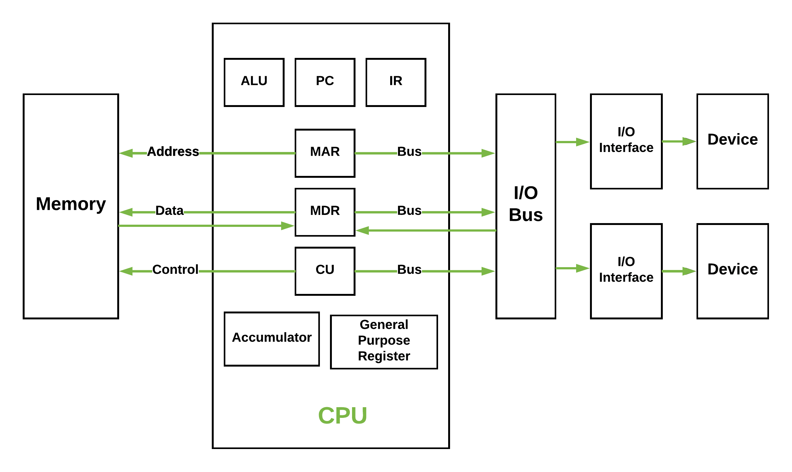

## CISC 複雜指令集架構

x86 架構的最大特色就是採用 CISC \(Complex Instruction Set Computer\) 複雜指令集架構，而 CISC 架構的處理器微指令有兩大特點，一是**可變指令長度**，以及**單一指令的功能較複雜 \(完整\)**。

這兩個特點其實是一體兩面，因為單一指令就可以完成一個較複雜的功能，而每個功能的動作又不盡相同，所以在實作上功能較複雜的指令其長度就會比較長，而功能較簡單的指令其長度就會比較短。複雜功能的指令有一個好處，因為單一指令的功能較完整，所以可以不需要太多指令就能完成一個程式，因此體來看程式的長度會比較短。

這樣的特點主導了 CISC 指令集架構的特性，而這必須從處理器地的運作方式談起。簡單來說，處理器的運作流程是: **1. 讀入指令、2. 將指令解碼、3. 依據解碼的結果執行動作，如此循環下去。**

其中的重點就是指令解碼，解碼將指令分解成一個個基本的處理器動作 \(譬如存取暫存器\)，由於指令的長度不一，因此每個指令的解碼後所得到的動作個數不一，這樣會使得指令執行的時間較難估計，這部分跟編譯器的設計與程式的最佳化很有關係。

x86 開始發展的時期，處理器的微指令都是屬於複雜指令集 \(CISC\) 類型的。因為當時的高階語言與編譯技術較不成熟，程式大多以低階語言來完成，所以為了減少程式開發的複雜度，遂開發出功能完整的指令，也就是說，程式設計師僅需用一行指令，就能令處理器完成一個完整但複雜的動作。複雜指令集的一大特色就是，程式相對較短，程式設計師的負擔較小。

因為要實做很多功能完整的動作，使得複雜指令集處理器的設計變得很複雜，晶片越複雜，相對地消耗的功率越大，而且因為指令的長短不一，所以難以進行最佳化。而且後來的統計研究發現，一個程式中大部分的程式往往僅使用到一少部分的指令集，也就是說指令集中大部分的指令僅僅佔程式的一小部分，甚至沒被用到。所以後來就有了開發精簡指令集電腦 \(RISC\) 的概念出現。

處理器指令集的發展有其歷史淵源，因為高階語言與編譯器的不成熟，使得指令集複雜化；而因為後來高階語言與編譯器的進步，精簡指令集\(RISC\) 的電腦架購才得以發展。相對於複雜指令集電腦 \(CISC\)，精簡指令集電腦採用截然不同的理念來設計，他固定指令的長度，所以只實作較少較簡易的指令，也因此處理器的複雜度較低，容易提高時脈，耗能也較低。還有因為指令的長度固定，所以容易進行最佳化。但是由於指令集較少功能又簡單，所以相對的程式的開發較複雜，程式碼也跟者膨脹。

CISC 與 RISC 指令集架構各有所長，一者著重在降低程式的複雜度，另一者致力於處理器最佳化。雖然後來 x86 的 CISC 架構曾被批評效率不如 RISC 架構，但是因為 x86 受到 IBM PC 所採用，而且是採開放式的架構，所以反而更加普及。


## CPU匯流排\(bus\)

匯流排是數位訊號快速移動資料的途徑。與處理器相關的內部匯流排有三種：資料匯流排\(data bus\)、地址匯流排 \(address bus\)和控制匯流排 \(control bus\)。這三者共同構成了 "系統匯流排"。

一個CPU，聯絡外部的資料匯流排與地址匯流排，可能有不同的寬度。如8086的地址匯流排寬度為20-bit，但資料匯流排為16-bit。

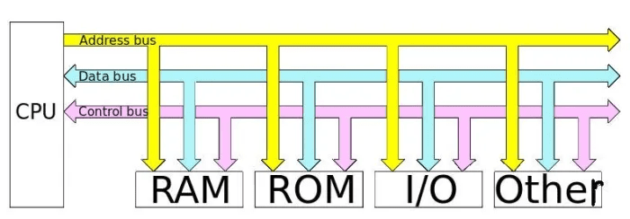

* 地址匯流排: 每條排線代表0或1位元，與控制訊號配合負責傳送位址，為一種CPU對記憶體單向輸出的排線，位址匯流排可決定主記憶體的最大記憶體容量。
  * 例如︰如果地址匯流排有N條排線（N位元），則主記憶體最大可定址到2^N 個記憶體位址，因為記憶體位址的基本單位為一個位元組（Byte），所以最大可有2^N 位元組的記憶體空間，如果有一台電腦的位址匯流排有32條線，則其記憶體的定址空間最大為2^32 位元組，也就是4GB。
  * 資料在儲存器中的物理位置由地址匯流排承載。內部的硬體元件，從地址匯流排接收到地址並即將接收資料後，使緩衝器允許訊號流入或從地址匯流排指定的位置流出。
  * **地址線的訊號均由處理器發出，故為單向性流動，因此只能由處理器指定記憶體位址，無法逆向由記憶體來指定處理器位址**。


* 資料匯流排：負責資料傳送於計算機單元之間，是**雙向傳輸的匯流排**。一般而言，資料匯流排線有幾位元可以決定一台電腦是幾位元的系統。
  * 即電腦的資料匯流排如有32條，則稱此電腦為32位元的電腦，這是因為資料匯流排的傳輸位元數與CPU一次能處理的位元數通常是相等的。
  * 資料匯流排的寬度反映了一次可以處理和傳送的最大資料量。 64位處理器的資料匯流排為64位，一次可以通訊64位資料，資料是讀還是寫由控制匯流排決定。


* 控制匯流排：負責傳送CPU執行指令時所發出之控制訊號，為一種CPU對其他單元單向輸出的排線，由控制單元傳送控制訊號給其他單元。

## 區段記憶體管理

8088有20條地址線，可定位2\*\*20=1M記憶體空間。而暫存器均為16-bit的寬度，因此必須使用CS與IP兩個暫存器才能正確定址。

定址方式為 CS暫存器之值 \* 16 + IP暫存器之值。暫存器之值乘以16可改寫為左移4-bit。

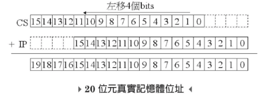

如果CS與IP中之值均以16進位表示時，則左移4-bit等於左移1個16位元的符號。如`1011h << 4 = 10110h`。 

## 暫存器\(register\)

暫存器位於CPU中，是一種可以快速存取的儲存空間，幫助CPU執行算術、邏輯或轉移計算，並儲存處理過程中的資料。

CPU是一個簡單的訊息處理單元，只看的懂本身的控制指令和暫存器中的內容。簡單的說，只要學會用使用CPU本身的指令和暫存器，即可以操作CPU能夠做到的所有動作。

如運算式「1+2+4」，CPU會先處理1+2的運算，將結果3放在暫存器中，再從暫存器中結果3與運算式中的4相加得到7，再將結果放到暫存器中。

* BIU中有5個暫存器：區段暫存器CS、DS、SS、ES與指位暫存器IP。
* EU有9個暫存器：AX、BX、CX、DX、SP、BP、SI、DI、FLAG。

因此8088中有14個暫存器，依功能可分為4大類如下：

| 類別 | 暫存器 |
| :--- | :--- |
| 一般暫存器 \(general purpose\) | AX、BX、CX、DX |
| 區段暫存器 \(segment\) | CS、DS、SS、ES |
| 指位暫存器 \(index\) | IP、SP、BP、SI、DI |
| 旗標暫存器 | FLAG |

## 一般暫存器 \(general purpose register\)

一般暫存器是用來暫時存放資料用，但在特殊的情況\(指令\)下，會有特定的用途和功能。

每一個一般暫存器都是16位元所構成，而每一個暫存器還可以再分兩個8位元暫存器來使用。如AX暫存器的8個高位元為AH暫存器，8個低位元為AL暫存器。

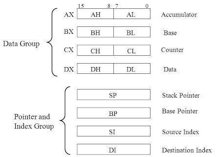

### AX \(accumulator\)暫存器

AX一般是用來做為存器運算結果的暫存器，也常用來做為對外資料傳輸的中繼站。

### BX\(base\)暫存器

BX為基底暫存器，一般做為定址法中的基底使用。因為8086處理器中，有20條地址線\(20-bit\)，但暫存器只有16-bit，因此需要兩個暫存器\(base+offset\)才能定位一個記憶體地址。

```erlang
MOV AX, INDEX[BX]  ;將記憶體[BX]+INDEX所存放的資料搬到AX暫存器中
```

### CX\(count\)暫存器

計數暫存器，一般做為迴圈或字串處理計數使用。

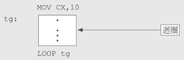

上圖中，首先CX的初始值為10，而在tg區塊內的程式，每經過LOOP tg後，CX之值會減去特定值\(通常是-1\)，重複執行到CX內的值為0為止。

### DX\(data\)暫存器

資料暫存器一般是資料存放或存放I/O地址所用。也可和AX暫存器配合，用作字組資料的乘法和除法使用。

```erlang
; 將 DX:AX =00100000h視為被除數
; CX為除數，商放在AX中，餘數放在DX中。
; 00100000h/0100h = 1000h + 0000h
MOV AX, 0000h
MOV DX, 0010h
MOV CX, 0100h
DIV CX
```

## 區段暫存器 \(segment register\)

每一個區段最大長度是64KB\(2\*\*16，因為暫存器長度為16-bit\)，而8088有20條地址線，可定址到1MB的記憶體。

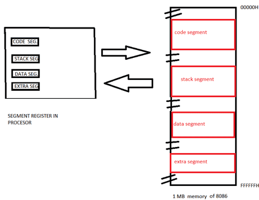

一般組合語言被組譯成機器語言時，各區段的地址分別用CS、DS、SS、ES來代表，而一個程式至少要有CS和DS兩個部份。

```c
#include <stdio.h>

int main(){
  int a = 0, b = 1, c;
  c = a + b;
  printf("%d\n", c);
  return 0;
}
```

上面程式中，`a=0`與 `b=1`是資料常數，會存在資料段中，而`printf`為被執行的指令，會放在程式段中。

### 指位暫存器\(index register\)

依定址功能，可將指位暫存器再分為二大類：

| 類別 | 暫存器 | 說明 |
| :--- | :--- | :--- |
| 指標暫存器 | IP、SP、BP | 與區段暫存器配合，可指定至所屬的區段地址上。 |
| 索引暫存器 | SI、DI | 與區段暫存器配合，用來指定字串資料上的地址。 |

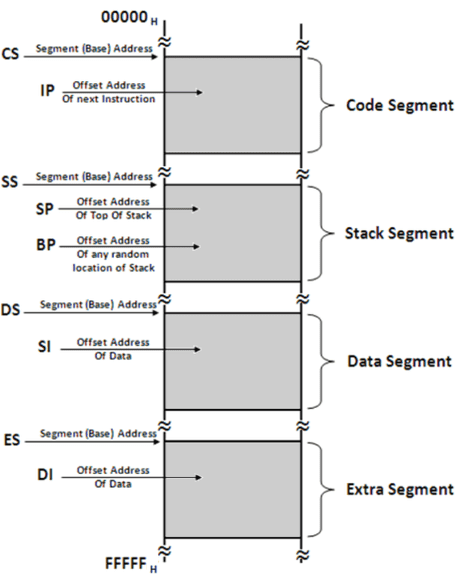

### IP \(instruction pointer\)

IP與CS暫存器是配對使用的，CS暫存器用於儲存程式段的記憶體地址，而IP暫存器用來指出下一個執行指令的地址。

* 下一個指令的地址：`CS*16+IP`
* CS乘以16之值，可以CS之值左移4-bit得到。

### SI \(source index\)

主要在字串使用，當作來源字串的索引指位。

### DI \(destination index\)

也是在字串運算中使用，當作目的字串的索引指位。

## 堆疊 \(stack\)

CPU中的暫存器數量有限，不可能將所有使用的資料都放在暫存器中，有些資料必須放在記憶體中，這些資料就放在堆疊中。堆疊的容量最大為64KB。堆疊功能整理如下：

* 儲存少量的資料
* 保存暫存器的環境
* 傳遞函數的參數

8088 CPU 透過 SS 和 SP暫存器實現堆疊的機制，SS + SP 會指向堆疊的頂部，加入元素時將`SS - 2`、取出元素時將`SS + 2`，堆疊的操作是以WORD為單位 \(2 bytes\)，不能像 MOV 一樣操作位元組，所以加入和取出是以 2 個位元組為單位。

為什麼加入元素是用減而不是用加，因為組合語言棧的方向和我們習慣的陣列相反，陣列索引由 0 開始向後遞增，而堆疊是由記憶體高位開始向低位遞減，所以加入元素才會用減的。

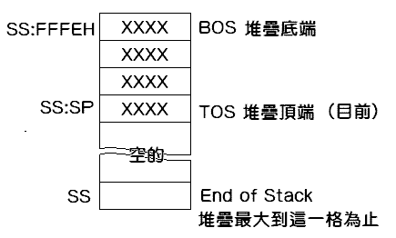

### SS \(stack segment\)

SS用於指定堆疊區段的起始地址。

### SP \(stack pointer\)

SP指向堆疊段的頂部。與DS段中的IP功能近似。

### BP \(base pointer\)

BP可指向堆疊段的任意地址，而SP只能指向堆疊端的頂部。

```c
MOV AX, 1234    ; AX=1234
MOV BX, 5678    ; BX=5678
PUSH AX         ; 先將 SP -= 2, 再將資料入堆疊
PUSH BX         ; 先將 SP -= 2, 再將資料入堆疊
POP BX          ; 先將元素取出 BX=5678, 再將 SP+=2, 
POP AX          ; 先將元素取出 AX=1234, 再將 SP+=2
```

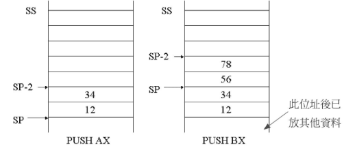

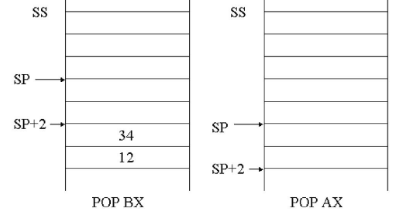

## 旗標暫存器 \(flag register\)

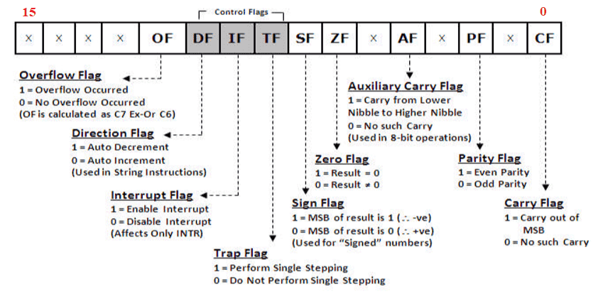

旗標暫存器是一個16-bit的暫存器，每一個位元都是單獨使用。

* 第0、2、4、6、7、11為狀態位元 \(6 status flags\)。
* 第8、9、10位元是控制用位元 \(3 control flags\)。
* 剩下的位元不使用。

### CF \(carry flag\)

進位旗標。在運算的過程中，當最高位元\(MSB\)發生進位或借位時，此旗標值設為1，否則為0。

```c
; 1111+1001 = 11000
MOV AX, 1111
MOV BX, 1101
ADD AX, BX    ;AX=1000, MSB進位, 所以CF=1
```

### PF \(parity flag\)

同位旗標，當運算的結果有偶數個1時，PF為1，否則為0。

上例中，因為ADD後有偶數個1，所以PF=1。

### AF \(auxiliary carry flag\)

輔助進位旗標。在運算的過程中，如果第3位元與第4位元有進位或借位時，AF=1，否則為0。

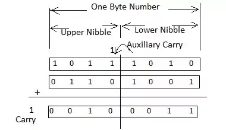

### ZF \(zero flag\)

零值旗標。如果運算結果為0時，ZF=1，否則為0。

### SF \(sign flag\)

符號旗標。若為正負數運算，結果為負數時，SF=1，如果為正數時，SF=0。換句話說，SF之值等於結果值的最高位元\(MSB\)。

### TF\(trap flag\)

單步旗標。當程式設定TF=1時，CPU會進入單步執行的狀態，即CPU會在執行完一個指令後，便進入中斷的狀態，方便設計師除錯。

### IF \(interrupt flag\)

中斷旗標。當IF=1時，CPU可以接受中斷的指令。當IF=0時，CPU不接受任何中斷指令。

### DF \(direction flag\)

方向旗標。當DF=0時，字串處理指令會從低位址往高位址的方向順序來處理字串。當DF=1時，字串處理指令會從高位址往低位地方向處理字串。

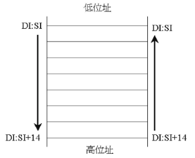

### OF \(overflow flag\)

溢位旗標。當運算結果數太大，超過CPU可接受的範圍時，稱之為溢位，此時OF=1，否則OF=0。


