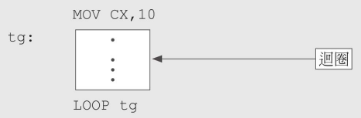

# x86 CPU簡介

## x86 CPU發展歷程

### 1971年：4004

Intel推出了微處理器4004，這是第一台用於計算機的4位元處理器。

### 1978年：i8086

Intel推出了16位元的微處理器i8086。

### 1979年：8088

Intel推出了16位元的微處理器8088。1981年8088晶片首次用於IBM PC上。PC\(個人電腦\)的概念開始發展。

### 1982年：80286

Intel推出了16位元的微處理器80286。為提升速度\(6MHz-&gt;20MHz\)的升級版。

### 1985年：80386

Intel推出了32位元的微處理器80386。頻率提升至20MHz、25MHz、33MHz。除了標準型的80386外，也推出了不同市場和應用考量的80386DX、80386SX、80386SL、80386DL。

### 1989年：80486

Intel推出了32位元的微處理器80486。此晶片有120萬個電晶體，速度提升至33MHz、50MHz。且結合了80387數學輔助計算器和8KB的快取記憶體。

### 1993年：Pentium

Pentium處理器有相當大的改良，有330萬個電晶體。在1995年推出了更快的Pentium Pro處理器。

### 1996年：Pentium MMX

MMX\(Mathematic Matrix eXtension\)是Intel發明的多媒體增強指令集技術。在Intel發表該處理器幾個月後，AMD公司也推出了K6處理器。

### 1997年：Pentium2

Pentium2與Pentium pro採用了相同的核心結構，加快了區段暫存器處理的速度和增加MMX指令集且使用了0.28 um的製程。此外，Intel還推出了工作站用的Xeon系列處理器。

1998年AMD推出了K6-2處理器，且開發了出3DNow指令集以對抗MMX指令集。

### 1998年：Celeron

Intel將資源放在Pentium2高階處理器，而AMD和Cyrix搶佔了低階處理器的市場。因此Intel發展了Celeron處理器進入低階處理器市場。

### 1999年：Pentium3

此處理器最大特點是多了SSE\(Streaming SIMD Extensions\)指令集，此指令集在MMX基礎上加了70條新指令，以及增強三維和浮點數計算的應用，且相同所有MMX程式。

AMD公司推出了K6-3處理器，有三層快取憶體結構\(L1、L2在CPU，L3在主機板\)，且支援增強型的3DNow指令集。之後AMD又推出了代號K7的Athlon處理器，為RISC核心，可在一個時脈周期\(clock\)同時執行三條浮點指令，且每一個浮點單元都有一個獨立的管道。

### 2000年：Pentium4

Pentium4採用了全新的設計，包括了400MHz的前端匯流排\(100x4\)、SSE2指令集、256K~512KB的L2快取記憶體、全新的超管線計術、以及NetBurst核心架構。

AMD在同期推出了第二個Athlon核心，thunderbird，改進了製程與針腳為socket A，L2快取改為256KB。

## 微電腦內部結構

在8088晶片中，功能可分為兩大處理單元：

* 匯流排介面單元 \(BIU, Bus Interface Unit\)：從記憶體特定地址讀取指令或將資料放入指令佇列。
* 執行單元 \(EU, Execution unit\)：到指令佇列中讀取內容，如果為指令的話，EU會執行之。

BIU與EU的內部包含著一些特殊記憶體供微處理器暫存資料用，稱為暫存器\(register\)，其計算過程如下。


## 暫存器\(register\)

暫存器位於CPU中，是一種可以快速存取的儲存空間，幫助CPU執行算術、邏輯或轉移計算，並儲存處理過程中的資料。

CPU是一個簡單的訊息處理單元，只看的懂本身的控制指令和暫存器中的內容。簡單的說，只要學會用使用CPU本身的指令和暫存器，即可以操作CPU能夠做到的所有動作。

如運算式「1+2+4」，CPU會先處理1+2的運算，將結果3放在暫存器中，再從暫存器中結果3與運算式中的4相加得到7，再將結果放到暫存器中。

* BIU中有5個暫存器：區段暫存器CS、DS、SS、ES與指位暫存器IP。
* EU有9個暫存器：AX、BX、CX、DX、SP、BP、SI、DI、FLAG。

因此8088中有14個暫存器，依功能可分為4大類如下：

| 類別 | 暫存器 |
| :--- | :--- |
| 一般暫存器 \(general purpose\) | AX、BX、CX、DX |
| 區段暫存器 \(segment\) | CS、DS、SS、ES |
| 指位暫存器 \(index\) | IP、SP、BP、SI、DI |
| 旗標暫存器 | FLAG |

## 一般暫存器

一般暫存器是用來暫時存放資料用，但在特殊的情況\(指令\)下，會有特定的用途和功能。

每一個一般暫存器都是16位元所構成，而每一個暫存器還可以再分兩個8位元暫存器來使用。如AX暫存器的8個高位元為AH暫存器，8個低位元為AL暫存器。


### AX \(accumulator\)暫存器

AX一般是用來做為存器運算結果的暫存器，也常用來做為對外資料傳輸的中繼站。

### BX\(base\)暫存器

BX為基底暫存器，一般做為定址法中的基底使用。因為8086處理器中，有20條地址線\(20-bit\)，但暫存器只有16-bit，因此需要兩個暫存器\(base+offset\)才能定位一個記憶體地址。

```erlang
MOV AX, INDEX[BX]  #將記憶體[BX]+INDEX所存放的資料搬到AX暫存器中
```

### CX\(count\)暫存器

計數暫存器，一般做為迴圈或字串處理計數使用。



上圖中，首先CX的初始值為10，而在tg區塊內的程式，每經過LOOP tg後，CX之值會減1，重複執行到CX內的值為0為止。


