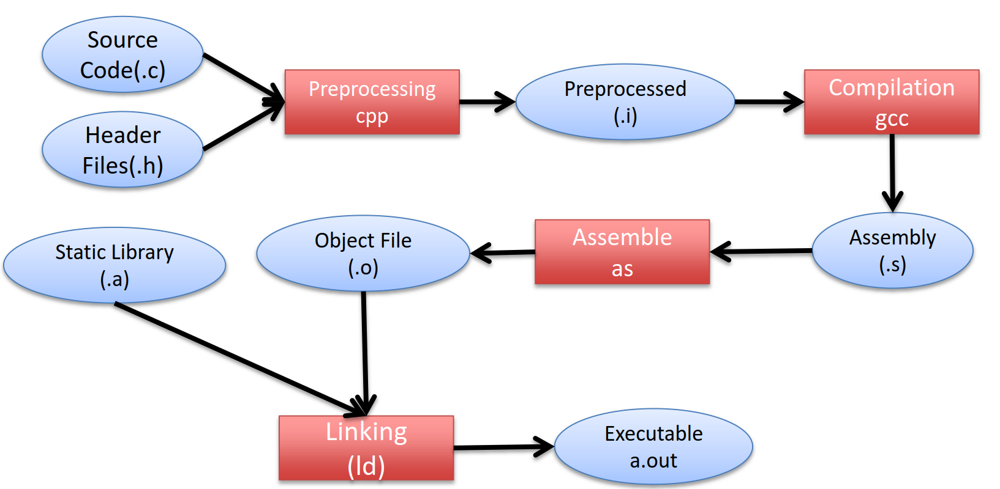
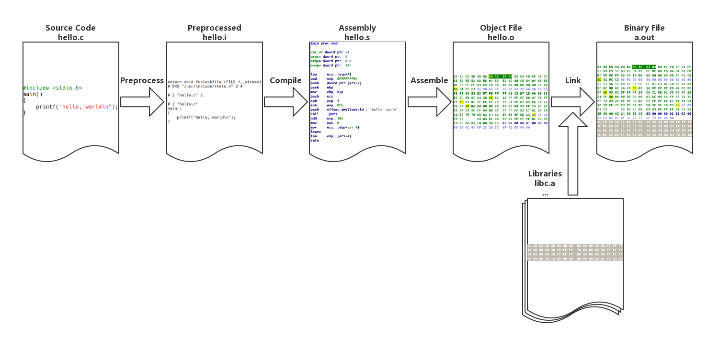

# GCC

C語言編譯可分為4個步驟：

* 前置處理\(pre-processing\)
* 編譯\(compilation\)
* 組譯\(assembly\)
* 連結\(linking\)






## 前置處理\(preprocessing\)

預編譯過程主要處理原始碼中以 “\#” 開始的預編譯指令：

* 將所有的 “\#define” 刪除，並且展開所有的巨集定義。
* 處理所有條件預編譯指令，如 “\#if”、“\#ifdef”、“\#elif”、“\#else”、“\#endif”。
* 處理 “\#include” 預編譯指令，將被包含的檔案插入到該預編譯指令的位置。注意，該過程遞迴執行。
* 刪除所有註釋。
* 新增行號和檔名標號。
* 保留所有的 \#pragma 編譯器指令。

```text
gcc -E hello.c -o hello.i
```

前處理後的結果如下：

```c
# 1 "hello.c"
# 1 "<built-in>"
# 1 "<command-line>"
  ......
  extern int printf(const char * __restrict __format, ...);
......
main() {
  printf("hello, world\n");
}
```

## 編譯\(compilation\)

將高階語言轉換成組合語言。編譯過程就是把預處理完的檔案進行一系列詞法分析、語法分析、語義分析及優化後生成相應的組合語言程式碼檔案。

```text
gcc -S hello.c -o hello.s
```

得到的結果如下：

```c
	.file	"hello.c"
	.text
	.section	.rodata
.LC0:
	.string	"hello world"
	.text
	.globl	main
	.type	main, @function
main:
.LFB0:
	.cfi_startproc
	endbr64
	pushq	%rbp
	.cfi_def_cfa_offset 16
	.cfi_offset 6, -16
	movq	%rsp, %rbp
	.cfi_def_cfa_register 6
	leaq	.LC0(%rip), %rdi
	call	puts@PLT
	movl	$0, %eax
	popq	%rbp
	.cfi_def_cfa 7, 8
	ret
	.cfi_endproc
.LFE0:
	.size	main, .-main
	.ident	"GCC: (Ubuntu 8.4.0-3ubuntu2) 8.4.0"
	.section	.note.GNU-stack,"",@progbits
	.section	.note.gnu.property,"a"
	.align 8
	.long	 1f - 0f
	.long	 4f - 1f
	.long	 5
0:
	.string	 "GNU"
1:
	.align 8
	.long	 0xc0000002
	.long	 3f - 2f
2:
	.long	 0x3
3:
	.align 8
4:
```

## 組譯\(assembly\)

將組合語言轉換成目的檔\(objective file\)或可執行檔 \(executable file\)。

```text
gcc -c hello.s -o hello.o
或
gcc -c helloc -o hello.o
```

會將原始碼轉換為機器碼，必須使用`objdump -sd`轉換成可讀的內容分析。-s：顯示所有sections的資訊。 -d：反組譯成指令。

```css
objdump -sd hello.o
hello.o:     file format elf64-x86-64

Contents of section .text:
 0000 f30f1efa 554889e5 488d3d00 000000e8  ....UH..H.=.....
 0010 00000000 b8000000 005dc3             .........].
Contents of section .rodata:
 0000 68656c6c 6f20776f 726c6400           hello world.
Contents of section .comment:
 0000 00474343 3a202855 62756e74 7520382e  .GCC: (Ubuntu 8.
 0010 342e302d 33756275 6e747532 2920382e  4.0-3ubuntu2) 8.
 0020 342e3000                             4.0.
Contents of section .note.gnu.property:
 0000 04000000 10000000 05000000 474e5500  ............GNU.
 0010 020000c0 04000000 03000000 00000000  ................
Contents of section .eh_frame:
 0000 14000000 00000000 017a5200 01781001  .........zR..x..
 0010 1b0c0708 90010000 1c000000 1c000000  ................
 0020 00000000 1b000000 00450e10 8602430d  .........E....C.
 0030 06520c07 08000000                    .R......
 
 Disassembly of section .text:

0000000000000000 <main>:
   0:   f3 0f 1e fa             endbr64
   4:   55                      push   %rbp
   5:   48 89 e5                mov    %rsp,%rbp
   8:   48 8d 3d 00 00 00 00    lea    0x0(%rip),%rdi        # f <main+0xf>
   f:   e8 00 00 00 00          callq  14 <main+0x14>
  14:   b8 00 00 00 00          mov    $0x0,%eax
  19:   5d                      pop    %rbp
  1a:   c3                      retq
```

## 連結\(linking\)

將多個目的檔結合形成可執行檔。

目的檔案需要連結一大堆檔案才能得到最終的可執行檔案（範例只展示了連結後的 main 函式，可以和 hello.o 中的 main 函式作對比）。連結過程主要包括地址和空間分配（Address and Storage Allocation）、符號決議（Symbol Resolution）和重定向（Relocation）等。

```css
gcc hello.o -o hello
```

```css
$ objdump -d -j .text hello
...
0000000000001149 <main>:
    1149:       f3 0f 1e fa             endbr64
    114d:       55                      push   %rbp
    114e:       48 89 e5                mov    %rsp,%rbp
    1151:       48 8d 3d ac 0e 00 00    lea    0xeac(%rip),%rdi        # 2004 <_IO_stdin_used+0x4>
    1158:       e8 f3 fe ff ff          callq  1050 <puts@plt>
    115d:       b8 00 00 00 00          mov    $0x0,%eax
    1162:       5d                      pop    %rbp
    1163:       c3                      retq
    1164:       66 2e 0f 1f 84 00 00    nopw   %cs:0x0(%rax,%rax,1)
    116b:       00 00 00
    116e:       66 90                   xchg   %ax,%ax
...
```

## gcc編譯技巧

通常在編譯後只會生成一個可執行檔案，而中間過程生成的 .i、.s、.o 檔案都不會被儲存。我們可以使用引數 `-save-temps` 永久儲存這些臨時的中間檔案。

```css
$ gcc -save-temps hello.c
$ ls
a.out hello.c  hello.i  hello.o  hello.s
```

gcc 預設使用動態連結，所以這裡生成的 a.out 實際上是共享目標檔案。靜態連結要加上`--static`引數。

```css
$file a.out
a.out: ELF 64-bit LSB shared object, x86-64, version 1 (SYSV), dynamically linked, interpreter /lib64/ld-linux-x86-64.so.2, BuildID[sha1]=59b12d2b61718335b179997b3d5c31ea7228026b, for GNU/Linux 3.2.0, not stripped
```

使用引數 `--verbose` 可以輸出 gcc 詳細的工作流程。

```css
$gcc hello.c -static --verbose
```

輸出的訊息很多，我們主要關注3個指令的資訊，`cc1`、`as`、`collect2`：

```css
 /usr/lib/gcc/x86_64-linux-gnu/8/cc1 -quiet -v -imultiarch x86_64-linux-gnu hello.c -quiet -dumpbase hello.c -mtune=generic -march=x
86-64 -auxbase hello -version -fasynchronous-unwind-tables -fstack-protector-strong -Wformat -Wformat-security -fstack-clash-protect
ion -fcf-protection -o /tmp/ccBDq9oH.s

as -v --64 -o /tmp/cchPfD2H.o /tmp/ccBDq9oH.s

 /usr/lib/gcc/x86_64-linux-gnu/8/collect2 -plugin /usr/lib/gcc/x86_64-linux-gnu/8/liblto_plugin.so -plugin-opt=/usr/lib/gcc/x86_64-l
inux-gnu/8/lto-wrapper -plugin-opt=-fresolution=/tmp/ccoSjkYJ.res -plugin-opt=-pass-through=-lgcc -plugin-opt=-pass-through=-lgcc_eh
 -plugin-opt=-pass-through=-lc --build-id -m elf_x86_64 --hash-style=gnu --as-needed -static -z relro /usr/lib/gcc/x86_64-linux-gnu/
8/../../../x86_64-linux-gnu/crt1.o /usr/lib/gcc/x86_64-linux-gnu/8/../../../x86_64-linux-gnu/crti.o /usr/lib/gcc/x86_64-linux-gnu/8/
crtbeginT.o -L/usr/lib/gcc/x86_64-linux-gnu/8 -L/usr/lib/gcc/x86_64-linux-gnu/8/../../../x86_64-linux-gnu -L/usr/lib/gcc/x86_64-linu
x-gnu/8/../../../../lib -L/lib/x86_64-linux-gnu -L/lib/../lib -L/usr/lib/x86_64-linux-gnu -L/usr/lib/../lib -L/usr/lib/gcc/x86_64-li
nux-gnu/8/../../.. /tmp/cchPfD2H.o --start-group -lgcc -lgcc_eh -lc --end-group /usr/lib/gcc/x86_64-linux-gnu/8/crtend.o /usr/lib/gc
c/x86_64-linux-gnu/8/../../../x86_64-linux-gnu/crtn.o
```

* cc1 是 gcc 的編譯器，將 .c 檔案編譯為 .s 檔案
* as 是彙編器命令，將 .s 檔案彙編成 .o 檔案。
* collect2 是連結器命令，它是對命令 ld 的封裝。靜態連結時，gcc 將 C 語言執行時庫的 5 個重要目標檔案 crt1.o、crti.o、crtbeginT.o、crtend.o、crtn.o 和 -lgcc、-lgcc\_eh、-lc 表示的 3 個靜態庫連結到可執行檔案中。

