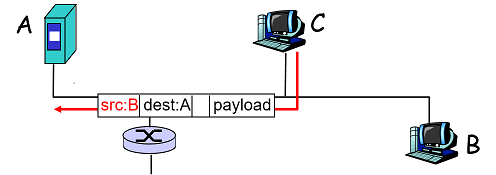
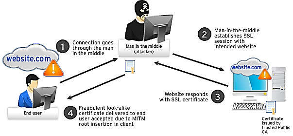

# 網路安全簡介

## 朋友與敵人

網路安全的普遍情形。Bob, Alice (lovers!) 想要”安全地”交談。而入侵者Trudy可能想介入或者對訊息作增減。

* 秘密(Secrecy)： 只有傳送者(sender)以及預期接收者(intended receiver)可知道訊息內容。
  * 傳送者對訊息加密
  * 接收者對訊息解密
* 認證(Authentication)： 傳送者和接收者欲確認彼此的特性(identity) 。
* 訊息完整性(Message Integrity)：傳送者和接收者欲確保訊息(在傳送或轉送中)不會被更改而沒有察覺。

## 網路安全常見的威脅

### 封包竊聽(Packet sniffing)

通常是廣播媒體或
錯綜複雜的網路介面卡（NIC） 讀取所有經過的封包。
可以讀取所有未加密的資料 (例如： 密碼)。
例如： C 竊聽 B的封包。

### 假冒IP(IP Spoofing)

可以直接從應用層產生造假的IP 封包，並塞入任意值到IP來源位址的欄位中。接收端無法判斷來源是否有欺騙的行為。例如: C 假裝成 B。

### 拒絕提供服務 （Denial of Service）(DOS)

惡意地產生大量的封包會讓接收端有掛點的現象。分散式的 DOS (DDOS): 多方來源使接收端掛點。
例如： C 和遠端終端機同步地攻擊 A。

### 中間人攻擊(man-in-the-middle)

## 密碼學

* 對稱金鑰(symmetric key) crypto： 傳送端和接收端使用相同的金鑰。
  * 替代祕文(substitution cipher): 由另一文字替代原本文字
  * DES: 資料加密標準(Data Encryption Standard)
    * 每一筆資料使用三個連續的（循序的）金鑰。
    *   使用密碼區塊鍊鎖。

* 公開金鑰(public-key) crypto: 使用公開金鑰加密，私人金鑰解密。
  * RSA (Rivest, Shamir, Adelson) algorithm

