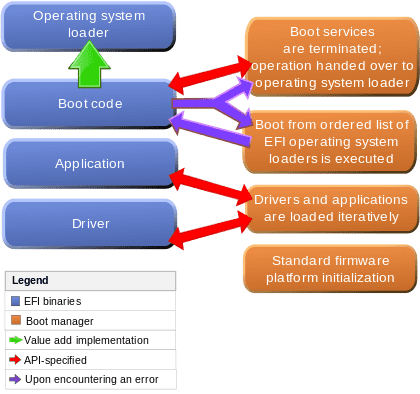
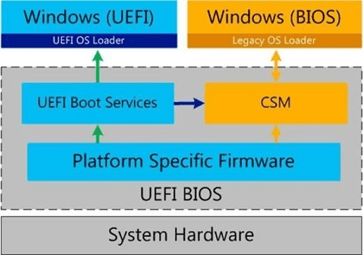

# UEFI

## 簡介

UEFI\(Unified Extensible Firmware Interface\)， 是一種詳細描述類型介面的標准。這種介面用於作業系統自動從預啟動的操作環境，加載到一種作業系統上。EFI \(Extensible Firmware Interface）是 Intel 為 PC 韌體的體系結構、介面和服務提出的建議標准。其主要目的是為了提供一組在 OS 加載之前（啟動前）在所有平台上一致的、正確指定的啟動服務，被看做是有近20多年歷史的 BIOS 的繼任者。 UEFI是由EFI1.10為基礎發展起來的，它的所有者已不再是Intel，而是一個稱作Unified EFI Form的國際組織。

BIOS產業是科技和人力密集型企業。BIOS對熟練工程師需求相當大，因為BIOS對硬體的改變相當敏感，硬體小變需要小改，大變需要大改。

我們的計算機系統可以粗粗看作由三部分組成，分別是硬體、BIOS韌體和作業系統。一般的作業系統可以在所有的電腦上運行，這是因為BIOS抽象了硬體的不同，向上提供了統一的介面，這個介面就是UEFI標準。如此Windows和Linux可以用UEFI標準定義的介面統一個別硬體的差異，而不需要為每個硬體改變做出修改，開發出來的系統，賣一套和賣一億套成本差異很小，擴展性極大，也就是Scale Out能力很大。

BIOS和硬體的操作介面是硬體暫存器，BIOS工程師需要根據各種規範、原理圖和功能需求，填寫暫存器，最後抽象後向上匯報符合UEFI標准統一介面。而各個硬體的暫存器沒有標准，且同廠商的硬體下一代會修修結構，於是BIOS也要不停的修改，只為了讓操作系統保持優雅，可以說BIOS做了產業鏈裡面最累的事。

現在作業系統和BIOS之間的介面已經標准化，但BIOS和硬體介面卻遠遠沒有標准化，能不能把暫存器標准化？因為各種CPU硬體設計的巨大差異，暫存器的標准化似乎不太現實。

* UEFI：簡單來說就是改良版的BIOS，但UEFI不能稱為BIOS，在新的主機板看到圖形化介面，以及可以用滑鼠鍵盤操作的”BIOS”畫面，就是UEFI介面。很多人混淆的一點，沒有’UEFI BIOS’。不過為了方便說明與避免混淆，仍會習慣使用”BIOS”代稱，但請不要認為UEFI是某種BIOS。

* .Boot:開機：硬碟剛買來時，硬碟裡面完全都是空的，也就是你不安裝作業系統的話，是沒辦法開機進去操作的。那如果你有兩顆硬碟時，在BIOS裡面，就可以選擇，我要從哪顆硬碟去啟動作業系統，即是所謂的開機選項，Boot Menu。
* 而如果想要UEFI啟動，就必須以UEFI模式安裝UEFI作業系統，但UEFI的開機選項不只有裝置順序，還有系統本身。

BIOS樣式的韌體只在IBM PC相容電腦上找的到。UEFI意味著更通用、更高效、更快速，並且可以在不屬於“IBM PC相容”類的系統上找到。

## CSM: Compatibility Support Module相容性支援模組

主機板改進到UEFI之後，那沒有支援UEFI的顯示卡，硬碟等等硬體怎麼辦呢?這時就需要CSM的出現，他是在UEFI淘汰掉BIOS中的過度功能，模擬傳統BIOS。

也就是說在UEFI架構下，透過CSM模擬BIOS來相容只支援BIOS開機的裝置。也稱為Legacy模式、LegacyMode、Legacy BIOS。所以如果要安裝純UEFI也就是將CSM給關閉\(Disable\)。如果你的電腦沒辦法關掉CSM，那就只能待在UEFI+CSM模式的半UEFI了。“CSM”有時會錯誤地將此功能稱為“禁用UEFI”，這在說法上是荒謬的。你無法“禁用”系統的韌體。

## Secure Boot 安全啟動

與UEFI不同。安全啟動的核心就是利用數字簽名來確認EFI驅動程序或者應用程序是否是受信任的。

“安全啟動”設計之初作用是防止惡意軟件侵入。事實上它能夠做到的僅僅是，當電腦啟動器被病毒修改之後，它會給出提醒並拒絕啟動，避免可能帶來的進一步損失。

Secure Boot要求原生UEFI環境，即不能開啟CSM，也就是開啟Secure Boot的系統不支援Legacy啟動及Legacy Option ROM。

## GOP與VBIOS

純UEFI介面\(無CSM模擬BIOS的UEFI\)，是由顯示卡\(或內顯\)的GOP來產生的。

而傳統BIOS就是用VBIOS產生的，所以，你的顯示卡如果較新，就會有GOP功能，才能以純UEFI啟動\(關掉CSM\)，那如果你是較舊的顯示卡，則會以CSM模擬BIOS再以顯示卡的VBIOS啟動。

## GPT與MBR

UEFI只能裝在GPT模式的硬碟。

GPT，一種新型磁盤模式，與我們常用的MBR磁盤相比更穩定，自糾錯能力更強，一塊磁盤上主分區數量不受限制，硬碟可支援到18ET，可分割128磁區\(128個C.D.E槽\)。


MBR，主引導記錄，一種磁盤分區模式。硬碟支援到2TB，最多可分個4個主要磁區\(4個C.D.E槽\)。當使用2TB以上硬碟請用GPT模式，否則MBR只認2TB內容，其他皆會浪費掉。

* BIOS+MBR：可重啟系統，所有系統可支援，不支援大於2T的硬盤。
* BIOS+GPT：不可重啟系統，可以做資料碟使用，不可引導系統。
* UEFI+MBR：可重啟系統，同BIOS+MBR 。
* UEFI+GPT：可重啟系統，可使用大於2T硬盤作為系統盤使用，僅64為系統可用。

## 純UEFI的限制

* 主機板為UEFI
* 顯示卡有支援GOP\(若VBIOS可靠後天刷成GOP\)
* 將CSM關閉
* 將作業系統以UEFI模式安裝
* Win7 64位元 或 Win8以後的作業系統
* 以USB安裝UEFI Windows必須是Fat32。exFat不行，NTFS可能不行。

