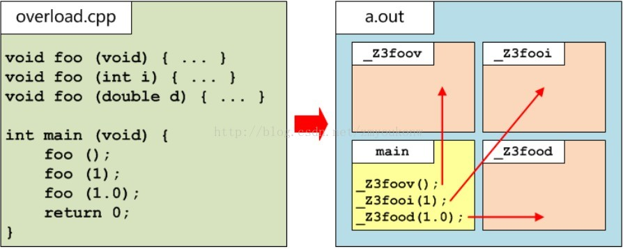
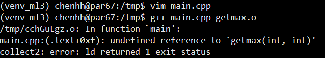

# 過載\(overloading\)

為了編譯一個函式呼叫，編譯器必須首先進行名稱查詢，對於函式來說，可能會涉及到依賴於引數的查詢，對於函式模板來說，可能會進行模板引數推導。如果這些步驟產生了多個候選函式，那麼就要進行過載解析，選擇實際呼叫的函式。

**一般情況下，引數與引數最匹配的候選函式就是被呼叫的函式**。
 如果一個函式不能通過過載解析來選擇（例如，它是一個約束失敗的模板實體），那麼它就不能被命名或以其他方式使用。

## 函式過載的條件

* 同一作用域
* 函式名稱相同
* 引數列表不同\(引數型別不同也視為相異，但如果只有回傳型別不同時無法分辦\)

三個條件缺一不可。

同一作用域與函式名稱相同很容易分辦，較難分辨的是引數列表不同。
 具體的引數列表不同表現在三個方面：

* 引數型別不一樣。
* 引數個數不一樣。
* 引數順序不一樣。

即函數的簽名必須不相同，才能夠多載。

在同一個名稱空間內，C++的函式簽名（function signature）包括：函式名、引數個數、引數型別、引數順序，但不包含回傳型別。

```cpp
int getmax(int x) {
  cout << "getmax(int)" << endl;
  return x;
}

int getmax(int x, int y) {
  // 與上一個函數類別個數不同
  // 注意y不可有預設值，否則無法和只有一個引數的同名函數分辨
  cout << "getmax(int,int)" << endl;
  return x > y ? x : y;
}

// int getmax(int x,int y=0){
//     // compile error
//     // 與第一個函數類別個數不同
//     // 注意y有預設值，與和只有一個引數的同名函數無法分辨
//     cout<<"getmax(int,int)"<<endl;
//     return x>y ? x : y;
// }

double getmax(int x, double y) {
  // 與上一個函數引數個數相同，但類別不同，可分辨
  cout << "getmax(int,double)" << endl;
  return x > y ? x : y;
}
double getmax(double x, int y) {
  // 與上一個函數引數個數相同，但類別順序不同，可分辨
  cout << "getmax(double,int)" << endl;
  return x > y ? x : y;
}

// int getmax(double x,int y ){
//     // compile error
//     // 與上一個函數引數相同，
//     // 只有return type不同，無法分辨
//     cout<<"getmax(double,int)"<<endl;
//     return x>y ? x: y;
// }
```

call by value與call by reference的函式簽名是相同的，無法重載

```cpp
// 兩函數的簽名相同，無法重載
int func(int x){
    cout<<"by value:"<<x<<endl;
    return x;
}

int func(int &x){
    cout<<"by reference:"<<x<<endl;
    return x;
}
```

## 過載的實作

過載實作的方式很簡單，就是編譯器會幫程式換名 \(name mangling\)，但每家編譯器換名的方式相異。

C++的編譯器會給每個函式名取不一樣的名字，同樣是foo函式，編譯器分別給他們取名叫做\_Z3foov\(\).\_Z3fooi,\_Z3food。實際上他們就是三個不一樣的函式了。



### 
換名帶來的問題

換名的問題一般發生在跨語法，跨編譯器上的。

在多檔案程式設計中，假設C語言實現了某一個函式功能，做成一個庫檔案（以 .o 檔案為例）供C++程式來呼叫這個函式。

```cpp
// 以C語言寫成
// gcc -getmax.c 生成getmax.o
#include  <stdio.h>

int getmax(int x, int y) {
  printf("getmax(int,int)\n");
  return x > y ? x : y;
}

// main.cpp
#include <iostream>
using namespace std;
int getmax(int x,int y);
int main(){
    getmax(1,2);
    return 0;
}
```

編譯器報錯如下，  C編寫的getmax函數，編譯器不會進行換名，它還叫做getmax。而在C++中我們宣告了getmax，但是C++編譯器將它換名為\_Z6getmaxii。

使用者在呼叫的時候，實際上是在呼叫\_Z6getmaxii，而這裡根本沒有\_Z6getmaxii的定義，只有getmax，所以編譯出錯了。



### 解決換名的問題: extern "C"

在c++的函式前加上 extern "C" 即可，c++編譯器就會像c編譯器那樣對待函式，不對它進行換名，也就從根本上杜絕了過載
。

```cpp
#include <iostream>

using namespace std;
extern "C" int getmax(int x, int y);
int main() {
  getmax(1, 2);
  return 0;
}
```


### 


## 

## 


