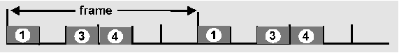
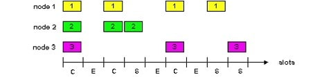

# 資料鏈結層\(data link layer\)

兩個實際相連的設備間
，如：host-router, router-router, host-host
。以訊框\(frame\)為資料的單位
。

此層的主要功能為：

* 把上層的datagram加頭加尾封裝成frame
* 定義媒介上的存取方式
* 使用實際位址 \(physical addresses\)，如網卡的MAC address。
* 實際連接兩點之間的可靠傳輸，如在傳送端和接收端的流量控制。
  * 錯誤偵測 \(Error Detection\) 
    ：訊號衰減和雜訊會造成錯誤發生
    。當接收端發現錯誤，會通知傳送端重送或是把訊框給丟掉
    。
  * 錯誤修正 
    ：由傳送端辨別並修正錯誤的位元，避免重送
    。
  * parity check, checksum

## 多重存取協定 \(multiple access protocol\)

單一共享頻道上有兩個或以上節點要同時存取資料
，但一次僅能容許一個節點存取 
。由分散式的協定來決定媒介的存取\(決定哪一個節點可以存取\)
。

多重存取協定可分為以下幾類：

* 分割頻道 \(Channel Partitioning\)
  * 把頻道分成許多小塊 \(例如.時間槽, 頻率\)
  * 分配小塊給節點使用
* 隨機存取 \(Random Access\)
  * 允許發生碰撞
  * 重點在發生碰撞後的處理動作
* 輪流
  \(polling\)

  * 嚴格地調節共享媒介的使用，以不發生碰撞為目的

### 頻道分割MAC協定: TDMA \(time division multiple access\)

* 每一個節點可以得到固定長度的slot\(長度 = 封包傳輸時間\)
* 沒用到的slot稱為idle 
* 範例: 6-station LAN, 1,3,4有封包, slots 2,5,6 idle 
* TDM \(Time Division Multiplexing\): 頻道分割成 N個時間槽, 每個節點使用一個

### 頻道分割MAC協定: FDMA\(frequency division multiple access\)

* 頻譜分割成幾個頻帶
  ，每一個節點使用固定的頻帶
  ，頻帶中可能有沒用到的傳輸時間
  。
* 範例: 6-station LAN, 1,3,4有封包, 頻帶2,5,6idle 。

### 頻道分割MAC協定：CDMA \(code division multiple access\)

* 指定唯一的code給每一個使用者，是為分割code set
  ，通常用在無線寬頻頻道 \(cellular, satellite\)
  。
* 所有的使用者分享一樣的頻率但是使用自己的code去編碼
  。
* encoded signal = \(original data\) X \(chipping sequence\)
* decoding: inner-product of encoded signal and chipping sequence
* 允許許多使用者同時傳送資料
  。

### Slotted ALOHA

時間分割成等長的slot
，節點在下一slot的開頭就傳送封包
，如果發生碰撞：以p的機率重送封包直到成功為止
。

