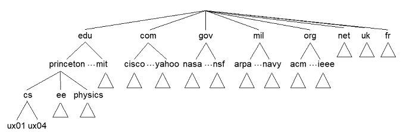
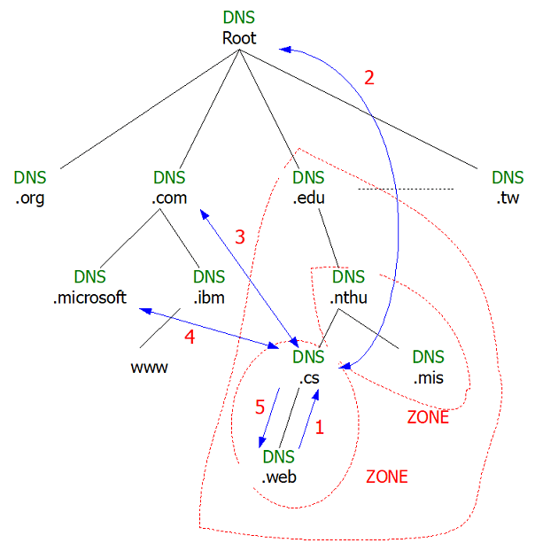

# DNS

## 為什麼我們要使用DNS \(domain name system\)?

* 可以幫助我們對應IP位址和主機名字\(hostname\)
  ，無須記憶IP位址，只需記憶名字。
* DNS是一個分散式的資料庫，將許多name servers變成階層式架構。
* DNS是屬於應用層的協定，Host, routers, name server透過溝通來達成解析名稱的目的\(address/name translation\)。

## 為什麼我們不採取集中式DNS？

* 如果單一DNS server壞了，會影響很大
* Traffic volume，一台server不可能處理全部的位址解析。
* Server所放置的位置過遠
* 維護不易

## DNS server分級

* 當地名稱伺服器\(Local name server\)：負責當地名稱解析，如解析不成，往上詢問root server。

* 根名稱伺服器\(Root name server\)：負責解析當地DNS無法解析之name。

* 認證名稱伺服器\(Authoritative name server\)：Host都會來此主機註冊，當root server亦無法解析名稱時，就會詢問authoritative name server。

## FQDN \(Fully Qualify Domain Name\)

一個將名稱與位址對應的機制，為的避免名稱重複以及做流量控制。一個DNS name = 一個FQDN，一個FQDN名稱可以對應到多個IP。

名稱解析的流程：Interactive Query

1. web往cs DNS主機查詢，找不到時往root DNS找。
2. cs DNS主機\(問: .com主機的IP\)往root DNS主機查詢\(答: .com DNS主機的IP\)。
3. cs DNS主機\(問: microsoft.com主機的IP\)往com DNS主機查詢\(答: microsoft.com DNS主機的IP\)。
4. cs DNS主機\(問：www.microsoft.com主機的IP\)往microsoft.com的DNS主機查詢\(問：www.microsoft.com主機的IP\)。取得名稱解析後的IP，會放在cs主機的快取中。
5. cs DNS主機回覆給web。

## ZONE

ZONE：是一個特殊單位。一個ZONE一定要有一個DNS來管，但是一個DNS可以管理許多的ZONE，而每一個ZONE都有一個ZONE File。

### ZONE File

### OA （Start-of-Authority）

Version Number（判斷新舊，但clock要相同）

Refresh timer（一個ZONE有兩個DNS Server, Secondary Server每隔一段時間去跟Master Server複製）

Entry timer

Expire time

TTL（問到機器的IP後可存放在catch中的時間。if TTL=0，多用於Proxy, DHCP）

## 

## 

