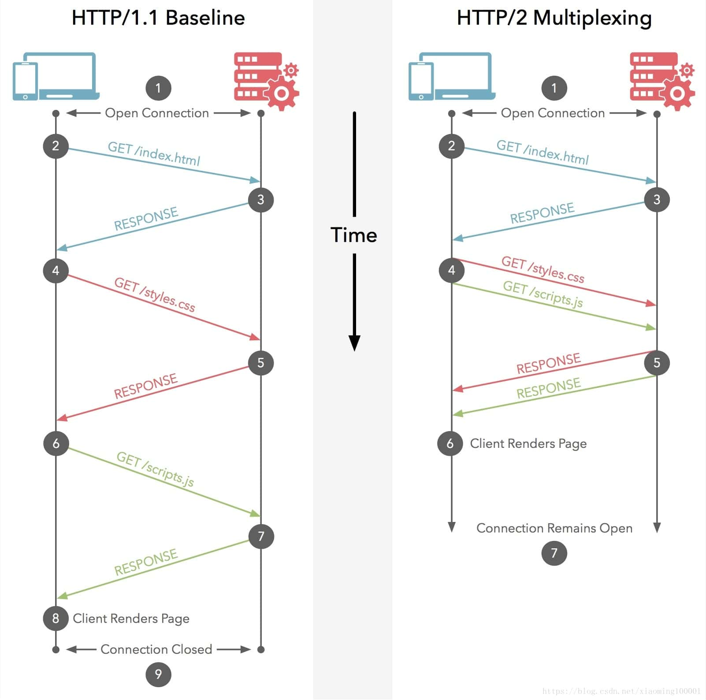

# http

## 簡介

* 支援客戶/伺服器模式。
* 簡單快速：客戶向伺服器請求服務時，只需傳送請求方法和路徑。請求方法常用的有GET、HEAD、POST。每種方法規定了客戶與伺服器聯繫的型別不同。由於HTTP協議簡單，使得HTTP伺服器的程式規模小，因而通訊速度很快。
* 靈活：HTTP允許傳輸任意型別的資料對象。正在傳輸的型別由Content-Type加以標記。
* 無連線：無連線的含義是限制每次連線只處理一個請求。伺服器處理完客戶的請求，並收到客戶的應答後，即斷開連線。採用這種方式可以節省傳輸時間。
* 無狀態：HTTP協議是無狀態協議。無狀態是指協議對於事務處理沒有記憶能力。缺少狀態意味著如果後續處理需要前面的資訊，則它必須重傳，這樣可能導致每次連線傳送的資料量增大。另一方面，在伺服器不需要先前資訊時它的應答就較快。

