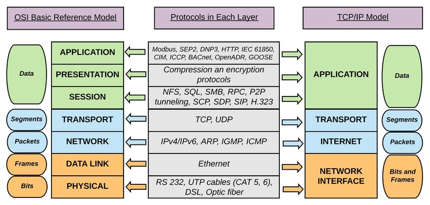
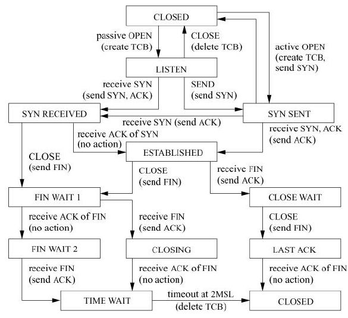

# OSI與TCP分層

## OSI與TCP/IP模型

ISO所制定的標準中，牽涉到網路通訊方面的就是開放式系統互連 \( Open Systems Interconnection, OSI \) 分層模型，是在1970 年代後期所提出來的。 

OSI模型是一個概念模型，它建立了一個框架，說明資訊該如何從應用程式、透過網路連線、經過實體的傳輸線，最後來到目標網站或主機。在 OSI模型當中有七層的架構，每一層都有其相對應的協定，定義了資訊傳出的規範。

相較於 OSI模型的七層架構，TCP/IP模型只有四層。雖然說是簡化，但實際上整體的架構還是不脫 OSI 模型的內容。

## OSI分層

### 應用層（Application Layer）

應用層主要功能是處理應用程式，進而提供使用者網路應用服務。

### 展示層（Presentation Layer）

應用層收到的資料後，透過展示層可轉換表達方式，例如將ASCII編碼轉成應用層可以使用的資料，或是處理圖片及其他多媒體檔案，如JPGE圖片檔或MIDI音效檔。

除了轉檔，有時候當資料透過網路傳輸時，需要將內容予以加密或解密，而這個工作就是在展示層中處理。

### 會議層（Session Layer）

這個層級負責建立網路連線，等到資料傳輸結束時，再將連線中斷，運作過程有點像召集多人開會（建立連線），然後彼此之間意見交換（資料傳輸），完成後，宣佈散會（中斷連線）。

有很多應用服務運作在會議層上，我們常接觸到的是NetBIOS names，這是一種用來識別電腦使用NetBIOS資源的依據。我們使用Windows系統時，開啟網路上的芳鄰，或是用到「檔案及列印分享」時，通常會看到群組及電腦名稱，這些就是NetBIOS names定義的。

### 傳輸層（Transport Layer）

傳輸層主要負責整體的資料傳輸及控制，是OSI模型中的關鍵角色，它可以將一個較大的資料切割成多個適合傳輸的資料，替模型頂端的第五、六、七等三個通訊層提供流量管制及錯誤控制。

傳輸控制協定（Transmission Control Protocol，TCP）是我們常接觸具有傳輸層功能的協定，它在傳輸資料內加入驗證碼，當對方收到後，就會依這個驗證碼，回傳對應的確認訊息（ACK），若對方未及時傳回確認訊息，資料就會重新傳遞一次，以確保資料傳輸的完整性。

### 網路層（Network Layer）

網路層定義網路路由及定址功能，讓資料能夠在網路間傳遞。這一層中最主要的通訊協定是網際網路協定（Internet Protocol，IP），資料在傳輸時，該協定將IP位址加入傳輸資料內，並把資料組成封包（Packet）。在網路上傳輸時，封包裡面的IP位址會告訴網路裝置這筆資料的來源及目的地。由於網路層主要以IP運作為主，故又稱為「IP層」。除了IP，在網路層上運作的協定還包含IPX及X.25。

路由器及Layer 3交換器即屬於第三層的網路裝置，主要以IP作為資料傳輸依據。

### 資料連結層（Data Link Layer）

資料連結層介於實體層與網路層之間，主要是在網路之間建立邏輯連結，並且在傳輸過程中處理流量控制及錯誤偵測，讓資料傳送與接收更穩定。資料連結層將實體層的數位訊號封裝成一組符合邏輯傳輸資料，這組訊號稱為資料訊框（Data Frame）。訊框內包含媒體存取控制（Media Access Control，MAC）位址。而資料在傳輸時，這項位址資訊可讓對方主機辨識資料來源。

MAC位址是一組序號，每個網路裝置的MAC位址都是獨一無二的，可以讓網路裝置在區域網路溝通時彼此識別，例如網路卡就是明顯的例子。

不少網路協定是在資料連結層上運作，我們較常聽到的是非同步傳輸模式（Asynchronous Transfer Mode，ATM），以及點對點協定（Point-to-Point Protocol，PPP）。前者是早期網路發展的通訊協定，由於單次傳輸量很小，適合用作語音傳輸；後者則是在我們使用ADSL時，會透過這項協定連線 ISP，從而連上網際網路。

網路交換器（Switch）是這個層級常見的裝置，主要在區域網路上運作，能依據MAC位址，將網路資料傳送到目的主機上。交換器一般分為可設定式與免設定兩種，前者可以設定流量控制或設定子網路分割，後者僅傳輸網路資料，不具其他進階功能。

### 實體層（Physical Layer）

實體層是OSI模型的最底層，它用來定義網路裝置之間的位元資料傳輸，也就是在電線或其他物理線材上，傳遞0與1電子訊號，形成網路。實體層規範的內容包含了纜線的規格、傳輸速度，以及資料傳輸的電壓值，用來確保訊號可以在多種物理媒介上傳輸。

網路線、網路卡與集線器（Hub），都是平常容易接觸到的實體層裝置。網路線包括辦公室及機房內常見的RJ-45 UTP雙絞線、有線電視使用的同軸電纜，以及應用在骨幹網路的光纖纜線等。不過，對無線網路而言，只要可以傳輸電波的介質，都屬於它的傳輸媒介。

## TCP分層

### 應用層 \(Application Layer \)

在應用層當中的協定，定義了應用程式透過網路交換資訊的格式，常見的有 HTTP、HTTPS、FTP \(檔案傳輸\)、POP3 \(接受電子郵件\)、SMTP \(發電子郵件\)、TELNET、SSH 等。

### 傳輸層 \(Transportation layer\)

在傳輸層當中的協定，定義了傳輸資料的品質（可靠性與順序性），譬如常見的 TCP 與 UDP 協議。

### 網路層 \(Internet layer\)

網路層當中的協定則定義了資料如何在一個單一網路上傳輸並可以抵達目的地。這裡其實就是靠著先前提到的 IP地址來找到目標位置。

### 實體層 \(physical layer\)

最後的實體層則定義資訊如何透過韌體與硬體間傳遞與接收。

在開發網路應用程式的過程當中，設計師大部分關注多在應用層，因為傳輸層與網路層實作，多半已由作業系統完成\(Windows socket, BSD socket等\)，而實體層則靠電腦與網路設備完成。

## TCP vs. UDP

TCP 和 UDP 都是透過同樣的方式傳輸資料，並透過 IP 找到目標。不過兩者因為性質上的差異，所以應用場景也有很大的不同。


TCP 用於需要「可靠通訊」的場景，即資料在傳輸的過程中不會遺漏，而且有正確的順序性。大部分情況下我們都需要 TCP 來保證通訊的可靠性。

相對於 TCP，UDP 有時也被稱作「不可靠的通訊」。因為 TCP 為了保證「可靠」，必須依賴相對應的機制，而這些機制會使用較多的資源，並降低傳輸效率。而在某些使用場景，像是網路電話、視訊會議、遊戲等，更看重傳輸速度與即時性，品質方面可以稍微犧牲，因此就可以採用 UDP 的傳輸方式。

另一方面，UDP 可以做到一對多的廣播功能，而 TCP 就只能夠一對一通訊。

## TCP 3-Way handshake & 4-Way handshake

TCP 為了在通訊連線前，確認對方可以準備接收訊號，以及在斷線前，確認對方準備好離線，因此發展出了連線前的 3-way handshake 與離線前的 4-way handshake 機制。

### 連線前的 3-way handshake

* CLIENT: 傳送通訊連線請求
* SERVER: 確認允許連線
* CLIENT: 確認連線

### 離線前的 4-way handshake

* CLIENT: 傳送通訊斷線請求
* SERVER: 確認收到斷線請求，並繼續傳送最後的資訊
* SERVER: 最後的資訊傳送完畢，確認可以斷線
* CLIENT: 確認斷線

## 埠\(Port\)的分類

從埠的性質來分，通常可以分為以下三類：

* **公認埠（Well Known Ports）**：這類埠也常稱之為常用埠。這類埠的埠號從0到1023，它們緊密繫結於一些特定的服務。
* **註冊埠（Registered Ports）**：埠號從1024到49151。它們鬆散地繫結於一些服務。也是說有許多服務繫結於這些埠，這些埠同樣用於許多其他目的。
* **動態和/或私有埠（Dynamic and/or Private Ports）**：埠號從49152到65535。

