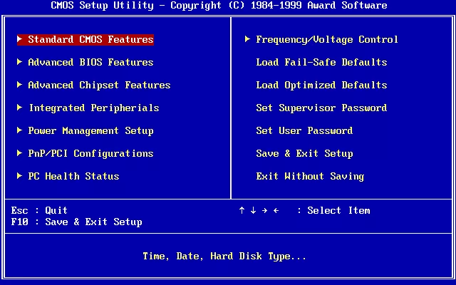

# BIOS

## BIOS韌體

BOOT是載入執行的一個預啟動的操作環境程式，嚴格來算是軟體。是一組固化到計算機內主機板上一個ROM晶片上的程式。它儲存著計算機最重要的基本輸入輸出的程式、系統設定資訊、開機後自檢程式和系統自啟動程式。其主要功能是為計算機提供最底層的、最直接的硬體設定和控制。

BIOS可以被視為專門與硬體溝通的微型作業系統，通常是使用針對相容CPU的組合語言寫成的。
BIOS 有時候稱做為韌體因為它是與硬體系統整合在一起的。在大約 1990年時，BIOS 是儲存在 ROM \(唯讀記憶體\)中而無法被修改。當複雜度和更新需要的成長，BIOS 韌體於是就儲存在 EEPROM 或者是 flash memory 裝置，可以輕易地讓使用者升級。而BIOS ROM平時是設定成唯讀狀態，必需藉由特定工具才可以加以修改、抹除。

其它的週邊也有自已的BIOS ROM，像是顯示卡、高階網路卡等，因為較複雜的外接週邊硬體設計差異很大，各自有其獨特初始動作，所以廠商會另外加上BIOS ROM。

然而，不適當的執行或是終止 BIOS 更新可能導致電腦或是裝置的不堪使用。為了避免 BIOS 損壞，有些新的主機板有備份的 BIOS \("雙BIOS"主機板\)，主要是因為CIH病毒可破壞BIOS。

當PC開機，BIOS 是由電路板上的ROM執行，並且他將晶片組和記憶體子系統順序起始化。他把自己從ROM中解壓縮到系統的主記憶體，並且從那邊開始執行。PC 的 BIOS 程式碼也包含診斷功能，以保證某些重要硬體元件的正確，像是鍵盤，磁碟裝置，輸出輸入埠等等，這些可以正常運作且正常地初始化。幾乎所有的 BIOS 都可以選擇性地執行 CMOS 記憶體的設定程式; 也就是儲存 BIOS 會存取的使用者自訂設定資料\(時間、日期、硬碟細節，等等\)。

現在的新式電腦用的基本都是UEFI啟動，早期的過渡電腦用的都是EFI啟動。其實EFI或UEFI的一部分也是儲存在一個晶片中，由於它們在表面形式、基本功能上和BIOS差不多，所以習慣上我們也把儲存EFI/UEFI的晶片叫做EFI/UEFI BIOS晶片，EFI/UEFI也叫做EFI/UEFI BIOS，但在實際上它們和BIOS根本是不一樣的設計。

## BIOS主要功能

BIOS用於**硬體自檢**、**CMOS設定**、**引導作業系統啟動**、**提供硬體I/O**、硬體中斷等4項主要功能，

因此BIOS程式可以分為若干模組，主要有Boot Block引導模組、CMOS設定模組、擴充套件配置資料（ESCD）模組、DMI收集硬體資料模組。

其中引導模組直接負責執行BIOS程式本身入口、電腦基本硬體的檢測和初始化，ESCD用於BIOS與OS交換硬體配置資料，DMI則充當了硬體管理工具和系統層之間介面的角色，通過DMI，使用者可以直觀地獲得硬體的任何資訊，CMOS設定模組就是實現對硬體資訊進行設定，並儲存在CMOS中，是除了啟動初始化以外BIOS程式最常用的功能。

## 真實模式下的記憶體佈局

BIOS本身是組合語言程式碼，是在16位元真實模式下呼叫INT 13H中斷執行的。由於x86-64是一個高度相容的指令集，也為了遷就BIOS的16位元真實模式的執行環境，所以即使現在的CPU都已是64位元，還是在BIOS啟動（常見於09年以前的主機板），在開機時仍然都是在16位真實模式下執行的。16位真實模式直接能訪問的記憶體只有1MB。

在這1MB記憶體中，頂層640K稱為基本記憶體，後面384K記憶體留給開機必要硬體和各類BIOS本身使用。

| 起始 | 結束 | 大小 | 用途 |
| :--- | :--- | :--- | :--- |
| FFFF0 | FFFFF | 16 Bytes | BIOS入口地址，此地址也屬於BIOS程式碼，同樣屬於頂部的640 KB位元組。只是為了強調入口地址才單獨寫出。此處16位元組的內容是跳轉指令 `JMP F000:E05B`。 |
| F0000 | FFFEF | 64KB~16B | 系統BIOS的範圍是F0000~FFFFF共640 KB，為了說明入口地址，將最上面的16 Bytes從此處扣除，所以結束地址是FFFEF。 |
| C8000 | EFFFF | 160KB | 映射硬體配接器的ROM或是記憶體映射的I/O |
| C0000 | C7FFF | 32KB | 顯示配接器BIOS |
| B8000 | BFFFF | 32KB | 文字模式顯示的配接器 |
| B0000 | B7FFF | 32KB | 用於黑白顯示配接器 |
| A0000 | AFFFF | 64KB | 用於彩色顯示配接器 |
| 9FC00 | 9FFFF | 1KB | EBDA \(extended BIOS data area\) |
| 7E00 | 9EBFF | 約608KB | 可用區域 |
| 7C00 | 7DFF | 512B | MBR被BIOS加載到此處，共512B |
| 500 | 7BFF | 約30KB | 可用區域 |
| 400 | 4FF | 256B | BIOS data area |
| 000 | 3FF | 1KB | Interrupt Vector Table\(中斷向量表\) |

## BIOS啟動流程

1. 系統開機後，第一步通電自檢（Power On Self Test，POST）。
2. POST過後初始化用於啟動的硬體（磁碟、鍵盤控制器等）。
3. BIOS會執行BIOS磁碟啟動順序中第一個磁碟的首440bytes（MBR啟動程式碼區域）內的程式碼。
4. 啟動引導程式碼從BIOS獲得控制權，然後引導啟動下一階段的程式碼（如果有的話）（一般是系統的啟動引導程式碼）。
5. 再次被啟動的程式碼（二階段程式碼）（即啟動引導）會查閱支援和配置檔案。
6. 根據配置檔案中的資訊，啟動載入程式會將核心和initramfs檔案載入系統的RAM中，然後開始啟動核心。

硬體初始化工作中，主要說明兩點，首先經過POST檢測後，電腦終於出現了開機啟動畫面，這就是已經檢測到了顯示卡並完成了初始化。但是請注意，由於BIOS是在16位真實模式執行，因此該畫面是以VGA解析度（640\*480，縱橫比4:3）顯示的，因為真實模式最高支援的就是VGA。

BIOS只識別到由主開機記錄（MBR）初始化的硬碟，之所以說明這點，是因為後續的EFI或UEFI採用了一種新的GUID磁碟分割槽系統（GPT）格式，這種硬碟在BIOS下是無法識別的。硬體全部初始化完畢後，接下來進入更新ESCD階段。

在ESCD更新階段中，BIOS將對儲存在CMOS中和作業系統交換的硬體配置資料進行檢測，如果系統硬體發生變動，則會更新該資料，否則不更新保持原狀不變，ESCD檢測或更新結束後，BIOS將完成最後一項工作，就是啟動作業系統。

最後這一步中，BIOS根據CMOS中使用者指定的硬體啟動順序，讀取相應裝置的啟動或引導記錄，引導相應裝置上的作業系統啟動，進入作業系統，此後便由作業系統接替BIOS負責硬體和軟體間的相互通訊。如果發現所有硬體都沒有能引導作業系統的記錄，則會在螢幕上顯示相應錯誤資訊，並將電腦維持在16位真實模式。

## BIOS 中斷向量表 \(interrupt vector table\)

| 中斷編碼 | 描述 |
| :--- | :--- |
| INT 00h | CPU：除以零錯，或商不合法時觸發。 |
| INT 01h | CPU：單步陷阱，TF標記為打開狀態時，每條指令執行後觸發。 |
| INT 02h | CPU：非可封鎖中斷，如啟動自我測試時發生記憶體錯誤。 |
| INT 03h | CPU：第一個未定義的中斷向量，約定俗成僅用於除錯程式。 |
| INT 04h | CPU：算數溢位。通常由INTO指令在置溢位位時觸發。|
| INT 05h | 在按下Shift-Print Screen或BOUND指令檢測到範圍異常時觸發。|
| INT 06h | CPU：非法指令。|
| INT 07h |CPU：沒有數學協處理器時嘗試執行浮點指令觸發。|
| INT 08h |IRQ0：可程式化中斷控制器每 55 毫秒觸發一次，即每秒 18.2 次。|
| INT 09h |IRQ1：每次鍵盤按下、按住、釋放。|
| INT 0Ah |IRQ2：|
| INT 0Bh	|IRQ3：COM2/COM4 |
| INT 0Ch |IRQ4：COM1/COM3。|
| INT 0Dh |IRQ5：硬碟控制器（PC/XT 下）或 LPT2。|
| INT 0Eh |IRQ6：需要時由軟碟控制器呼叫。|
| INT 0Fh |IRQ7：LPT1。|
| INT 10h |顯示服務 - 由BIOS或作業系統設定以供軟體呼叫。|

