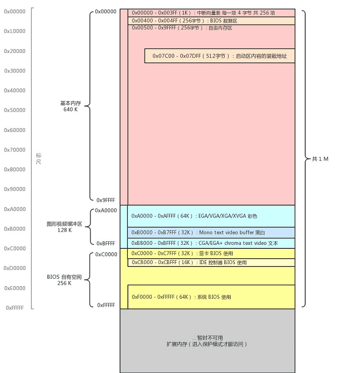
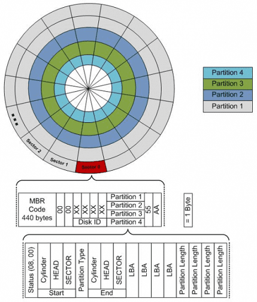

# 開機流程

## 前置知識

學習計算機啟動過程的前置知識是什麼呢？需要已知以下幾點：

* 記憶體是存儲資料的地方，給出一個位址信號，記憶體可以返回該位址所對應的資料。
* CPU 的工作方式就是不斷從記憶體中取出指令並且執行。
* CPU 從記憶體的哪個位址取出指令，是由一個暫存器中的值決定的，這個值會不斷進行 +1 操作\(下一個指令或位元\)，或者由某條跳轉指令指定其值是多少。

## 我們按下開機鍵後究竟發生了什麼？

開機後有四次關鍵跳躍\(jmp\)指令，都是當時 Intel 和 BIOS 等製作廠商的固定下來的流程，記住就好。開機的時候CPU處於真實模式，可定址範圍為1M：

1. 按下開機鍵，CPU 將 PC 暫存器的值強制初始化為 0xFFFF0，這個位置是 BIOS 程式的入口位址（第一次跳躍）
   。
2. 該入口位址處是一個跳轉指令，跳轉到 0xFE05B 位置，開始執行（第二次跳躍）
   。
3. 執行了一些硬體檢測工作後，最後一步將啟動區內容加載（復制）到記憶體 0x7C00，並跳轉到這裡（第三次跳躍）。
4. 啟動區代碼主要是加載作業系統內核，並跳轉到加載處（第四次跳躍）。

經過這連續的四次跳躍，終於來到了作業系統的世界了，剩下的內容，可以說是整個作業系統課程所講述的原理，分段、分頁、建立中斷、裝置驅動、記憶體管理、程式管理、檔案系統、使用者態介面等等。

## 記憶體對映\(memory mapping\)

CPU 位址匯流排的寬度決定了可訪問的記憶體空間的大小。

* 比如 16 位的 CPU 位址總線寬度為 20 條，可定址位址范圍是 $$2^{20} = 1 \ MB$$ 。
* 32 位的 CPU 位址總線寬度為 32 位，位址范圍是 $$2^{20} = 4\ GB$$ 。

可存取的記憶體空間這麼大，並不等於說全都給記憶體使用，也就是說定址的物件不只有記憶體，還有一些外圓設備也要通過位址匯流排的方式去存取。

那怎麼去存取這些外部設備呢？就是在位址范圍中劃出一片片的區域，這塊給視訊記憶體使用，那塊給硬碟控制器使用。我們在相應的位置上讀取或者寫入記憶體，就相當於在視訊記憶體等外設的相應位置上讀取或者寫入，就好像這些外設的儲存區域，被對映到了記憶體中的某一片區域一樣。這樣我們就不用管那些外設啦，關注點仍然是一個簡簡單單的記憶體。這就是所謂的**記憶體對映**。

真實模式時，記憶體的配置如下圖：



記憶體被各種外部設備對映在了記憶體中。BIOS不但其空間被對映到了記憶體 0xC0000 - 0xFFFFF 位置，其裡面的程式還佔用了開頭的一些區域，比如把中斷向量表寫在了記憶體開始的位置。

## BIOS 第一個被執行的部份

目前已經知道 BIOS 裡的資訊被對映到了記憶體 0xC0000 - 0xFFFFF 位置，其中最為關鍵的系統 BIOS 被對映到了 0xF0000 - 0xFFFFF \(16 Bytes\) 位置。

按下開機鍵，CPU 將 PC 暫存器的值強制初始化為 0xFFFF0，這個位址
。更詳細的說，CPU 將段基址暫存器 CS 初始化為 0xF000，將偏移位址暫存器 IP 初始化為 0xFFF0，根據真實模式下的最終位址計算規則，將段基址左移 4 位，加上偏移位址，得到最終的實體位址也就是抽象出來的 PC 暫存器位址為 0xFFFF0。

0xF0000 - 0xFFFFF 只有16位元組，其中儲存的機器指令轉成組合語言是：

```erlang
JMP FAR F000:E05B ; 跳轉到實體位址 0xFE05B 處開始執行
```

位址 0xFE05B 處開始，便是 BIOS 真正發揮作用的程式碼了，這塊程式碼會檢測一些外部設備資訊，並初始化好硬體，建立中斷向量表並填寫中斷例程。這裡的部分不要展開，這只是一段寫死的程式而已，而且對理解開機啟動過程無幫助，後面精彩的部分是 BIOS 的最後一項工作：**載入啟動區**。

載入啟動區是將外部設備啟動區內容加載（復制）到記憶體 0x7C00，並跳轉到這裡。

## 將啟動區複製到記憶體0x7C00位址

BIOS 裡面有一段寫死的程式碼，會幫我們把啟動區的第一扇區的 512 位元組的內容，原封不動複製到記憶體 0x7c00 這個位置，並跳轉到此處。

BIOS 啟動順序的經歷，通常有 USB硬碟啟動、硬碟啟動、軟硬啟動、光碟啟動等等BIOS。 會按照順序，讀取這些啟動盤中位於 0 盤 0 道 1 扇區的內容。

 這 0 盤 0 道 1 扇區的內容一共有 512 個位元組，如果末尾的兩個位元組分別是 0x55 和 0xAA，那麼 BIOS 就會認為它是個啟動區，即所謂的MBR\(master boot record\)。



BIOS 找到了這個啟動區之後，把這 512 個位元組的內容，全部複製到記憶體的 0x7C00位址 。啟動區的內容就是我們自己寫的程式碼了。

複製完成\(512B\)之後，接下來應該是一個跳轉指令。沒錯，正是這樣，PC 暫存器的值變為 0x7c00，指令開始從這裡執行。之後我們的程式就接管了接下來的流程，BIOS 的使命也就結束。

## 為何啟動程式碼是在0x7C00 位址?

正因為 BIOS 將啟動區的程式碼載入到了這裡，因此有了一個偏移量，所以所有寫啟動區程式碼的人就需要在開頭寫死一個這樣的程式碼，不然全都錯位了。

正因為所有寫作業系統的，啟動區的第一行組語程式碼都寫死了這個數字，那 BIOS 開發者最初定的這個數字就不好改。

另一個解釋是第一個 BIOS 開發團隊是 IBM PC 5150 BIOS，當時被認為的第一個作業系統是 DOS 1.0 作業系統，BIOS 團隊就假設是為它服務的。但作業系統還沒出，BIOS 團隊假設其作業系統需要的最小記憶體為 32 KB。BIOS 希望自己所載入的啟動區程式碼盡量靠後，這樣比較“安全”，不至於過早的被其他程式覆蓋掉。可是如果僅僅留 512 位元組又感覺太懸了，還有一些堆疊空間需要預留，那擴大到 1 KB 吧。這樣 32 KB 的末尾是 0x8000，減去 1KB\(0x400\) ，剛好等於 0x7C00。

## QEMU實作啟動區程式

* 機器：用虛擬機器實現（QEMU）
* 硬碟：用虛擬磁碟映像實現（img）
* 寫入資料：用軟體往磁碟映像中寫（dd 命令）

我們只需要編輯一個虛擬磁碟映像檔案，再用 QEMU 啟動一下就好了。這裡我們使用和真正硬碟中資料一一對應的無格式的格式（raw）。該格式中記錄磁碟第一扇區的 512 位元組的位置，就是該檔案從第一個位元組開始往後的 512 位元組。


