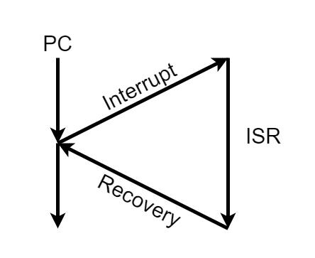

# 中斷\(interrupt\)

## 簡介

中斷的目的是為了分時多工的處理機制，沒有中斷就只能用批次\(batch\)處理的方式處理工作。

CPU在執行目前任務時，當有特別事件\(event\)發生時，CPU應當暫停正在執行的程式，轉向執行處理該事件的子程式；事件處理完畢後，恢復原來的狀態，再繼續執行原來的程式。這種對這些事件的處理模式，稱為程式中斷控制模式，簡稱中斷控制或中斷。

這種處理緊急事件的服務子程式稱為中斷子程式。這種引起中斷的事件稱為中斷源。這些事件包括磁碟、鍵盤等等輸入輸出裝置，異常錯誤的發生甚至另一個CPU的呼叫。

## 中斷處理機制

為了快速處理常見的中斷，作業系械給予一個表格，儲存中斷服務函式的進入點，如果有中斷發生，可以快速查表，找到要服務的函式，此表格稱之為中斷處理函式（Interrupt handler routine），通常都置於記憶體開始的地方。

