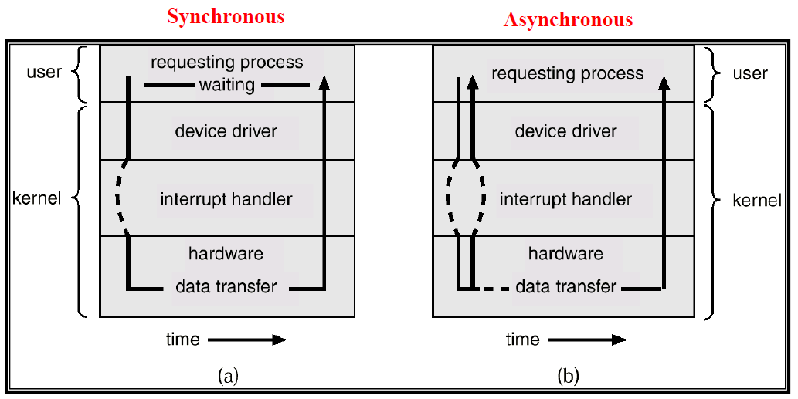

# 中斷\(interrupt\)

## 簡介

中斷的目的是為了分時多工的處理機制，沒有中斷就只能用批次\(batch\)處理的方式處理工作。

CPU在執行目前任務時，當有特別事件\(event\)發生時，CPU應當暫停正在執行的程式，轉向執行處理該事件的子程式；事件處理完畢後，恢復原來的狀態，再繼續執行原來的程式。這種對這些事件的處理模式，稱為程式中斷控制模式，簡稱中斷控制或中斷。

這種處理緊急事件的服務子程式稱為中斷子程式。這種引起中斷的事件稱為中斷源。這些事件包括磁碟、鍵盤等等輸入輸出裝置，異常錯誤的發生甚至另一個CPU的呼叫。

## 中斷處理機制

為了快速處理常見的中斷，作業系械給予一個表格，儲存中斷服務函式的進入點，如果有中斷發生，可以快速查表，找到要服務的函式，此表格稱之為中斷處理函式（Interrupt handler routine），通常都置於記憶體開始的地方。

* 每個中斷事件會提供一小段程式去服務此中斷，稱之為中斷服務常式（Interrupt Service Routine, ISR\)）。
* 而中斷向量（Interrupt vector）是一個由00H 到FFH 的數字，用來判 斷中斷的種類。

### 優點

相對於忙碌等待 \(busy waiting\)、輪詢 \(polling\) 有更好的效率，因為不需要額外的資源去確認是否有事件要處理，使用中斷可以專心於正在處理的事件，不需要時也可以進入休眠狀態節省資源，亦可實現分時多工、並行 \(concurrency\)
。

### 
應用

* 協調 I/O，避免資料傳輸時 CPU被佔用
* 優雅結束錯誤並繼續執行正常流程
* 即時系統

## 中斷的種類

* 外部中斷\(external interrupt\): 又稱非同步中斷 \(Asynchronous\)， CPU 外的週邊元件所引起的。（I/O Complete Interrupt, I/O Device error）
* 內部中斷 \(internal interrupt\):又稱同步中斷 \(Synchronous\)，不合法的用法所引起的。（Debug, Divide-by-zero, overflow）
* Software Interrupt（軟體中斷）：使用者程式在執行時，若需要作業系統提供服務時，會藉由系統呼叫來呼叫作業系統執行對應的服務常式，完成任務請求後，再將結果傳回給使用者程式。

