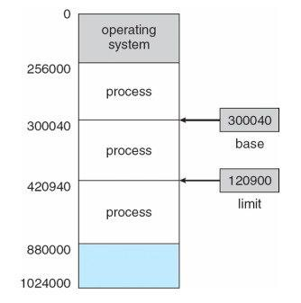
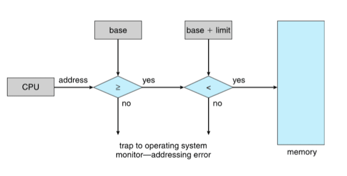

# 記憶體管理\(memory management\)

* 程式必須要被進主記憶體中（從硬碟中），並且放入行程中運行。
* 主記憶體以及暫存器是CPU唯二可以直接存取的儲存空間。
* 記憶體單元只能辨認位址流+讀取請求或寫入請求。
* 暫存器存取在一個CPU振盪（或更少）時間。
* 存取主記憶體可能需要很多周期，導致停頓。
* 快取被放在CPU暫存器以及主記憶體之間\(L1, L2, L3 Cache\)。
* 記憶體管理的目的是保護主記憶體以確保正確操作。

在保護模式中，有三種定址方式：邏輯位址（Logical Address）、線性位址（Linear Address）、和實體位址（Physical Address）。

對大部分的應用程式而言，幾乎只會用到邏輯地址。線性也址和實體地址在大部分的情形中，只有作業系統會使用。

* 邏輯地址\(logical address\)：CPU所處理的地址，又叫做虛擬地址\(virtual address\)。
* 實體地址\(Physical address\)：記憶體上真實的地址\(經過MMU處理過\)。32-bit系統中為系統的記憶體的真正位址，它的範圍由 00000000h 到 FFFFFFFFh，共有 4GB。
* 在沒有使用分頁（Paging）功能的時候，線性地址是直接對映到實體地址的，也就是說，線性地址就等同於實體地址。不過，在開啟分頁分能之後，一個線性地址可能沒有相對映的實體地址（因為它所對映的記憶體可能被 swap 到硬碟裡了）。

大部分情形中，系統的 RAM 都是由 00000000h 開始定址（即在最底端），而 ROM 則由 FFFFFFFFh 開始定址（即在最頂端）。這是因為在 RESET 之後，處理器會從定址空間的頂端開始執行，所以把 ROM 定址在頂端才能讓處理器在 RESET 後執行到開機用的程式（如開機自我測試之類的程式）。

## 基底與限制暫存器\(base and limit registers\)

基底與限制暫存器是用來定義邏輯地址空間\(logical address space\)，分別紀錄行程起始記憶體位置\(使用基底暫存器\)跟行程所佔記憶體位置大小\(使用限制暫存器\)。

CPU必須確認每一個來自使用者空間的記憶體操作，都坐落在基底以及限制暫存器的值之間。

## 地址的繫結\(address binding\)

繫結決定了程式起始地址，即程式要在記憶體的哪個地方開始執行。

繫結有 3 個時期如下：

*  編譯時期 \(Compile time\)：由編譯器決定，將來程式執行的起始位址不得變更。
  * 缺點：若所決定的位址內有其它的程式在執行，或之後要變更程式執行的起始位址，則須重新編譯。
* 載入時期 \(Load time\)：由連結器決定。在編譯時不會固定地址，因此生成可重定位地址\(relocatable address\)，不一定由固定位置執行。
  * 缺點：執行時間沒有被呼叫到的模組仍需事先 linking, Allocation, Loading，浪費時間也浪費記憶體。 \(e.g. if-else 的程序、OS 錯誤處理程序。\)
  * 程式執行期間仍不可以改變起始位址。
* 執行時期 \(Execution time\)：由OS動態決定。如果記憶體區段在執行時被移動，連結才會延到這個時期。這需要硬體MMU上的支援、彈性高，但執行慢效率差。

MMU \(Memory-Management Unit\) 是一種可將邏輯地址轉換成實體地址的硬體設備。基底暫存器在這就被稱為重定位暫存器\(relocation register\)。

