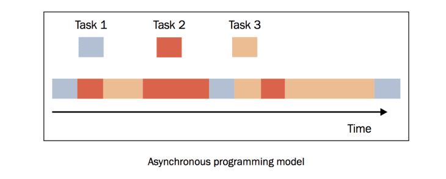
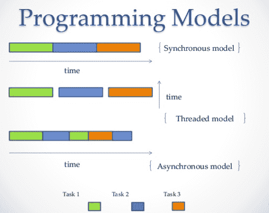
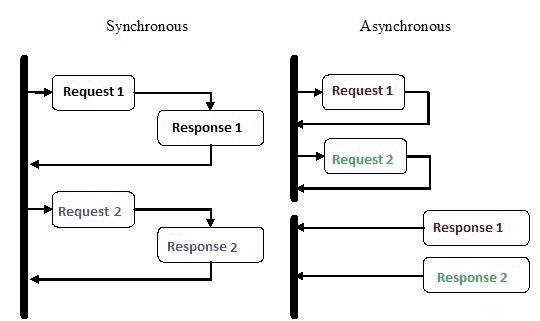

# 異步\(非同步\)程式設計

## 簡介

除了順序執行和平行執行的模型之外，還有第三種模型，叫做異步\(非同步\)模型，這是事件驅動模型的基礎。異步活動的執行模型可以只有一個單一的主控制流，能在單核心系統和多核心系統中執行。

在平行執行的異步模型中，許多任務\(task\)被穿插在同一時間線上，所有的任務都由一個控制流執行（單一執行緒）。任務的執行可能被暫停或恢復，中間的這段時間執行緒將會去執行其他任務。

任務（不同的顏色表示不同的任務）可能被其他任務插入，但是都處在同一個執行緒下。當某一個任務執行的時候，其他的任務都暫停了。與多執行緒編程模型很大的一點不同是， **多執行緒由作業系統決定在時間線上什麼時候掛起某個活動或恢復某個活動，而在異步平行模型中，程式設計師必須假設執行緒可能在任何時間被掛起和替換**。

異步的機制和執行緒與矚程完全不同，基本上是可以在一個行程或執行者下，就達到多工處理的目的，不需要靠作業卜統調配行程和執行緒的調度。





## 同步與異步\(Synchronous & Asynchronous\)

**同步和異步關注的是訊息通訊的機制**。

* 同步，就是在發出一個調用時，在沒有得到結果之前，該調用就不返回。**也就是，調用者主動等待這個調用的結果**。
* 異步則是相反，調用在發出之後，這個調用就直接返回了，所以沒有返回結果。換句話說，當一個異步過程調用發出後，調用者不會立刻得到結果。而是在調用發出後，被調用者通過狀態得知結果是否已經傳回。





## 阻塞和非阻塞\(Blocking & Non-blocking \)

此這概念是指一個函數執行後，會不會一直等回傳結果才做下一件事情，阻塞和非阻塞關注的是程序在等待調用結果（消息，返回值）時的狀態。

例如去買書，問老闆有沒有書，阻塞程序就會等回傳後的結果後才會進行下一步，非阻塞則是在問有沒有書的同時就去旁邊玩沙了，過一會兒再來看看有沒有回傳值。

## 異步程式設計概念

1. 單行程，單執行緒，就能對IO密集的程序進行多工處理，不需要動用到作業系統調度。
2. 需要良好的程式技巧，使用await 釋放出資源。
3. 不需要使用阻塞函數。

例如使用time.sleep或是一些socket操作，都是常見會阻塞的函數，都可以換成asyncio裡面提供的非阻塞函數。

## python的asyncio

Python是3.4以後，在標準上逐步加入了asyncio、async與await等支援。asyncio本身主要有兩個對象：直接使用（end-user）的開發者與框架設計者。龐大的API文件中，大部份都是給框架設計者看的，直接使用的開發者其實不用瞭解那麼多。

asyncio是用在IO密集型和高層級結構化網路程式碼\(因為網路傳輸和IO一樣需要等待很多時間\)的最佳選擇。

用最白話的說法是，今天用了asyncio的寫法，就不是主動等待去獲得答案，而是等函式主動告知你答案。

```python
# 最簡單的async模型
import asyncio

async def main():
    await asyncio.sleep(1.0)
    print('done')
    asyncio.run(main())
```

## asyncio的組成元件

### event loop \(事件循環\)

Event Loop\(事件循環\)負責排程調配各項協程\(coroutine\)，類似於作業系統做context switch的管理員。

* 一方面，它類似於 CPU ，順序執行協程的程式碼；另一方面，它相當於作業系統，完成協程的排程，即一個協程“暫停”時，決定接下來執行哪個協程。
* 最基礎的切換也是通過 Python 生成器的 yield 加強版語法來完成的，但我們還要考慮協程鏈的情況。
*  在作業系統中，可以產生事件的實體叫做事件源，能處理事件的實體叫做事件處理者。此外，還有一些第三方實體叫做事件迴圈。它的作用是管理所有的事件，在整個程式執行過程中不斷迴圈執行，追蹤事件發生的順序將它們放到佇列中，當主執行緒空閒的時候，呼叫相應的事件處理者處理事件。

 事件循環的pseudo code如下，所有的事件都在 while 迴圈中捕捉，然後經過事件處理者處理。事件處理的部分是系統唯一活躍的部分，當一個事件處理完成，流程繼續處理下一個事件。

```python
# pseudo code of event loop
while (True) {
    events = getEvents();
    for (e in events)
        processEvent(e);
}

#在python中使用以下程式碼建立事件循環
	import asyncio
	loop = asyncio.get_event_loop() 
```


### 


## 參考資料

* [\[林信良\] asyncio由簡入繁](https://www.ithome.com.tw/voice/138875)


