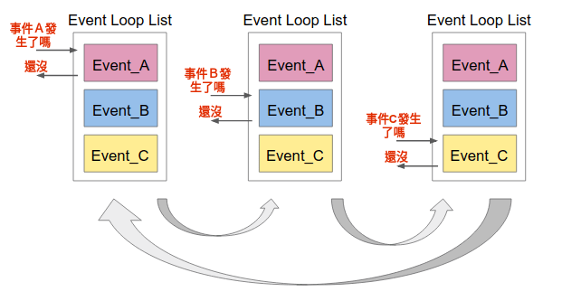
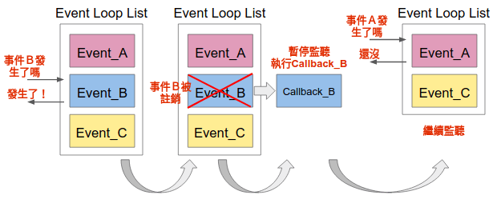
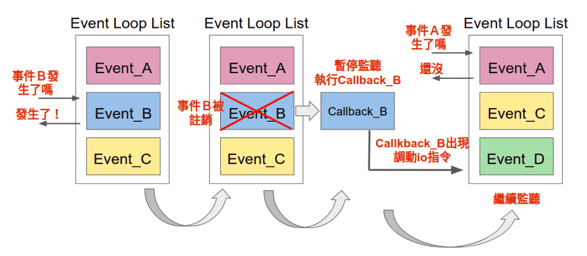

# 異步\(非同步\)程式設計

## 簡介

除了順序執行和平行執行的模型之外，還有第三種模型，叫做異步\(非同步\)模型，這是事件驅動模型的基礎。異步活動的執行模型可以只有一個單一的主控制流，能在單核心系統和多核心系統中執行。

在平行執行的異步模型中，許多任務\(task\)被穿插在同一時間線上，所有的任務都由一個控制流執行（單一執行緒）。任務的執行可能被暫停或恢復，中間的這段時間執行緒將會去執行其他任務。

任務（不同的顏色表示不同的任務）可能被其他任務插入，但是都處在同一個執行緒下。當某一個任務執行的時候，其他的任務都暫停了。與多執行緒編程模型很大的一點不同是， **多執行緒由作業系統決定在時間線上什麼時候掛起某個活動或恢復某個活動，而在異步平行模型中，程式設計師必須假設執行緒可能在任何時間被掛起和替換**。

異步的機制和執行緒與矚程完全不同，基本上是可以在一個行程或執行者下，就達到多工處理的目的，不需要靠作業卜統調配行程和執行緒的調度。


## 同步與異步\(Synchronous & Asynchronous\)

**同步和異步關注的是訊息通訊的機制**。

* 同步，就是在發出一個調用時，在沒有得到結果之前，該調用就不返回。**也就是，調用者主動等待這個調用的結果**。
* 異步則是相反，調用在發出之後，這個調用就直接返回了，所以沒有返回結果。換句話說，當一個異步過程調用發出後，調用者不會立刻得到結果。而是在調用發出後，被調用者通過狀態得知結果是否已經傳回。


## 阻塞和非阻塞\(Blocking & Non-blocking \)

此這概念是指一個函數執行後，會不會一直等回傳結果才做下一件事情，阻塞和非阻塞關注的是程序在等待調用結果（消息，返回值）時的狀態。

例如去買書，問老闆有沒有書，阻塞程序就會等回傳後的結果後才會進行下一步，非阻塞則是在問有沒有書的同時就去旁邊玩沙了，過一會兒再來看看有沒有回傳值。

## 異步程式設計概念

1. 單行程，單執行緒，就能對IO密集的程序進行多工處理，不需要動用到作業系統調度。
2. 需要良好的程式技巧，使用await 釋放出資源。
3. 不需要使用阻塞函數。

例如使用time.sleep或是一些socket操作，都是常見會阻塞的函數，都可以換成asyncio裡面提供的非阻塞函數。

## python的asyncio

Python是3.4以後，在標準上逐步加入了asyncio、async與await等支援。asyncio本身主要有兩個對象：直接使用（end-user）的開發者與框架設計者。龐大的API文件中，大部份都是給框架設計者看的，直接使用的開發者其實不用瞭解那麼多。

asyncio是用在IO密集型和高層級結構化網路程式碼\(因為網路傳輸和IO一樣需要等待很多時間\)的最佳選擇。

用最白話的說法是，今天用了asyncio的寫法，就不是主動等待去獲得答案，而是等函式主動告知你答案。

```python
# -*- coding: UTF-8 -*-
import asyncio


async def hello():
    print("hello")
    await asyncio.sleep(2)
    print("world")

if __name__ == '__main__':
    # python3.7以後直接用run即可自動建構event loop
    # asyncio.run() 函數用來運行最高層級的入口點函數
    asyncio.run(hello())
    """
    hello
    world
    """
```

```python
# -*- coding: UTF-8 -*-
import asyncio
import time


async def say_after(delay: int, what: str):
    await asyncio.sleep(delay)
    print(what)


async def main():
    print(f"started at {time.strftime('%X')}")

    await say_after(1, 'hello')
    await say_after(2, 'world')

    print(f"finished at {time.strftime('%X')}")


if __name__ == '__main__':
    # 直接使用await一次只會處理一個coroutine
    # 所以花了3秒才執行完成
    asyncio.run(main())
    """
    started at 17:45:50
    hello
    world
    finished at 17:45:53
    """
```

## asyncio的組成元件

### event loop \(事件循環\)

Event Loop\(事件循環\)負責排程調配各項協程\(coroutine\)，類似於作業系統做context switch的管理員。

* 一方面，它類似於 CPU ，順序執行協程的程式碼；另一方面，它相當於作業系統，完成協程的排程，即一個協程“暫停”時，決定接下來執行哪個協程。
* 最基礎的切換也是通過 Python 生成器的 yield 加強版語法來完成的，但我們還要考慮協程鏈的情況。
*  在作業系統中，可以產生事件的實體叫做事件源，能處理事件的實體叫做事件處理者。此外，還有一些第三方實體叫做事件迴圈。它的作用是管理所有的事件，在整個程式執行過程中不斷迴圈執行，追蹤事件發生的順序將它們放到佇列中，當主執行緒空閒的時候，呼叫相應的事件處理者處理事件。

 事件循環的pseudo code如下，所有的事件都在 while 迴圈中捕捉，然後經過事件處理者處理。事件處理的部分是系統唯一活躍的部分，當一個事件處理完成，流程繼續處理下一個事件。

```python
# pseudo code of event loop
while (True) {
    events = getEvents();
    for (e in events)
        processEvent(e);
}


# 3.6的寫法
import asyncio
futures = [...]
loop = asyncio.get_event_loop()
loop.run_until_complete(asyncio.wait(futures))
loop.close()

# python 3.7之後將 loop 封裝，
# 只需要使用 asyncio.run() 一行程式就結束，
# 不用在建立 event_loop 
# 結束時也不需要 loop.close。
asyncio.run()
```

### Coroutine \(協程\)

在事件循環下的一個任務單位，\(背後原理是 generator的生成器\)，在on await的時候，就會釋放出系統資源回給事件循環，協程被安排時，會被包裝成Tasks。

* 協程可以看做是”能在中途中斷、中途返回值給其他協程、中途恢復、中途傳入參數的函數”\(使用yield完成\)，和一般的函數只能在起始傳入參數，不能中斷，而且最後返回值給父函數之後就結束的概念不一樣。
* 定義協程很簡單，只要在定義函數時再前面加入”async”這個關鍵字就可以了。

### future

事件循環在執行協程時，會回傳結果，這些結果的集合就是Futures，\(結果也有可能是Exception\)。

### callback function \(回調、回呼函數\)

非直接執行的函數，而是等特定事件執行完成後才被執行的函數。

現在事件循環裡面有一個list，若程式有一些任務需要以非同步的方式去執行，那就需要以"Event:Callback"的型式註冊進我們事件循環的list裡面，之後事件循環以for迴圈的方式去察看list裡面的事件是否發生，若發生了就執行相對應的callback函數，並登出這個事件的監聽。

例如天對事件循環註冊了三個任務：

* "Event\_A:Callback\_A"
* "Event\_B:Callback\_B"
* "Event\_C:Callback\_C"






上圖中，執行完Callback\_B之後才會繼續監聽，但假設在執行Callback\_B這個任務的中途，出現了需要調動IO的指令，不就應該要先放下Callback\_B這個任務，去監聽其他事件並執行其他任務嗎？為什麼要等到Callback\_B執行完呢？

異步程式設計應該要在遇到IO讀取的時候切換其他任務去執行，但上圖確實是Event\_loop的實作機制。

所以如果你的Callback\_B的內容像以下這樣，你的程式是沒有辦法中途去切換其他任務的。

```python
# 無法中途切換任務
def Callback_B():
    do_some_work1()
    # 讀取IO的指令，等到讀取完成才能執行下一個指令
    read_from_io_and_wait() 
    do_some_work2()
    return

# 若要能夠切換其他任務，應該要設計成以下型式
def Callback_B():
    do_some_work1()
    # 讀取io的指令，不用等到讀取完成就直接執行下一個指令
    read_from_io_and_not_wait() 
    register_to_EventLoop("finish read from io",Callback_D)
    return
 
def Callback_D(): 
    # 等到Callback_B讀取io的指令完成並被EventLoop監聽到就執行
    do_some_work2()
    return
```

事實上如果Callback\_B若要有遇到調動IO指令就暫停執行的功能，那他應該要設計成遇到調動IO指令，就多註冊一個"Event\_D:Callback\_D"進去Event loop list。

這個Event\_D指的是"調動IO完成"，Callback\_D的任務範圍是完成調動IO"後"所要執行的指令，而Callback\_B的任務範圍應該只有完成調動IO"前"所要執行的指令。




### async/await關鍵字

簡單來說：

* **async：用來宣告函數能夠有非同步的功能**。

  * async def 函式內無法與 yield 或 yield from 共同使用，會引發SyntaxError 錯誤。
  * 使用方法：將 async 加在 function 定義前面。
  * 協程函數：定義形式為 async def 的函數;
  * 協程物件：調用協程函數所返回的物件。


* **await：用來標記協程\(async function\)切換暫停和繼續的點**。
  * await 後面必須接一個 Coroutine 對象或是 awaitable 型別的物件。
  * 
    await 的目的是將控制權回傳給事件循環並等待返回，而背後實現暫停掛起函數操作的是 yield。

  * 使用方法：加在要等待的 function 前面。

如果一個物件可以在 await 語句中使用，那麼它就是 可等待物件。許多 asyncio API 都被設計為接受可等待對象。

可等待物件有三種主要類型：**協程，任務\(task\) 和 Future**。


## 參考資料

* [\[python\] 協程與任務](https://docs.python.org/zh-tw/3/library/asyncio-task.html)
* [\[林信良\] asyncio由簡入繁](https://www.ithome.com.tw/voice/138875)


