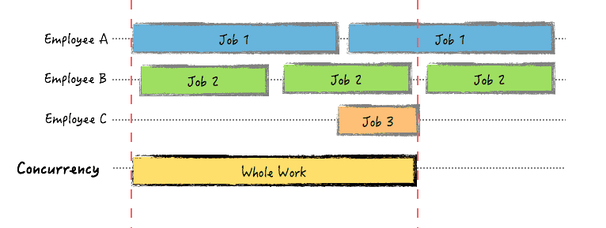
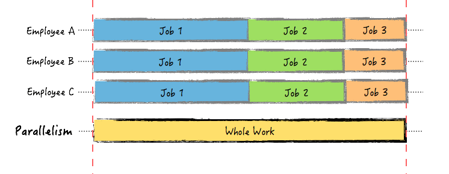
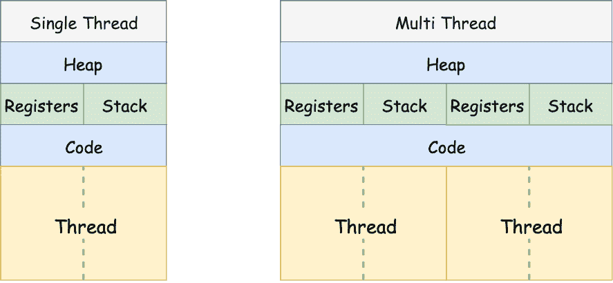
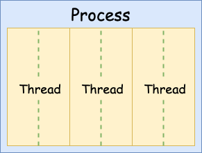

# concurrent, parallel


簡單來說，Concurrency是邏輯上\(logically\)的同時做更多事情，邏輯上的意思就是你把Program分割成Multiple Threads去執行，若CPU是單一核心的時候，Threads會互相搶CPU的執行時間，因此同一個時間下還是只有一個Thread被執行。

舉例來說一個人可能會去做 Job1、Job2、Job3這三件事，但是在一個時間點內只會做一個 Job，像是早上做 Job1、下午做 Job2、晚上做 Job3不斷的切換。Concurrent 的目標是希望能做更多的事。

也因此Concurrency並不保證可以同時做更多事情，在單一CPU情況之下，你只是看起來所有事情都是同時完成，但其實是只是多個Threads輪流去執行，最後一起完成，並沒有真正的減少時間。

**Concurrency 主要目的是去減少Latency。**舉個例子，例如網站中有個表單要使用者填入資料，這種UI blocking的時候，CPU可以先去執行其他事情，避免整個CPU閒置等待User response，也因此Concurrency是透過程式設計把有邏輯的把程式分割成個別的Thread，透過不同Threads交互執行，盡可能提高CPU的使用效率, 避免CPU idle\(ex 等待User response\)。

Parallel programming是實際上\(physically\)的同時做更多事情，是真實的同時執行更多東西。這種就需要硬體上的支援，最基本的就是Multiple cores CPU。

Parallel 主要是會有多個 CPU 在同一個時間點內會去做多件事，例如會有三個人同時分別在做 Job1、Job2、Job3 的事情。因此 Parallel 的目標是希望能把事情更快速的做完。

Parallel 雖然和 Concurrency 非常相關， 但是兩個是不同的概念， Parallel 的重點是事情真的 “同時” 在處理， 可以分成 bit-level、instruction level、data、task parallelism。

Concurrency

* 輪流進行處理
* 只能使用單核
* 執行順序無法預期 \(Race Condition\)

Parallelism

* 同時進行處理
* 能夠使用多核
* 執行順序可以預期

不寫 Parallelism 邏輯，也能透過 Concurrency 改善效能：

* 記憶體共享
* I/O
* 空檔中會有其他 Multi-Process\(Multi-Thread\) 進行其他工作



照A 處理 Job1、B 處理 Job2、C 處理 Job3，但是 A、B、C 彼此牽制，好比搶奪一個辦公桌，誰坐在上面就能開始工作，離開崗位後其他人利馬搶辦公桌來使用。



依照 A、B、C 進行工作處理分別為 Job1、Job2、Job3。但是 A、B、C 同時依序進行工作，沒有誰先誰後的問題，同時的進行處理。





```text
+-------------------------+
|              +----------|-----------------------------+
|              | +--------|-------+                     |
|              | |        |       |                     |
|              | |        |       |                     |
|  Parallelism | | Multithread    |    Concurrency      |
|              | |        |       |                     |
|              | |        |       |                     |
|              | +--------|-------+                     |
|              +----------|-----------------------------+
+-------------------------+
```

* Multithread 包含於 Concurrency
* 存在某情況屬於 Multithread 但不屬於 Parallelism
* 也存在某情況屬於 Multithread 也屬於 Parallelism
* 存在某情況屬於 Concurrency 和 Parallelism 但不屬於 Multithread
* 存在某情況不屬於 Concurrency 但屬於 Parallelism


