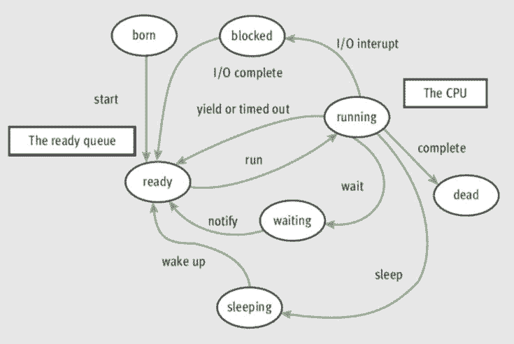
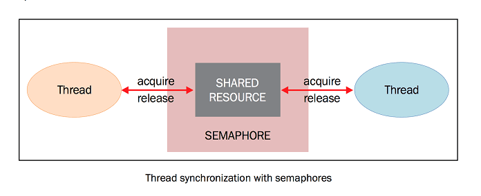

# 執行緒\(thread\)

## 簡介

執行緒是獨立的處理流程，可以和系統的其他執行緒並行或並發地執行。**多執行緒可以共享資料和資源**，利用所謂的共享記憶體空間。

目前，在軟體應用中使用最廣泛的並發編程範例是多執行緒。通常，一個應用有一個行程，分成多個獨立的執行緒，並行運行、互相配合，執行不同類型的任務。

雖然這種模式存在一些缺點，有很多潛在的問題，但是多執行緒的應用依然非常廣泛。

執行緒和行程的具體實現取決於所執行的作業系統，但是總體來講，我們可以說執行緒是包含在行程中的，同一行程的多個不同的執行緒可以共享相同的資源。相比而言，行程之間不會共享資源。

* 每一個執行緒基本上包含3個元素：**程式計數器**，**暫存器**和**變數堆疊**。
* 執行緒與同一行程的其他執行緒共享的資源基本上包括資料和系統資源。
* 每一個執行緒也有自己的執行狀態，可以和其他執行緒同步，這點和程序一樣。執行緒的狀態大體上可以分為ready, running, blocked。



Python中，\_thread是低階的執行緒模組，threading是高階的執行緒模組。threading模組的主要組件如下：

* 執行緒物件
* Lock物件
* RLock物件
* 信號物件
* 條件變數物件
* 事件物件

在 CPython 中，由於存在全域性解釋器鎖\(GIL\)，同一時刻只有一個執滿者可以執行 Python 代碼。 如果想讓應用更好地利用多核心計算機的計算資源，推薦你使用 multiprocessing 或 concurrent.futures.ProcessPoolExecutor。 但是，如果你想要同時運行多個 I/O 密集型任務，則多執行緒仍然是一個合適的模型。

## 建立執行緒

```python
class threading.Thread(
    group=None, target=None, name=None, args=(), kwargs={})
```

* group: 一般設置為 None ，這是為以後的一些特性預留的
* target: 當執行緒啟動的時候要執行的函數
* name: 執行緒的名字，默認會分配一個唯一名字 Thread-N
* args: 傳遞給 target 的參數，要使用tuple類型
* kwargs: 同上，使用字典類型dict

創建執行緒的方法非常實用，通過target參數指定執行的函數、arg和kwarg將參數傳入函數，告訴執行緒應該做什麼。

### 如何實現一個執行緒

使用threading模組實現一個新的執行緒，需要下面3步：

* 定義一個 Thread 類的子類；
* 重寫 `__init__(self [,args])` 方法，可以新增額外的引數；
* 最後，需要重寫 `run(self, [,args])` 方法來實現執行緒要做的事情。

執行緒被創建之後並不會馬上運行，需要手動調用 start\(\) ， join\(\) 讓調用它的執行緒一直等待直到執行結束。

當建立了新的 Thread 子類的時候，可以實例化這個類，呼叫 `start()` 方法來啟動它。執行緒啟動之後將會執行 `run()` 方法。

呼叫 `start()` 之後子執行緒變為活躍狀態，並且持續直到 `run()` 結束，或者中間出現異常。所有的執行緒都執行完成之後，程式結束。

### 以thread執行外部函數

* thread建立時，如果沒有指定`name`時，以thread-{num}命名。
* 需要被執行的函數以target在thread建立時傳入，thread會自動以成員函數run\(\)執行target函數。
* 若目標函數需要參數時，可在建立thread時，以arg關鍵字，將參數以list或tuple傳入。

```python
# -*- coding: UTF-8 -*-
import threading
import time


def first_function():
    # currentThread()可得到目前的thread object
    t_name = threading.currentThread().getName()
    print(f"{t_name} is starting")
    time.sleep(2)
    print(f"{t_name} is exiting")
    return


def second_function():
    t_name = threading.currentThread().getName()
    print(f"{t_name} is starting")
    time.sleep(2)
    print(f"{t_name} is exiting")
    return


def third_function():
    t_name = threading.currentThread().getName()
    print(f"{t_name} is starting")
    time.sleep(2)
    print(f"{t_name} is exiting")
    return


def param_function(arg):
    t_name = threading.currentThread().getName()
    print(f"{t_name} is starting, arg={arg}")
    time.sleep(2)
    print(f"{t_name} is exiting")
    return


if __name__ == "__main__":
    # 建立Thread object
    # target 是用於 run() 方法調用的可調用對象。
    t1 = threading.Thread(name='1st_thread',
                          target=first_function)
    t2 = threading.Thread(name='2nd_thread',
                          target=second_function)
    t3 = threading.Thread(name='3rd_thread',
                          target=third_function)
    t4 = threading.Thread(name='arg_thread',
                          target=param_function,
                          args=["hello world",])
    threads = (t1, t2, t3, t4)
    # start thread
    # 建立thread時, 因為t1, t2, t3是依序建立,
    # 所以在印出starting時不會亂序
    [t.start() for t in threads]

    #  查看目前有多少個執行緒
    print(f"current acting threads: {threading.active_count()}")

    # wait thread finish
    # thread完成時，不一定會按照次序，所以exiting會亂序
    # 如果沒有join時，main thread會直接結束而不會
    # 等到child threads結束
    [t.join() for t in threads]
    print("finished")

# 1st_thread is starting
# 2nd_thread is starting
# 3rd_thread is starting
# 2nd_thread is exiting
# 1st_thread is exiting
# 3rd_thread is exiting
# finished

```

### 覆寫thread class的run成員函數

* 如果不使用target在thread建構時傳入函數，也可以在覆寫thread class的run成員函數做更精細的控制。

使用threading模組實現一個新的執行緒，需要下面3步：

* 定義一個 Thread 類的子類
* 重寫 `__init__(self [,args])` 方法，可以新增額外的參數
* 最後，需要重寫 `run(self, [,args])` 方法來實現執行緒要做的事情

```python
# -*- coding: UTF-8 -*-
import _thread
import threading
import time

exitFlag = 0


class MyThread(threading.Thread):
    def __init__(self, thread_id, name, counter):
        threading.Thread.__init__(self)
        self.thread_id = thread_id
        self.name = name
        self.counter = counter

    def run(self):
        print(f"{self.thread_id} starting: {self.name}")
        print_time(self.name, self.counter, 2)
        print(f"{self.thread_id} exiting {self.name}")


def print_time(thread_name, delay, counter):
    while counter:
        if exitFlag:
            # Python3中已經不能使用thread，以_thread取代
            _thread.exit()
        time.sleep(delay)
        print(f"{thread_name} {time.ctime(time.time())}")
        counter -= 1


if __name__ == '__main__':
    # Create new threads
    threads = (MyThread(1, "Thread-1", 1), MyThread(2, "Thread-2", 2))

    # Start new Threads
    [t.start() for t in threads]

    # wait child threads complete
    [t.join() for t in threads]
    print("Exiting Main Thread")
```

### setDaemon

若子執行緒希望在主執行緒執行完畢後，不管其他的執行緒是否已執行完畢，都強制跟主執行緒一起結束，則必須寫在start\(\) 之前，預設為 False。

```python
# -*- coding: UTF-8 -*-
import threading
import time


def thread_first_job(x):
    name = threading.currentThread().getName()
    time.sleep(5)
    print(f"thread name:{name}, 1st job: {x}")
    print(f"thread name:{name}, 1st job finished")


def thread_second_job(x):
    name = threading.currentThread().getName()
    print(f"thread name:{name}, 2nd job: {x}")
    print(f"thread name:{name}, 2nd job finished")


if __name__ == '__main__':
    t1 = threading.Thread(target=thread_first_job, args=("Hi",))
    t2 = threading.Thread(target=thread_second_job, args=("Hello",))
    # t2的daemon設為true, 則不論t1是否結束, t2會和main thread一起結束,
    # 必須寫在t2.start之前
    t2.setDaemon(True)
    t1.start()
    t2.start()
    print("main thread finished")

    """
    thread name:Thread-2, 2nd job: Hello
    thread name:Thread-2, 2nd job finished
    main thread finished
    thread name:Thread-1, 1st job: Hi
    thread name:Thread-1, 1st job finished
    """
```

## Queue

[https://docs.python.org/zh-tw/3.8/library/queue.html](https://docs.python.org/zh-tw/3.8/library/queue.html)

如果只是threading之間要通訊，可以使用queue。Thread 無法回傳值，所以要使用 `Queue.put()` 將要傳回的值存入 Queue，再用 `Queue.get()` 取出。

Queue是同步的類別，實現了多生產者、多消費者隊列。這特別適用於訊息必須安全地在多線程間交換的線程編程。模塊中的 Queue 類實現了所有所需的鎖定語義。

Queue模組有幾個類別：

* queue.Queue：FIFO佇列。
* queue.LifoQueue：LIFO 隊列構造函數
* queue.PriorityQueue：優先級隊列構造函數。
* queue.SimpleQueue：無界的 FIFO 隊列構造函數。簡單的隊列，缺少任務跟蹤等高級功能。

而Python的threading模組提供了很多同步方法，包括互斥量\(mutex\)、訊號量\(semaphore\)、原子變數\(atomic\)、條件變數\(conditional variable\)、事件\(event\)和鎖\(lock\)。如果可以使用這些方法的話，應該優先考慮使用這些，而不是使用queue（佇列）模組。

```python
# -*- coding: UTF-8 -*-
import threading
from queue import Queue


# 將要傳回的值存入 Queue
def thread_job(data, q):
    for i in range(len(data)):
        data[i] = data[i] * 2
    q.put(data)


def multi_thread():
    data = [[1, 2, 3], [4, 5, 6]]
    q = Queue()
    all_thread = []

    # 使用 multi-thread
    for idx in range(len(data)):
        thread = threading.Thread(
            target=thread_job, 
            args=(data[idx], 
            q))
        thread.start()
        all_thread.append(thread)

    # 等待全部 Thread 執行完畢
    [t.join() for t in all_thread]

    # 使用 q.get() 取出要傳回的值
    result = [q.get() 
        for _ in range(len(all_thread))]
    print(result)


if __name__ == '__main__':
    multi_thread()
    # [[2, 4, 6], [8, 10, 12]]
```

## Lock

當同時有幾個 Thread 要用到同一個資料時，為了不發生 Race Condition 的現象，需要使用 `lock.acquire()` 以及 `lock.release()` 來將其鎖定住，不讓其他Thread 執行。

* 鎖有兩種狀態： `locked`（被某一執行緒拿到）和`unlocked`（可用狀態）。
* 我們有兩個方法來操作鎖： `acquire()` 和 `release()`。

lock遵循以下規則：

* 如果狀態是unlocked， 可以調用 acquire\(\) 將狀態改為locked。
* 如果狀態是locked， acquire\(\) 會被block直到另一執行緒調用 release\(\) 釋放鎖。
* 如果狀態是unlocked， 調用 release\(\) 將導致 RuntimError 異常。
* 如果狀態是locked， 可以調用 release\(\) 將狀態改為unlocked。

```python
# -*- coding: UTF-8 -*-
import threading


def thread_first_job(t_amount, t_lock):
    # 因為傳入的t_amount是thread間共用的變數
    # 所以寫入時必須先鎖定，否定會有race condition
    for _ in range(10):
        t_lock.acquire()
        t_amount += 1
        print("This is the first thread ", t_amount)
        t_lock.release()


def thread_second_job(t_amount, t_lock):
    for _ in range(10):
        t_lock.acquire()
        t_amount -= 1
        print("This is the second thread ", t_amount)
        t_lock.release()


if __name__ == '__main__':
    amount = 0
    lock = threading.Lock()
    t1 = threading.Thread(target=thread_first_job, args=(amount, lock))
    t2 = threading.Thread(target=thread_second_job, args=(amount, lock))
    threads = (t1, t2)
    [t.start() for t in threads]
    [t.join() for t in threads]
    
```

## RLock

[https://docs.python.org/zh-tw/3/library/threading.html\#rlock-objects](https://docs.python.org/zh-tw/3/library/threading.html#rlock-objects)

在鎖定狀態下，某些執行緒擁有鎖 ； 在非鎖定狀態下， 沒有執行緒擁有它。

如果想讓只有拿到鎖的執行緒才能釋放該鎖，那麼應該使用 RLock\(\) 類別。和 Lock\(\) 類別一樣， RLock\(\) 類別有兩個方法： acquire\(\) 和 release\(\) 。當你需要在類別外面保證執行緒安全，又要在類內使用同樣方法的時候 RLock\(\) 就很實用了。

RLock其實叫做“Reentrant Lock”，就是可以重複進入的鎖，也叫做“遞迴鎖”。這種鎖對比Lock有是三個特點：

* 誰拿到誰釋放。如果執行緒A拿到鎖，執行緒B無法釋放這個鎖，只有A可以釋放；
* 同一執行緒可以多次拿到該鎖，即可以acquire多次；
* acquire多少次就必須release多少次，只有最後一次release才能改變RLock的狀態為unlocked


```python
# -*- coding: UTF-8 -*-
import threading
import time


class Box(object):
    # class variable
    lock = threading.RLock()

    def __init__(self):
        self.total_items = 0

    def execute(self, n):
        Box.lock.acquire()
        self.total_items += n
        Box.lock.release()

    def add(self):
        Box.lock.acquire()
        self.execute(1)
        Box.lock.release()

    def remove(self):
        Box.lock.acquire()
        self.execute(-1)
        Box.lock.release()


## These two functions run n in separate
## threads and call the Box's methods
def adder(box, items):
    while items > 0:
        print("adding 1 item in the box")
        box.add()
        time.sleep(1)
        items -= 1


def remover(box, items):
    while items > 0:
        print("removing 1 item in the box")
        box.remove()
        time.sleep(1)
        items -= 1


## the main program build some
## threads and make sure it works
if __name__ == "__main__":
    items = 5
    n_thread = 2
    print(f"putting {items} items in the box ")
    box = Box()
    threads = []
    for idx in range(n_thread):
        if idx % 2 == 0:
            threads.append(threading.Thread(target=adder, args=(box, items)))
        else:
            threads.append(threading.Thread(target=remover, args=(box, items)))

    [t.start() for t in threads]
    [t.join() for t in threads]
    print(f"{box.total_items} items still remain in the box ")

```

## 訊號量\(Semaphore\)

* semaphore可類比於抽號碼牌等資源的概念。雖然binary semaphore等價於lock，但是semaphore應用於執行緒間的同步，而不適用於用lock資源。
* 訊號量是由作業系統管理的一種抽象資料型別，用於在多執行緒中同步對共享資源的使用。

  本質上說，訊號量是一個內部資料，用於標明當前的共享資源可以有多少並發讀取\(類似抽號碼牌\)。

* threading模組中，訊號量的操作有兩個函式，即 `acquire()` 和 `release()` ，解釋如下：

  * 每當執行緒想要讀取關聯了訊號量的共享資源時，必須呼叫 acquire\(\) ，此操作減少訊號量的內部變數, 如果此變數的值非負，那麼分配該資源的許可權。如果是負值，那麼執行緒被掛起，直到有其他的執行緒釋放資源。
  * 當執行緒不再需要該共享資源，必須通過 release\(\) 釋放。這樣，訊號量的內部變數增加，在訊號量等待佇列中排在最前面的執行緒會拿到共享資源的許可權。




```python
# -*- coding: UTF-8 -*-
# binary semaphore

import threading


def thread_first_job(t_a, sem):
    for _ in range(10):
        # 取得旗標
        sem.acquire()
        t_a += 1
        print(f"This is the first thread {t_a}")
        # 釋放旗標
        sem.release()


def thread_second_job(t_a, sem):
    for _ in range(10):
        # 取得旗標
        sem.acquire()
        t_a -= 1
        print(f"This is the second thread {t_a}")
        # 釋放旗標
        sem.release()


if __name__ == '__main__':
    a = 0
    # 設定旗標計數器為2
    semaphore = threading.Semaphore(2)
    t_1 = threading.Thread(target=thread_first_job, args=(a, semaphore))
    t_2 = threading.Thread(target=thread_second_job, args=(a, semaphore))
    threads = (t_1, t_2)
    [t.start() for t in threads]
    [t.join() for t in threads]
```

## condition

條件指的是應用程式狀態的改變。這是另一種同步機制，其中某些執行緒在等待某一條件發生，其他的執行緒會在該條件發生的時候進行通知。一旦條件發生，執行緒會拿到共享資源的唯一權限。

提供比 Lock, RLock更高級的功能：

* 等待 wait\(\)；
* 喚醒等待中的執行緒 notify\(\)；
* 喚醒所有等待中的執行緒 notifyAll\(\)；
* 也提供了acquire, release方法

threadiong.Condition 在內部維護一個鎖物件 \(預設是 RLock\)，可以在創建Condition對象的時候把鎖物件作為參數傳入。

```python
# -*- coding: UTF-8 -*-
import threading


def thread_first_job(a, cond):
    # 取得 lock
    cond.acquire()
    print("Acquire the condition lock")
    # 執行緒進入等待狀況
    if a == 0:
        print("Wait…")
        cond.wait()
    # 喚醒執行緒
    print("Notify to wake up…")
    cond.notify()

    for _ in range(3):
        a += 1
        print("This is the first thread ", a)

    # 釋放 lock
    cond.release()


def thread_second_job(a, cond):
    # 取得 lock
    cond.acquire()

    # 喚醒執行緒
    cond.notify()
    a += 1

    # 釋放 lock
    cond.release()


if __name__ == '__main__':
    a = 0
    cond = threading.Condition()
    threads = [
        threading.Thread(target=thread_first_job, args=(a, cond)),
        threading.Thread(target=thread_second_job, args=(a, cond))]
    [t.start() for t in threads]
    [t.join() for t in threads]
# Acquire the condition lock
# Wait…
# Notify to wake up…
# This is the first thread  1
# This is the first thread  2
# This is the first thread  3
```

### 生產者-消費者

```python
# -*- coding: UTF-8 -*-
from threading import (Thread, Condition)
import time


class Consumer(Thread):
    """ 消費者 """
    def __init__(self, _items, _condition):
        super().__init__()
        self.items = _items
        self.condition = _condition

    def consume(self):
        # 要求lock
        self.condition.acquire()
        if len(self.items) == 0:
            self.condition.wait()
            print("消費者: 沒有產品了")
        self.items.pop()
        print(f"消費者: 使用1個產品，還有{len(self.items)}個產品")
        # 喚醒等待的執行緒
        self.condition.notify()
        # 釋放lock
        self.condition.release()

    def run(self):
        for _ in range(0, 20):
            time.sleep(1)
            self.consume()


class Producer(Thread):
    """ 生產者 """
    def __init__(self, _items, _condition):
        super().__init__()
        self.items = _items
        self.condition = _condition

    def produce(self):
        self.condition.acquire()
        if len(self.items) == 10:
            self.condition.wait()
            print(f"生產者:現在產品滿了，有{len(self.items)}個產品，停止生產")
        self.items.append(1)
        print(f"生產者:生產1個，現在共有{len(self.items)}個產品")
        self.condition.notify()
        self.condition.release()

    def run(self):
        for i in range(0, 20):
            time.sleep(0.5)
            self.produce()


if __name__ == "__main__":
    items = []
    condition = Condition()

    producers = (Producer(items, condition), Producer(items, condition), Producer(items, condition))
    consumers = (Consumer(items, condition), Consumer(items, condition), Consumer(items, condition))
    [p.start() for p in producers]
    [c.start() for c in consumers]
    [p.join() for p in producers]
    [c.join() for c in consumers]
```

## Event

用於執行緒間的通訊，藉由發送執行緒設置的信號，若信號為True，其他等待的執行緒接受到信號後會被喚醒。提供 設置信號 event.set\(\), 等待信號 event.wait\(\), 清除信號 event.clear\(\) 功能。

```python
# -*- coding: UTF-8 -*-
import threading
import time


def thread_first_job(a, event):
    # 執行緒進入等待狀況
    print("Wait…")
    event.wait()

    for _ in range(3):
        a += 1
        print(f"This is the thread {a}")


if __name__ == '__main__':

    a = 0
    # 創建 event
    event = threading.Event()
    threads = [
        threading.Thread(target=thread_first_job, args=(a, event)),
        threading.Thread(target=thread_first_job, args=(a, event))
    ]
    for t in threads:
        t.start()
        time.sleep(1)
        # 喚醒處於等待狀態的執行緒
        print("Wake up the thread…")
        event.set()
    [t.join() for t in threads]
# Wait…
# Wake up the thread…
# This is the thread 1
# This is the thread 2
# This is the thread 3
# Wait…
# This is the thread 1
# This is the thread 2
# This is the thread 3
# Wake up the thread…

```

## 參考資料

* [\[python\] thread module](https://docs.python.org/zh-tw/3.8/library/threading.html)
* [Python並行編程\(python parallel programming cookbook\) 中文版](https://python-parallel-programmning-cookbook.readthedocs.io/zh_CN/latest/index.html)

