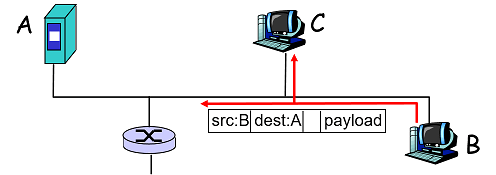
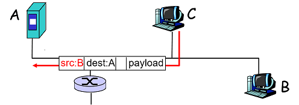
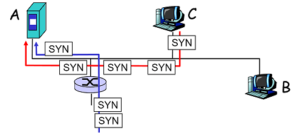

# 網路安全簡介

## 朋友與敵人

網路安全的普遍情形。Bob, Alice \(lovers!\) 想要”安全地”交談。而入侵者Trudy可能想介入或者對訊息作增減。

* 秘密\(Secrecy\)： 只有傳送者\(sender\)以及預期接收者\(intended receiver\)可知道訊息內容。
  * 傳送者對訊息加密
  * 接收者對訊息解密
* 認證\(Authentication\)： 傳送者和接收者欲確認彼此的特性\(identity\) 。
* 訊息完整性\(Message Integrity\)：傳送者和接收者欲確保訊息\(在傳送或轉送中\)不會被更改而沒有察覺。

## 網路安全常見的威脅

### 封包竊聽\(Packet sniffing\)

通常是廣播媒體或
錯綜複雜的網路介面卡（NIC） 讀取所有經過的封包。
可以讀取所有未加密的資料 \(例如： 密碼\)。
例如： C 竊聽 B的封包。

### 假冒IP\(IP Spoofing\)

可以直接從應用層產生造假的IP 封包，並塞入任意值到IP來源位址的欄位中。接收端無法判斷來源是否有欺騙的行為。例如: C 假裝成 B。

### 拒絕提供服務 （Denial of Service）\(DOS\)

惡意地產生大量的封包會讓接收端有掛點的現象。分散式的 DOS \(DDOS\): 多方來源使接收端掛點。
例如： C 和遠端終端機同步地攻擊 A。

### 

## 

