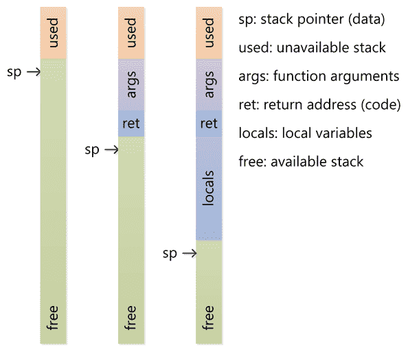
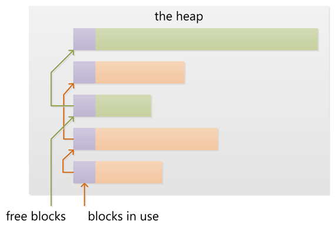

# 記憶體管理

## 堆疊與堆積\(stack and heap\)

一個行程在執行的時候，它所佔用的記憶體的虛擬位址空間一般被分割成好幾個區域，我們稱為“段”（Segment）。常見的幾個段如下。

* 程式碼片段 \(code segment\)：編譯後的機器碼存在的區域。一般這個段是唯讀的。
* bss段：存放未初始化的全域變數和靜態變數的區域。
* 資料段 \(data segment\)：存放有初始化的全域變數和靜態變數的區域。
* 函式呼叫堆疊（call stack segment）：存放函數參數、區域變數以及其他函式呼叫相關資訊的區域。
* 堆積（heap）：存放動態分配記憶體的區域。

函式呼叫堆疊（call stack）也可以簡稱為堆疊（stack）。因為函式呼叫堆疊本來就是基於堆疊這樣一個資料結構實現的。它具備“後入先出”（LIFO）的特點。最先進入的資料也是最後出來的資料。

一般來說，CPU有專門的指令可以用於入堆疊\(PUSH\)或者出堆疊\(POP\)的操作。當一個函數被調用時，就會有指令把當前指令的位址壓入堆疊內保存起來，然後跳轉到被調用的函數中執行。函數返回的時候，就會把堆疊裡面先前的指令位址彈出來繼續執行。

堆積是為動態分配預留的記憶體空間。和堆疊不一樣，從堆積上分配和重新分配塊沒有固定模式，使用者可以在任何時候分配和釋放它。這樣就使得跟蹤哪部分堆積已經被分配和被釋放變得異常複雜；有許多定制的堆積分配策略用來為不同的使用模式下調整堆的性能。堆積是在記憶體中動態分配的記憶體，是無序的。每個執行緒都有一個堆疊，但是每一個應用程式通常都只有一個堆積。在堆積上的變數必須要手動釋放，不存在作用域的問題。

一般來說，作業系統提供了在堆積上分配和釋放記憶體的系統調用，但是使用者不是直接使用這個系統調用，而是使用封裝的更好的“記憶體分配器”（Allocator）。比如，在C語言裡面，執行時（runtime）就提供了malloc和free這兩個函數可以管理堆記憶體。

堆積和堆疊之間的區別有：

* 堆疊上保存的區域變數在退出當前作用域的時候會自動釋放；
* 堆積上分配的空間沒有作用域，需要手動釋放；
* 一般堆疊上分配的空間大小是編譯階段就可以確定的（C語言裡面的VLA除外）；
* 堆疊有一個確定的最大長度，超過了這個長度會產生“堆疊溢出”（stack overflow）；
* 堆積的空間一般要更大一些，堆積上的記憶體耗盡了，就會產生“記憶體分配不足”（out of memory）。



## segment fault

segfault實際上是“segmentation fault”的縮寫形式，可以翻譯為“段錯誤”。

**segfault是這樣形成的：行程空間中的每個段通過硬體MMU映射到真正的物理空間；在這個映射過程中，我們還可以給不同的段設置不同的存取權限**，比如程式碼片段就是只能讀不能寫；

**行程在執行過程中，如果違反了這些許可權，CPU會直接產生一個硬體異常；硬體異常會被作業系統內核處理，一般內核會向對應的行程發送一條信號；如果沒有實現自己特殊的信號處理函數，預設情況下，這個行程會直接非正常退出**；如果作業系統打開了core dump功能，在行程退出的時候作業系統會把它當時的記憶體狀態、暫存器狀態以及各種相關資訊保存到一個檔案中，供用戶以後除錯使用。

在傳統系統級程式設計語言C/C++裡面，製造segfault是很容易的。程式師需要非常小心才能避免這種錯誤，這也是為什麼會有那麼多的程式碼標準來規範程式師的行為。而另外一類程式設計語言規避segfault的辦法是使用自動垃圾回收機制\(garbage collection, GC\)。在這些程式設計語言中，指標的能力被大幅限制，記憶體分配和釋放都在一個執行時環境中被嚴格管理。當然，這麼做也付出了一定的代價。某些應用場景下用這樣的代價換取開發效率和安全性是非常划算的，而在某些應用場景下這樣的代價是不可接受的。

Rust的主要設計目標之一，是在不用自動垃圾回收機制的前提下避免產生segfault。從這個意義上來說，它是獨一無二的。

