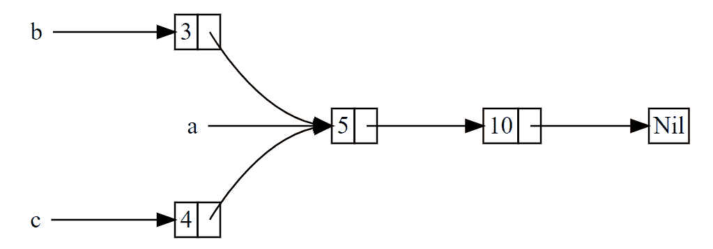

# Rc引用計數

## 簡介

為了啟用多所有權，Rust 有一個叫做 `Rc` 的類型。其名稱為 引用計數（reference counting）的縮寫。引用計數意味著記錄一個值引用的數量來知曉這個值是否仍在被使用。如果某個值有零個引用，就代表沒有任何有效引用並可以被清理。

<mark style="color:blue;">Rc 用於當我們希望在堆上分配一些內存供程式的多個部分讀取，而且無法在編譯時確定程式的哪一部分會最後結束使用它的時候</mark>。如果確實知道哪部分是最後一個結束使用的話，就可以令其成為數據的所有者，正常的所有權規則就可以在編譯時生效。

注意 Rc 只能用於單執行緒場景；

## Rc (reference counting)

單執行緒的引用計數指標，用來共享配置在堆積上的資料。

* 內部記錄引用資料的指標數量，當最後一個 Rc 指標銷毀時，資料也隨風而去。
* &#x20;因為共享，所以禁止任何改變（但可從內部可變性繞過）。&#x20;
* 可能發生迴圈引用，導致記憶體洩漏，此時須使用 Weak 弱引用。&#x20;
* <mark style="color:red;">非原子操作，所以無法在執行緒間傳遞</mark>，但可用 Arc 原子引用計數指標。&#x20;
* 類似 C++std::shared\_ptr。



```rust
#[derive(Debug)]
enum List {
    Cons(i32, Rc<List>),
    Nil,
}

use std::rc::Rc;
use List::{Cons, Nil};

fn main() {
    let a = Rc::new(Cons(5, Rc::new(Cons(10, Rc::new(Nil)))));
    println!("count after creating a = {}", Rc::strong_count(&a)); // 1
    let b = Cons(3, Rc::clone(&a));
    println!("count after creating b = {}", Rc::strong_count(&a)); // 2

    let c = Cons(4, Rc::clone(&a));
    println!("count after creating c = {}", Rc::strong_count(&a));// 3

    println!("{:?}", a); // Cons(5, Cons(10, Nil))
    println!("{:?}", b); // Cons(3, Cons(5, Cons(10, Nil)))
    println!("{:?}", c); // Cons(4, Cons(5, Cons(10, Nil)))
}
```

`Rc::clone` 的實現並不像大部分類型的 clone 實現那樣對所有數據進行深拷貝。`Rc::clone` 只會增加引用計數，這並不會花費多少時間。

在程式中每個引用計數變化的點，會列印出引用計數，其值可以通過調用 `Rc::strong_count` 函數獲得。這個函數叫做 strong\_count 而不是 count 是因為 Rc 也有 `weak_count`。

```rust
pub struct Rc<T: ?Sized> {
    ptr: NonNull<RcBox<T>>,
    phantom: PhantomData<T>,
}
struct RcBox<T: ?Sized> {
    strong: Cell<usize>,
    weak: Cell<usize>,
    value: T,
}
```

建立 Rc 並共享引用（複製 Rc pointer）。

```rust
use std::rc::Rc;
fn main() {
    let obj = Rc::new((1, 2, 3));
    let another_obj = Rc::clone(&obj);
    assert_eq!(obj, another_obj);
}
```


## 升級 `Weak` -> `Rc` ，與降級 `Rc` -> `Weak。`

```rust
use std::rc::Rc;
fn main() {
    let five = Rc::new(5);
    let weak_five = Rc::downgrade(&five);
    let strong_five: Option<Rc<_>> = weak_five.upgrade();
    assert!(strong_five.is_some());
    // Destroy all strong pointers.
    drop(strong_five);
    drop(five);
    assert!(weak_five.upgrade().is_none());
}
```

### Rc 如何管理 weak 與 strong reference

```rust
unsafe impl<#[may_dangle] T: ?Sized> Drop for Rc<T> {
    fn drop(&mut self) {
        unsafe {
            self.dec_strong();
            if self.strong() == 0 {
                // destroy the contained object
                ptr::drop_in_place(self.ptr.as_mut());
                // remove the implicit "strong weak" pointer now that we've
                // destroyed the contents.
                self.dec_weak();
                if self.weak() == 0 {
                    Global.dealloc(self.ptr.cast(), Layout::for_value(self.ptr.as_ref()));
                }
            }
        }
    }
}
```

### 什麼時候該用 Rc

* 你需要共享一堆引用，但不確定哪個引用的生命週期會先結束。
* 你的資源不足，但需要一個 GC（Rc + RefCell = 窮人的 GC）。
