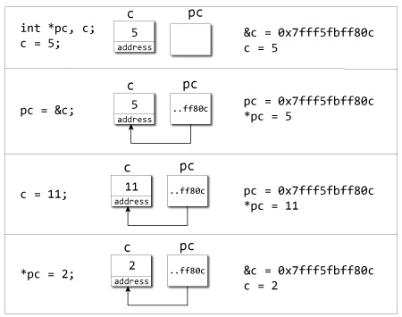

# 指標\(pointer\)

## 儲存的內容為記憶體地址

 

```cpp
#include<iostream>
using std::cout;
using std::endl;

int main(){
    int *pc = nullptr, c=5;
    cout << "value of c:" << c <<endl;
    cout << "address of c:" << &c <<endl;

    pc = &c;
    cout << "value of pc:" << pc <<endl;
    cout << "value of the address of pc:" << *pc <<endl;

    c = 11;
    cout << "value of pc:" << pc <<endl;
    cout << "value of the address of pc:" << *pc <<endl;

    *pc = 2;
    cout << "value of c:" << c <<endl;
    cout << "address of c:" << &c <<endl;
    return 0;
}

```

* 指標儲存的是記憶體位址，初始化時建議設定為NULL或0\(in C\)或nullptr\(C++11之後\)。
* 變數前加上`&`符號表示取變數的記憶體地址，可設值給指標。
* 指標變數`pc`儲存的是記憶體地址，而`*pc`為指向記憶體地址的數值或變數。

