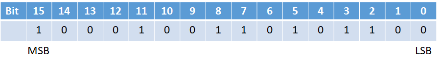

# 有號數與無號數\(signed and unsigned number\)

## C語言資料型態長度

只有`long`與`pointer`在不同環境下長度有異。

| 資料型態 | 一般32-bit環境 | 一般64-bit環境 | x86-64 |
| :--- | :--- | :--- | :--- |
| char | 1 | 1 | 1 |
| short | 2 | 2 | 2 |
| int | 4 | 4 | 4 |
| **long** | 4 | 8 | 8 |
| float | 4 | 4 | 4 |
| double | 8 | 8 | 8 |
| **pointer** | 4 | 8 | 8 |

## 整數的編碼

無號數\(unsigned number\)：`X`為二進位的編碼，`U(X)`為對應的十進位，`N`為編碼的長度\(4-byte時N=32，以此類推\)。

$$
U(X)=\sum_{i=0}^{N-1} {x_i} \cdot {2^i}
$$

有號數\(signed number\)：MSB\(most significant bit\)之值為0時是正數，為1時是負數，以2的補數得十進位。

$$
T(X)=-x_{N-1} \cdot 2^{N-1} \sum_{i=1}^{N-2} x_i \cdot 2^{i}
$$

| 變數 | 十進位\(dec\) | 十六進位\(hex\) | 二進位\(binary\) |
| :--- | :--- | :--- | :--- |
| `x` | 15213 | 3B 6Dh | 00111011 01101101 |
| `y` | -15213 | C4 93h | 11000100 10010011 |



一般在表示二進位編碼時，最左邊為MSB，而最右邊為LSB，但在記憶體空間時，必須以系統為[大端或小端](../assembly/big-endian-and-little-endian.md)儲存資料的方法才可正確取出資料。

不是所有的位元組合都能表示合理的數字，存取某些位元組合在特定機器上可能會造成嚴重錯誤，此種組合稱作**陷阱表示法 \(trap representation\)**。除非使用位元運算或是違反標準其他規定 \(如溢位\)，一般的運算不可能產生陷阱表示法。

以4-bit的編碼來看時，有號數與無號數的所有編碼方式如下表：

* 在正值時，有號數與無號數的編碼方式相同
* 如果要進行位元運算\(bit operation\)，應選用無號數。
* 整數類別可表達的上、下限，以巨集定義在`limit.h(climit)`檔案中。如有號整數的上、下限為`INT_MAX, INT_MIN`


| x | U\(X\) | T\(X\) |
| :--- | :--- | :--- |
| 0000 | 0 | 0 |
| 0001 | 1 | 1 |
| 0010 | 2 | 2 |
| 0011 | 3 | 3 |
| 0100 | 4 | 4 |
| 0101 | 5 | 5 |
| 0110 | 6 | 6 |
| 0111 | 7 | 7 |
| **1000** | **8** | **-8** |
| **1001** | **9** | **-7** |
| **1010** | **10** | **-6** |
| **1011** | **11** | **-5** |
| **1100** | **12** | **-4** |
| **1101** | **13** | **-3** |
| **1110** | **14** | **-2** |
| **1111** | **15** | **-1** |

## 有號數與無號數的比較

有號數與無號數進行&gt;、&gt;=、&lt;、&lt;=、==的運算時，**有號數會隱式轉換成無號數進行比較**。在0、最大最小值，與強制轉型時，可能會得到錯誤的比較結果。

**特別是有號數&lt;-&gt;無號數之間的轉型，因為變數的二進位符號不變，但是解讀的方法改變\(reinterpreted\)，所以變數所代表的意義會完全不同**。

```c
#include <cstdio>
#include <climits>

int main() {
  int a = 0, b = 0;
  unsigned int ua = 0, ub = 0;

  // 有號數與無號數比較時會自動轉為無號數
  printf("a == ua: %d\n", a == ua); // 1

  // 不正確的結果
  // 比較時a會轉為無號數, 會昋到 a > ua為true
  a = -1, ua = 0;
  printf("a > ua: %d\n", a > ua); // 1

  // 不正確的結果
  // 比較時a會轉為無號數, 會昋到 a > ua為false
  a = INT_MAX, ua = INT_MIN;
  printf("a > ua: %d\n", a > ua); // 0

  // 不正確的結果,
  a = -2, ua = (int) -1;
  printf("a > ua: %d\n", a > ua); // 0

  // 不正確的結果,
  a = INT_MAX, ua = (int) -INT_MIN;
  printf("a > ua: %d\n", a > ua); // 0

  return 0;
}
```

## 位元位移操作\(bit shift operation\)

* 邏輯位移 \(Logical shift\) : 左側會補上 0。
* 算術位移 \(Arithmetic shift\) : 補上號數 \(sign bit\) 也就是MSB的值在左側。
* eg: `X=10100010`

  * 邏輯位移, `X>>2=00101000`
  * 算術位移, `X>>2=11101000` 


位移運算的兩種**未定義狀況**：

* 左移超過變數長度，其結果未定義\(編譯器實作會送出error訊息\)。
* 右移一個負數時，可能是邏輯位移或是算術位移，C 語言標準未定義 \(依編譯器實作而定\)。

算術位移的應用：若要判斷一個 int 型態的變數是否為正數，可用 `n >> 31` 其等價於 `n >=0 ? 0: -1`。


```c
/* gcc, icc, clang結果均相同 */
#include <cstdio>

int main() {
  // 1000 0000 0000 0000 0000 0000 0000 0000
  int x = 0x80000000;
  // x=x<<32;    // error, 位移超過型別長度
  printf("%d\n", x); // -2147483648
  x = x >> 31;
  // arithmetic shift    
  printf("%d\n", x); // -1
  printf("0x%08x\n", x); // 0xffffffff

  unsigned int y = 0x80000000;
  printf("%u\n", y); // 2147483648
  y = y >> 31;
  // logical shift
  printf("%u\n", y); // 1
  printf("0x%08x\n", y); // 0x00000001

  return 0;
}
```

### 有號數擴展

有號數從位元數較小的型別擴展到位元數較大的型別，如short到int型別時，MSB的符號會自動補0或1。

| 變數 | 十進位 | 十六進位 | 二進位 |
| :--- | :--- | ---: | ---: |
| x | 15213 | 3B 6Dh | 00111011 01101101 |
| ix | 15213 | 00 00 3B 6Dh | 00000000 00000000 00111011 01101101 |
| y | -15213 | C4 93h | 11000100 10010011 |
| iy | -15213 | FF FF C4 93h | 11111111 11111111 11000100 10010011 |

```c
#include <cstdio>

int main() {
  short x = 15213;
  int ix = (int) x;
  // %h : 將數字視為 short in (%hd)或unsigned int(%hu)
  // 0x00003B6D 0x00003B6D
  printf("0x%08hX 0x%08X\n", x, ix);

  short y = -15213;
  int iy = (int) y;
  // 0x0000C493 0xFFFFC493
  printf("0x%08hX 0x%X\n", y, iy);

  return 0;
}
```

