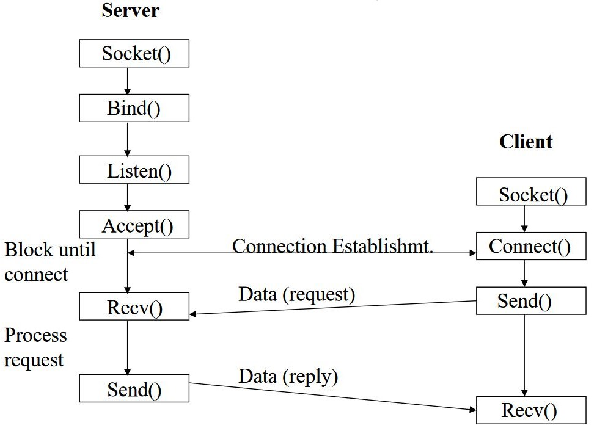
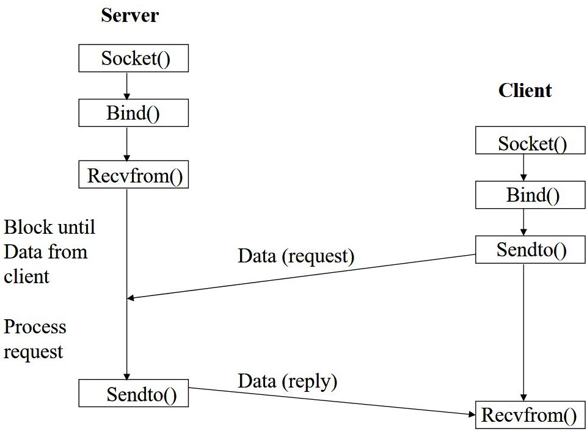

# BSD socket

## Socket

socket的功該是讓相同或者不同的裝置在兩個不同的程序之間進行通訊。更加確切來說，Socket是使用Unix標準檔案描述器\(file descriptor\)讓不同的設備進行交流的一種方式。

在Unix中，每一個I/O操作都是通過讀或者寫一個檔案描述器來實作，而檔案描述器其實本質上就是一個整數\(標準輸入0，標準輸出為1，標準錯誤為2\)，通過這個整數可以對應一個打開的檔案，而這個檔案可以是一個網路連線、一個文字檔案，亦或是一個終端等。

在開發者的觀點中，socket更像是一個底層的檔案描述器，因為在開發的過程中，不管是對socket的處理還是對檔案或者pipe（管道）處理的時候，都會呼叫read\(\)或者write\(\)函式。

Socket通訊的雙方可以分為客戶端和伺服器端，客戶端的基本流程如下：

* 建立socket
* 連線到伺服器
* 傳送資料到伺服器
* 從伺服器接受資料
* 關閉連線

伺服器端的步驟稍微多一些，主要增加了與埠繫結（bind）和監聽（listen）、接受阻塞（accept）等流程。

## socket常用型別簡介

socket常用的4種型別，分別是Steam Socket、Datagram Sockets、Raw Sockets 和Sequenced Packet Sockets 。我們經常使用的型別是前兩種，第三種、第四種使用得少。

### Stream Socket

該Socket型別提供有序的、可靠的、雙向的和基於連線的位元組流，使用帶外資料傳送機制，為Internet地址族使用TCP。 保證了資料互動的可靠性。可以確保資料可靠的發送到對方。但是Stream Socket所佔的資源更多。 TCP傳送的是一個無記錄邊界概念的位元組流。可以總結為TCP中沒有使用者可見的"分組"概念，它只是傳送了一個位元組流，我們無法準確地預測在一個特定的讀操作中會返回多少位元組。最最簡單的例子來說，你通過send函式send 3次的資料可能在另一端接受的時候 2次就讀取完了。

### Datagram Sockets

該Socket型別支援無連線的、不可靠的和使用固定大小（通常很小）緩衝區的資料服務，為Internet地址族使用UDP。 因為是使用UDP來實現資料通訊，因此它不能保證資料能夠到達目的地，但是由於它不需要專用的網路連結，所以它所需的資源相對少的多。相對於TCP而言， TCP 協議在傳輸資料的時候，如果資料發生錯誤，那麼將重新傳輸該錯誤的部分。但是這樣以來常常會浪費很多時間，在一些講究實時性的通訊過程中，這樣做有些不切實際。例如我們在觀看網路影片的時候，少量的資料丟失並不會有很嚴重的影響，因此我們就會用到UDP 這樣的協議。

### Raw sockets

該Socket型別為使用者提供了訪問底層通訊協議的能力，該型別不適於一般的使用者，它主要是用於有想法開發新的協議或者對現有協議進行自定義操作的研發人員。

